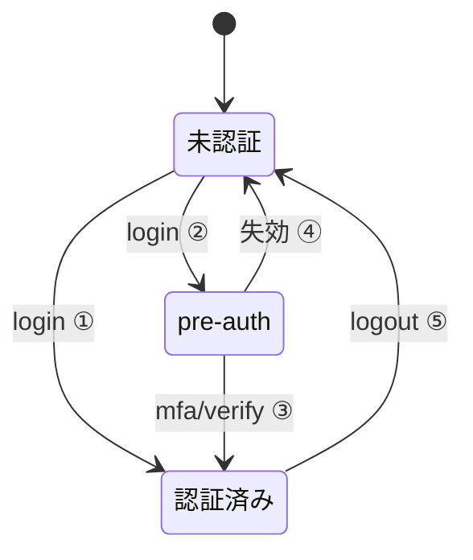

# ドメイン A. 認証・セッション（コントロールプレーン）＝詳細確定（2026-07-27・再レビュー反映 2026-07-29）

> API 全体規約は [`README.md`](./README.md) 第1章（特に §1.4 認証・セッション）を参照。本ファイルはドメイン A の分割レビュー成果＝各エンドポイントの req/res・状態遷移・エラー・画面対応。

対象画面＝**SC-00 ログイン**（3状態＝ログイン／認証コード(MFA)／初回パスワード設定。※初回パスワード設定状態は login 応答ではなく**メールリンク経由で開く**＝F3・A.1/A.7）。全エンドポイントは**コントロールプレーン**（管理DB `accounts`／`otp_challenges`／`trusted_devices`＋Redis）で完結し、会社DB へはルーティングしない。データモデル §4.1〜4.4・§8-①②⑨、コーディング規約 §1（フロントに認証ロジックを持たせない）準拠。

## A.0 状態機械・Cookie/トークン一覧



**遷移の凡例**（エッジのラベルは短縮し、条件は下記に集約）:

| # | 遷移 | 契機・条件 | 結果 |
| --- | --- | --- | --- |
| ① | 未認証 → 認証済み | `login`（PW OK **かつ信頼端末**＝`iq_trust` 有効） | MFA をスキップして本セッション発行（`iq_session`＋`iq_csrf`） |
| ② | 未認証 → pre-auth | `login`（PW OK・**要MFA**） | OTP をメール送信・`iq_preauth`（既定10分）発行。最小権限＝`mfa/verify`・`mfa/resend` のみ受理 |
| ③ | pre-auth → 認証済み | `mfa/verify`（OTP 一致） | pre-auth 消費→本セッション発行。**認証成功時は常に新規セッションID**（固定化対策） |
| ④ | pre-auth → 未認証 | **10分TTL切れ** または **verify 連続失敗上限** | pre-auth 破棄＝`login` からやり直し |
| ⑤ | 認証済み → 未認証 | `logout`（現端末のみ）／`logout-all`（全端末＋`trusted_devices` 失効） | セッション破棄・Cookie 失効 |

- **`mfa/resend`（OTP再発行）は状態を変えない自己遷移**＝pre-auth に留まったまま OTP のみ再発行するため図では省略（レート制限は `resend_available_in` 経過後・§A.1）。

| 名前 | 種別 | 属性 | 目的・TTL |
| --- | --- | --- | --- |
| `iq_session` | Cookie | httpOnly / Secure / SameSite=Lax | 本セッションID。実体は Redis（`account_id`/`company_id`/`system_role` 等）。TTL＝アイドル延長（既定＝実装時確定・SC-00 §10） |
| `iq_preauth` | Cookie | httpOnly / Secure / SameSite=Lax | 未MFA中間状態の pre-auth トークンID。実体は Redis（`account_id`/`company_id`/`otp_challenge_id`・**既定10分**）。mfa/verify 成功で消費・削除 |
| `iq_csrf` | Cookie | **非httpOnly** / Secure / SameSite=Lax | ダブルサブミット用トークン。状態変更系で `X-CSRF-Token` ヘッダと一致必須（§1.4）。**セッション発行時・pre-auth 発行時に発行し、その期間は同一値**（画面遷移ごとの再発行はしない） |
| `iq_trust` | Cookie | httpOnly / Secure / SameSite=Lax | 信頼端末トークン（`trusted_devices`・**30日**）。login 時に照合、有効なら MFA スキップ |

- **pre-auth トークンはセッションと別実体（最小権限）**＝pre-auth では `GET /auth/session` や業務 API を一切通さない（`mfa_verify`／`mfa_resend` のみ受理）。
- **CSRF ／ Origin 検証は状態変更系の全 A エンドポイントに適用**。ただし `POST /auth/login` は未ログイン起点のため CSRF トークン検証は免除し **Origin/Sec-Fetch 検証のみ**（`iq_csrf` は login 成功時／セッション発行時に再発行）。**要MFA分岐で pre-auth を発行する時も `iq_csrf` を同時発行**する＝pre-auth 中の `mfa/verify`／`mfa/resend`（CSRF＋Origin 必須）がダブルサブミットを満たせるようにするため。
- **セッション固定対策**：**認証成功時は常に新しいセッションID を発行**（login 成功・mfa/verify 成功のいずれも。pre-auth は消費して破棄）。既存の未認証状態の値を昇格して使い回さない。
- **トークン生成**：`iq_session`/`iq_preauth`/`iq_csrf`・OTP・password_setup トークンは**暗号学的に安全な乱数（CSPRNG）**で生成し、意味のある情報を埋め込まない（セキュリティ一覧 3・13）。
- **Cookie スコープ最小化**：全 Cookie は `Path=/`・**Domain はホスト限定**（親ドメインへ広げない）。

### Cookie 属性値の意味（なぜこの設定か）

| 属性値 | 意味 | 本設計での狙い |
| --- | --- | --- |
| `httpOnly` | **JavaScript から `document.cookie` で読めない**（送信時にブラウザが自動付与するのみ） | **XSS でセッションID/トークンを窃取されない**ため。`iq_session`/`iq_preauth`/`iq_trust` は JS が触る必要がないので付与 |
| **非httpOnly**（`iq_csrf` のみ） | **JS から読める**（あえて httpOnly を外す） | フロントが Cookie 値を読んで `X-CSRF-Token` ヘッダに載せる**ダブルサブミット**方式のため（§1.4）。CSRF トークンは漏れても即被害にならない性質＝読めてよい |
| `Secure` | **HTTPS 接続でのみ送信**（平文 HTTP には乗らない） | 通信路での盗聴（中間者）を防ぐ。全 Cookie に付与 |
| `SameSite=Lax` | **クロスサイトのサブリクエスト（``/`fetch`/フォーム POST 等）では Cookie を送らない**。トップレベル GET 遷移（リンククリック）でのみ送る | **CSRF の一次防御**。`Strict` ではなく `Lax` にするのは、外部リンクから遷移した初回でもログイン状態を保つ UX のため（不足分は CSRF トークン＋Origin 検証で補強＝多層防御） |
| `Path=/` | このオリジンの**全パスに送信**（特定パスに限定しない） | アプリ全体で同一セッションを使うため。パスで絞る意味がある構成ではないので最小の広さ＝サイト全体に統一 |
| `Domain=`（未指定＝ホスト限定） | **発行元ホストだけに送信**（`Domain` を明示せず、親ドメインやサブドメインへ広げない） | 他サブドメインへ Cookie を漏らさない**スコープ最小化**。テナントはサブドメイン分離しない前提（§1.5・会社特定は会社コード）とも整合 |

- **補足**：`SameSite=Lax` と CSRF トークン（`iq_csrf`）と Origin/Sec-Fetch 検証は**それぞれ単独では穴があり得るため併用**（多層防御）。`iq_csrf` を非httpOnly にする代わりに、値が漏れても成立しないよう Origin/Sec-Fetch も必須にしている（§1.4）。

## A.1 エンドポイント一覧（`/auth`・コントロールプレーン）

| メソッド/パス | 概要 | リクエスト（ボディ/前提） | レスポンス（主なデータ・Set-Cookie） |
| --- | --- | --- | --- |
| `POST /auth/login` | 会社コード＋ID＋PW でログイン認証（未認証起点） | ボディ: `company_code`,`login_id`,`password`／前提: 認証不要・**CSRF免除（Origin/Sec-Fetch のみ）**・レート制限（IP＋login_id） | 2分岐（下記「レスポンス分岐」）＝`authenticated`／`mfa_required`。成功時 `Set-Cookie: iq_session,iq_csrf`（要MFA時は `iq_preauth`＋`iq_csrf`） |
| `POST /auth/mfa/verify` | pre-auth 中の OTP を検証し本セッション発行 | ボディ: `code`,`trust_device`／前提: **pre-auth（`iq_preauth`）必須**・CSRF＋Origin | `200 { status:"authenticated", session:{…§A.6} }`＋`Set-Cookie: iq_session,iq_csrf`（`trust_device=true` は `iq_trust` も）・`iq_preauth` 削除 |
| `POST /auth/mfa/resend` | OTP を再送（旧OTP失効） | 前提: pre-auth 必須・CSRF＋Origin・**レート制限**（`resend_available_in` 経過前は 429＋`Retry-After`） | `200 { expires_in:600, resend_available_in:30 }` |
| `POST /auth/logout` | 現在の端末をログアウト | 前提: 本セッション必須・CSRF＋Origin | `204`（現 `iq_session` を Redis 破棄・Cookie 失効） |
| `POST /auth/logout-all` | 全端末をログアウト＋信頼端末失効 | 前提: 本セッション必須・CSRF＋Origin | `204`（当該 `account_id` の**全セッション破棄＋`trusted_devices` を `revoked`**＝全端末で次回 MFA 必須） |
| `GET /auth/session` | 現在のセッション情報を取得（フロント初期化＝ロール別UI・言語） | 前提: 本セッション必須（pre-auth では 401）・CSRF不要（GET） | `200 { …§A.6 }`／未認証＝`401 { code:"unauthenticated" }` |

- **`POST /auth/login` のレスポンス分岐**（2分岐）:
  - **信頼端末で MFA スキップ／`mfa_required=false`**＝本セッション発行 → `Set-Cookie: iq_session, iq_csrf` ＋ `200 { "status":"authenticated", "session": { …§A.6 } }`。
  - **要 MFA**＝OTP をメール送信＋pre-auth 発行 → `Set-Cookie: iq_preauth, iq_csrf` ＋ `200 { "status":"mfa_required", "mfa": { "delivery":"email", "masked_to":"y****@acme.co.jp", "expires_in":600, "resend_available_in":30 } }`。
  - **初回パスワード未設定（`password_set=false`）は login では分岐しない（列挙耐性・F3 ハードニング）**＝PW 照合は必ず実行され、PW を持たない当該アカウントは他の失敗と区別せず**一律 `401 { "code":"unauthenticated" }`**。初回パスワード設定は **login 応答では誘導せず、メールリンク（A.7）に一本化**する（`password_set` 状態を未認証者に漏らさない）。
- **エラー・秘匿**:
  - `login`＝会社コード不正・login_id 不在・PW 不一致・**初回パスワード未設定（`password_set=false`）**はいずれも**一律** `401 { "code":"unauthenticated" }`（列挙耐性・SC-00 方針・F3）。会社 `suspended`＝**資格情報照合が成功した後に**`503 { "code":"company_suspended" }`（README §1.7 の code 表と統一・会社コードの有無を漏らさない・運営は別途 admin ログイン想定）。
  - `mfa/verify`＝OTP 不一致 `401 { "code":"otp_invalid", "attempts_left":n }`（連続失敗上限で pre-auth 失効＝`login` やり直し）／pre-auth 不在・期限切れ `401 { "code":"preauth_expired" }`／OTP 期限切れ `401 { "code":"otp_expired" }`（resend 案内）。
  - `mfa/resend`＝クールダウン中 `429 { "code":"rate_limited" }`＋`Retry-After`。
- **強制ログアウト（サーバー発火）**: 「全セッション破棄＋信頼端末失効」は logout-all 以外に、**ロール（`system_role`）変更・アカウント無効化(disable)・PW 変更/再設定**でもユーザー操作なしでサーバーが強制発火（トリガはドメイン B／A.7・詳細＝§A.9-③）。
- **SC-00／共通ヘッダー対応**: `login` 成功→ダッシュボード遷移／`mfa_required`→認証コード入力状態。`mfa/verify` 成功→ダッシュボード・失敗は残回数表示（上限でログイン画面へ戻す）。**初回PW設定状態は login からは遷移せず、メールリンク（A.7）で開く専用ルートで表示**（F3 ハードニング＝login 応答では `password_setup_required` を返さない）。ログアウト導線＝共通ヘッダーのユーザーメニュー。
- **デイリーログインボーナス（日次ログイン XP・FR-05／G.6 `reason=login`）の付与契機＝「新しい暦日（JST）の最初の認証済みリクエスト」**（ログイン成功はその特例）: 認証イベントだけに紐づけると、持続セッション（アイドル延長＋絶対有効期限・§A.9-③）で日を跨いで使う利用者がボーナスと連続ログイン実績を取り逃すため、**付与契機をセッション寿命から切り離す**（＝毎日使えば毎日成立・再認証は不要）。
  - **判定＝純粋関数**（ドメイン G の domain）: `daily_login_bonus_due(last_grant_date_jst, now_jst)`（DB 非依存・§3.3 でユニットテスト）。**付与＝冪等な台帳書き込み**（G の repository・同一 UoW）: `activities(reason=login)` を**「ユーザー×JST日」で 1 回きり**にする（投票 XP と同じ**台帳存在チェック**が真の冪等保証＝複数端末/同時初回でも二重付与しない）。付与ドメインは **G**（コーディング規約 §3.5-(2)＝A が G の純粋 domain を import＋その repository を同一 UoW で呼ぶ）。
  - **契機の実装＝セッション解決の依存性**（imperative shell・毎リクエスト実行済み）: Redis セッションに `last_login_bonus_date`(JST) を保持し、**当日未付与のときだけ**上記付与を G へ委譲。**当日 2 回目以降は日付比較のみでスキップ**（追加コストほぼゼロ）。台帳の一意性が真実・セッション日付は最適化。**業務ロジックをミドルウェアに直書きしない**（判定は純粋・付与は G＝§3.1）。演出（`login_bonus`）はダッシュボードが当日初回に 1 回だけ返す（ドメイン I）。

## A.6 セッション情報スキーマ（`session`）

```json
{
  "account_id": "acc_…",
  "company_id": "co_…",
  "company_code": "ACME-01",
  "system_role": "general",            // general | company_account_admin | system_admin（会社アカウント管理者=自社全アカウント管理・§8-⑯／QG管理者は system_role では表さず会社DB quest_group_members.role=admin で判定＝B案）
  "locale": "ja",                       // ja | en（accounts源泉ミラー・§8-⑬）
  "user": {                             // 会社DB users の表示情報（会社DB解決後にミラーから）
    "user_id": "usr_…",
    "display_name": "山田 太郎",
    "avatar_url": "…"
  }
}
```

## A.7 初回パスワード設定／再設定（`/auth/password-setup`）

用途＝**初回PW設定／自己サービスのPW再設定（パスワード忘れ）／管理者によるPW再設定**。3 経路とも**同一のメールリンク基盤**（`otp_challenges` purpose=`password_setup`・単回トークン・**72h**・データモデル §4.4）を使い、差は「リンク発行の起点」だけ＝(a) 管理者のアカウント発行/再設定（ドメイン **B.2〔system_admin・全社〕/ B.2.1〔会社アカウント管理者・自社〕** の `password-reset`）、(b) **本人の自己サービス要求（`request`・下記）**、(c) 既存トークンの `verify`/`complete`。認証不要（トークンが本人性・`request` は company_code＋login_id）・CSRF＝Origin のみ（未ログイン起点）。※**QG管理者（B.4）は参加選択専任で PW 再設定を持たない**（SoD・§8-⑯）。

| メソッド/パス | 概要 | リクエスト（ボディ） | レスポンス（主なデータ） |
| --- | --- | --- | --- |
| `POST /auth/password-setup/request` | **自己サービスでパスワード再設定リンクを要求**（SC-00「パスワードをお忘れですか？」） | ボディ: `company_code`,`login_id`／前提: 認証不要・**CSRF免除（Origin/Sec-Fetch のみ）**・レート制限（IP＋company_code＋login_id） | **常に `202 { status:"accepted" }`**（アカウントの有無・PW設定状態・会社状態を漏らさない＝列挙耐性）。該当アカウントが**有効な場合のみ**登録メールへ `password_setup` リンク（72h・単回）を実送信 |
| `POST /auth/password-setup/verify` | リンクトークンの有効性を確認（設定画面の表示用） | ボディ: `token` | `200 { valid:true, login_id:"yamada" }`／無効・期限切れ・使用済＝`410 { code:"token_expired" }`（管理者再送/再要求を案内） |
| `POST /auth/password-setup/complete` | 新パスワードを設定して完了 | ボディ: `token`,`new_password` | `200 { status:"ok" }`（ログイン画面へ）。PWポリシー（§A.9）違反＝`422 { code:"validation_error", errors:[…] }` |

- **`request` の列挙耐性（重要）**: `company_code`/`login_id` の当否・アカウント有無・`password_set` の状態・会社 `suspended` の有無に**依らず常に同一応答（`202`）**とし、実際のメール送信は「会社が有効かつアカウントが `active`」の場合のみ行う（該当しなければ無送信で同一応答）。**タイミング差も抑制**（存在判定の有無で応答時間が変わらないようにする）。連続要求は**レート制限＋クールダウン**（既存 `password_setup` トークンがあれば再利用 or 失効して新規・多重送信防止）。
- `complete` 成功時＝PW 設定・`password_set=true`・**当該アカウントの全アクティブセッション破棄＋信頼端末を失効**（§A.9-③）・トークン消費。**accounts 更新と同一Tx で `account_sync_outbox` に upsert**（§1.13）。
- **SC-00 対応**: 「パスワードをお忘れですか？」導線→再設定リクエストのフォーム（company_code＋login_id・送信後は**常に同一の確認メッセージ**）／メールリンクを開いた初回/再設定パスワード設定状態のフォーム（PW／確認・表示切替）。
- **管理者再設定との関係**: **B.2〔system_admin〕/ B.2.1〔会社アカウント管理者〕** の `password-reset`（管理者起点）と本 `request`（本人起点）は**同じ `password_setup` リンクを発行**する等価な入口。監査上は起点（操作者）で区別（§A.9-⑥）。QG管理者（B.4）は PW 再設定を持たない（SoD）。

## A.8 未確定（実装時に確定でも可）

- **セッションの具体値**：無操作タイムアウト・**絶対有効期限**・pre-auth TTL（既定10分）・信頼端末 TTL（既定30日）の各値（SC-00 §10 の閾値。方針＝§A.9）。
- **ブルートフォース閾値**：ログイン失敗の一時ロック発動回数／解除時間、OTP 連続失敗上限、resend クールダウン秒、漸増遅延の有無、**パスワード再設定要求（`password-setup/request`）のレート制限／クールダウン秒**。
- **PW ポリシー具体値**：最低文字数・文字種要件、漏えい済み/よく使われる PW 拒否リストの採否（方針＝§A.9-④）。
- **監査ログ**：保存期間・出力先（方針＝§A.9-⑥）。
- メール送信基盤（dev=MailHog／prod=SMTP）の接続設定＝実装フェーズ。

## A.9 セキュリティ対策マッピング／補強（`doc/WEBアプリ開発時のセキュリティ対策一覧.md` 突合・2026-07-27）

同一覧の **1.認証／3.セッション管理／7.CSRF／14.エラー処理／15.ログ・監査** をドメイン A に対応づけ、既定で満たす確定事項と補強を整理。CSRF/Cookie 属性/列挙耐性/MFA/初回PW設定/pre-auth 分離は本ファイル本文・README §1.4/1.7 で既定済み。以下は**追加で確定する補強**。

- **① PW ハッシュ**：`accounts.password_hash` は **Argon2id**（ソルト付き・コーディング規約 §3.4 `core/security.py`）。平文保存禁止・MD5/SHA-1 をパスワード用途に使わない（一覧 1・13）。
- **② セッション固定対策**：認証成功時に常に新規セッションID を発行（§A.0）。セッションID は CSPRNG・URL に含めない・意味情報を埋め込まない（一覧 3）。
- **③ セッション失効ルール（確定）**：以下でサーバーが**該当アカウントの全アクティブセッション破棄＋信頼端末失効**を強制する。
  - `logout`（現端末のみ）／`logout-all`（全端末・ユーザー操作）＝§A.1。
  - **`system_role` 変更・アカウント無効化(disable)・PW 変更/再設定**＝ユーザー操作なしで発火（トリガはドメイン B の admin 操作／A.7）。セッションは `system_role` を保持するため、ロール変更後の旧権限セッションを残さない（一覧 3-④、1・3-⑯）。
  - 併せて**無操作タイムアウト＋絶対有効期限を併用**（idle だけに頼らない・一覧 3-⑥）。
- **④ ブルートフォース／PW 品質**：ログインは**レート制限（IP＋login_id）に加え、失敗連続でアカウント一時ロック（＋任意で漸増遅延）**（一覧 1-⑧⑨）。PW 設定/変更時に**最低文字数＋漏えい済み・よく使われる PW の拒否**を検証（一覧 1-⑤⑥・具体値は §A.8）。
- **⑤ 秘匿・列挙耐性の徹底**：ログイン/OTP 失敗は一律メッセージ（本文）。**初回パスワード未設定（`password_set=false`）も `login` では区別せず一律 `401 unauthenticated`**＝「その login_id が実在し未設定」という状態を未認証者に漏らさない（初回PW設定はメールリンク A.7 に一本化・F3 ハードニング）。**自己サービスのパスワード再設定要求（`POST /auth/password-setup/request`）も、アカウント有無・PW設定状態・会社状態に依らず常に `202 accepted`＋タイミング差抑制**で、実存を漏らさない（A.7）。**`company_suspended` は資格情報照合が成功した後に判定**して返し（`503`）、未認証者に会社コードの有無を漏らさない（一覧 14・1-⑨）。認証・認可エラーの詳細を出しすぎない。
- **⑥ 認証イベントの監査ログ**：**ログイン成功/失敗・MFA 発行/検証結果・アカウント一時ロック・logout/logout-all・PW 設定/変更・PW再設定リクエスト（自己サービス `request`／管理者 `password-reset`・起点で区別）・ロール変更**を、操作者/日時/対象/結果/IP・UA とともに記録（一覧 15）。**PW・セッションID・OTP・各種トークンはログに出力しない**（一覧 3・15）。共通監査列（データモデル §2.1）とは別に、セキュリティ監査イベントの記録方針を実装時に具体化（保存先/期間＝§A.8）。
- **⑦ 他ドメインへ委譲（A では未実装・該当ドメインのレビューで確定）**：
  - **認証済みユーザーの自己 PW 変更＝現在の PW 再確認**（一覧 1-㉒）／**email・MFA 設定変更時の再認証**（一覧 1-㉓）＝**ドメイン K（プロフィール）** で設計（現状 A のメールリンク経路のみ）。
  - ロール変更・disable の**権限変更履歴の記録**（一覧 2-⑬）＝**ドメイン B**。
- **⑧ セキュリティ通知（決定 2026-08-02・監査ログとは別に本人へ知らせる）**：認証イベントを本人に通知して不正の早期検知を促す（一覧 15 の“重要操作の本人通知”）。通知の**発火はドメイン H（認証フローが本体コミット後の post-commit で `notify()` を呼ぶ・§3.5-(3)）・表示は SC-02**（アプリ内）、種別は `notification_type` に **`security_new_device`／`security_password_changed`** を追加（データモデル §3・§5.24）。通知先レコード（会社DB `notifications`）へは、認証フローが**ログインで確定した `company_id` を使ってテナントDBへ書き込む**（クロスプレーン・アカウント発行の outbox と同様に会社DBへ反映）。**いずれも認証成功後／本人宛のみ**＝列挙耐性の問題なし。監査ログ（⑥）は別途必ず残す。
  - **(a) 新しい端末からのログイン**：**未登録端末（有効な `iq_trust` を持たない端末）からの認証成功時**に通知（＝MFA=ON では毎回OTPを経た成功、MFA=OFF ではパスワードのみの未登録端末ログイン）。信頼登録済み端末の再ログインでは通知しない（ノイズ回避）。内容＝日時／IP／UA（おおよその地域）。**MVP＝アプリ内通知＋監査**。**メール通知は将来**（外部通知の解禁時）だが、**`mfa_required=false` の会社では前倒しで有効化**する（パスワードのみ＝価値が高い）。※MFA=ON かつメール通知だと「新端末成功＝メール到達済み＝OTP と同じ経路」で追加価値が小さいため、メールは MFA=OFF 優先。
  - **(b) パスワードの変更完了**：`POST /auth/password-setup/complete` 成功（初回設定／自己サービス再設定／管理者再設定の3経路共通）および**プロフィールでの自己PW変更（ドメイン K）**の完了時に通知。**チャネル＝メール＋アプリ内**（`security_password_changed`）。内容＝「パスワードが変更されました。心当たりがなければ管理者に連絡」。**§A.9-③の全セッション破棄＋信頼端末失効とセット**で「なぜログアウトされたか」の説明にもなる。※「再設定を**要求した**」段階の気づきは、A.7 の**再設定リンクメール自体**が担う（別途の“要求通知”は設けない）。完了通知はPW変更が**実際に行われた**ことを本人に知らせる点で別物・価値が高い。
  - **セキュリティ通知はオプトアウト不可**（種別ごとの ON/OFF 対象外＝SC-02 §9 の設定対象に含めない）。

## A.10 設計判断（ADR）：Cookie＋Redis セッション vs JWT（2026-07-27）

**決定＝ブラウザ向けの認証は「httpOnly Cookie＋サーバー側（Redis）の不透明セッション」を採用し、JWT（アクセス/リフレッシュトークン）は MVP では不採用**（将来の外部/ネイティブクライアント向けに `Authorization: Bearer` 受理の余地のみ残す＝§1.4）。

### 背景・要件
本アプリは**単一 FastAPI バックエンド＋共有 Redis＋リバプロ同一オリジン**のブラウザ向け Web で、**セッションの即時失効を確定要件**とする（logout-all／ロール変更／アカウント無効化(disable)／PW 変更・再設定で全セッションを即無効化＝§A.9-③・B.2）。

### 比較（要点）
| 観点 | Cookie＋Redis 不透明セッション（採用） | JWT＋アクセス/リフレッシュ（不採用） |
| --- | --- | --- |
| 即時失効 | ◎ Redis 削除で即無効 | ✕ アクセストークンは exp まで有効。失効には denylist/introspection が必要＝ステートレスの利点が消える |
| XSS 耐性（トークン窃取） | ◎ httpOnly で JS から読めない | △〜✕ localStorage 保存は XSS で窃取可。httpOnly Cookie 保存にすると結局 CSRF 対策が要り「Cookie セッションの再発明」 |
| CSRF | 要（ダブルサブミット＋Origin＋SameSite で対処済み・§1.4） | Cookie 保存なら同様に要／ヘッダ方式は上の XSS 問題を抱える |
| 実装事故の余地 | 小（乱数 ID＋サーバー照合のみ） | 大（alg=none・HS/RS 混同・鍵管理・時刻ずれ・リフレッシュ盗難/ローテーション） |
| 秘匿情報の露出 | セッション ID は無意味な乱数 | JWT は claim 内包（Base64＝誰でもデコード可）。機密を載せない運用が必要 |

### 根拠
- JWT の主目的（**ステートレス水平スケール／サービス間・サードパーティ連携**）は本構成にほぼ効かない（共有 Redis・単一バックエンド・同一オリジン）。
- JWT のステートレス性は**即時失効の確定要件と正面から矛盾**する。両立させると「JWT＋サーバー側失効リスト」となり、Redis セッションと同じ状態管理をより複雑に再構築するだけ。
- 「最も安全なブラウザ向け JWT 構成」を突き詰めると **httpOnly Cookie＋CSRF＋サーバー側失効** ＝本設計に収束する。

### 再検討の条件（将来）
- 共有ストア無しで複数の独立サービスへトークンを持ち回る必要が出た場合、モバイル/外部 API/SSO（OIDC・現状 Could）が主体になった場合は、`Authorization: Bearer`（署名検証＋短命アクセストークン＋リフレッシュ回転＋失効リスト）を**追加**で検討（Cookie セッションは Web 向けに併存可）。
