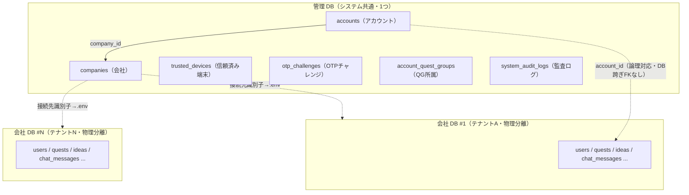
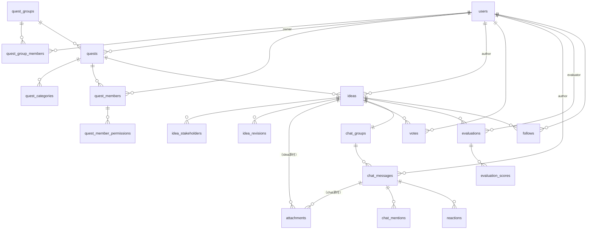
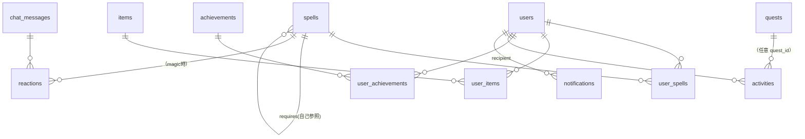

# ideaquest データモデル詳細

> **位置づけ**: 本ファイルは要件定義書 `doc/要件定義/README.md` 第9節「データモデル」を、実装（PostgreSQL スキーマ／SQLAlchemy モデル）に落とし込むための **詳細設計**（ER 図・テーブル定義・型・制約・インデックス）。
> **正典は README**。齟齬があれば README を優先し、確定した変更は README ＋ 本ファイル ＋ handoff を同時更新する。
>
> - 最終更新: 2026-07-19
> - 対象フェーズ: データモデル詳細（画面設計フェーズ完了後の次フェーズ第1段）
> - 次段: API 設計 → 実装（compose / スキャフォールド）

---

## 0. 目次

1. 全体構成（2 層 DB）
2. 命名規約・共通方針
3. Enum（列挙型）一覧
4. 管理 DB（コントロールプレーン）
5. 会社 DB（データプレーン）
6. 全文検索の索引（FR-31）
7. 集計・派生値の扱い（XP/コイン/SP/ランキング）
8. データモデル関連の未決事項（TBD）
9. 次アクション

---

## 1. 全体構成（2 層 DB）

エンティティは **2 種類の DB** に分かれて格納される（README 第9節）。

- **管理 DB（コントロールプレーン / システム共通・1 つ）**
  認証・テナント振り分けに必要な情報を全社横断で保持。ログイン時にここで所属会社を判定し、当該 **会社 DB** へ動的ルーティングする。
- **会社 DB（データプレーン / 会社ごとに物理分離・別コンテナ）**
  各社のクエスト・アイデア・チャット・ゲーミフィケーション等の機密データを隔離して保持。

**DB 跨ぎの参照は物理 FK を張れない**（別インスタンスのため）。管理 DB の `accounts` と 会社 DB の `users` は **`account_id`（UUID）で論理的に対応付け**る。整合はアプリ層（ログイン時のプロビジョニング/同期）で担保する（同期方式の詳細は §8 TBD）。

---

## 2. 命名規約・共通方針

- **物理テーブル名**: スネークケースの **複数形**（例: `quests`, `idea_revisions`, `evaluation_scores`）。
- **論理名（日本語）**: 各テーブル定義の見出しに「物理テーブル名（複数形 snake_case）＋日本語論理名」を、各カラムに「物理名＋日本語論理名」を併記する。ER 図のエンティティ名も物理テーブル名（複数形）に揃える。
- **カラム名**: スネークケース（英小文字）。
- **主キー**: `id UUID PRIMARY KEY DEFAULT gen_random_uuid()`。
  - 理由: マルチテナント・列挙耐性（連番推測を避ける）・MinIO オブジェクトキーや URL への露出耐性。`pgcrypto`（or PG13+ の `gen_random_uuid()`）前提。
- **タイムスタンプ**: `timestamptz`（UTC 保存・表示層で JST 変換）。`created_at`/`updated_at` を基本装備（`updated_at` は更新のあるエンティティのみ）。
- **論理削除**: アカウントは無効化（`status=disabled`）＝論理削除（入力履歴は残す）。その他は原則物理削除しない設計を優先（監査・履歴保持）。
- **外部キー**: 会社 DB 内は物理 FK を張る。**DB 跨ぎ**（accounts↔users, account_quest_groups↔quest_groups）は **論理参照**（FK なし・アプリ整合）。
- **Enum**: PostgreSQL の `ENUM` 型 or `text + CHECK`。本書では値集合を §3 に集約。実装ではマイグレーション容易性から `text + CHECK` を推奨（値追加が軽い）。
- **金額/ポイント**: XP・コイン・SP は `integer`（残高系は 0 以上を保証＝`CHECK (>= 0)`）。
- **添付/画像パス**: MinIO オブジェクトキー（ハッシュ名）を `text` で保持。バケット/プレフィックスは会社ごとに論理分離（実体名は元ファイル名と別）。

---

## 3. Enum（列挙型）一覧

| Enum | 値 | 用途 |
| --- | --- | --- |
| `system_role` | `system_admin` / `quest_group_admin` / `general` | accounts のシステムロール |
| `company_status` | `active` / `suspended` | 会社（テナント）状態 |
| `account_status` | `active` / `disabled`（論理削除） | accounts 状態 |
| `otp_purpose` | `login`（MFA） / `password_setup`（初回/再設定） | OTP チャレンジ用途 |
| `quest_status` | `draft`（下書き） / `recruiting`（募集中） / `in_progress`（進行中） / `evaluating`（評価中） / `completed`（完了） | quests ステータス |
| `idea_status` | `draft`（下書き） / `published`（公開） | ideas ステータス |
| `permission_type` | `owner`（所有者） / `quest_admin`（クエスト管理） / `evaluator`（評価者） / `vote`（投票） / `idea_create`（アイデア作成） / `comment`（コメント） | クエスト内 6 権限 |
| `vote_type` | `approve`（賛成） / `oppose`（反対） | 投票種別 |
| `reaction_type` | `normal`（絵文字） / `magic`（魔法） | チャットリアクション種別 |
| `spell_effect` | `fire` / `ice` / `thunder` / `sparkle` / `rainbow` / `aura` | 魔法エフェクト（`.spell-fx--*` と対応） |
| `spell_line` | `flame`（烈火系: 炎→雷→虹） / `quiet_light`（静輝系: 氷→キラキラ→オーラ） | 魔法系統（スキルツリー） |
| `rarity` | `common`（コモン） / `standard`（標準） / `rare`（レア） | 装備・魔法のレアリティ |
| `equipment_slot` | `head`（頭） / `face`（顔） / `body`（体） / `hand`（手持ち） / `background`（背景） | 装備スロット（各 1 点） |
| `evaluation_status` | `draft`（下書き・付与なし） / `submitted`（確定・XP/コイン付与） | 評価の状態 |
| `evaluation_visibility` | `party`（パーティー全員・既定） / `limited`（投稿者＋評価者＋所有者/管理） | 評価結果の公開範囲 |
| `evaluation_aspect` | `novelty`（新規性） / `impact`（影響度） / `feasibility`（実現度） / `fit`（適合性） / `cost`（コスト・低いほど高得点） | 評価の 5 観点 |
| `achievement_tier` | `bronze`（銅 ◆20） / `silver`（銀 ◆50） / `gold`（金 ◆150） | 実績ティア＋報酬コイン |
| `notification_type` | `mention` / `idea_comment`（自アイデアへ新規コメント） / `follow_comment` / `follow_evaluation` / `follow_selection` / `idea_updated`（版追加・投票見直し FR-34） / `achievement`（実績獲得） / `magic_reaction`（魔法リアクション受領） | 通知種別（SC-02） |
| `activity_kind` | `xp_gain` / `coin_gain` / `coin_spend` / `sp_gain` / `sp_spend` | XP/コイン/SP の増減履歴種別 |

---

## 4. 管理 DB（コントロールプレーン）

### 4.1 companies（会社 / テナント）

会社（テナント）。**会社単位の設定フラグ**（投票匿名化・管理者への開示・MFA 必須）を保持し、ログイン時に会社判定と併せて参照する（SC-92 会社設定で編集）。

| 物理名 | 論理名 | 型 | 制約 / 既定 | 説明 |
| --- | --- | --- | --- | --- |
| `id` | ID | uuid | PK | |
| `name` | 会社名 | text | NOT NULL | |
| `db_identifier` | 会社DB識別子 | text | NOT NULL, UNIQUE | 会社 DB の識別子（接続情報の実体は `.env`。ここはキー/参照のみ） |
| `status` | 状態 | company_status | NOT NULL, default `active` | active / suspended（メンテ中） |
| `color` | 会社カラー | text | NOT NULL, default（既定色） | プリセットパレットの hex（クエストカラーと同方式） |
| `icon_image_path` | 会社アイコン画像パス | text | NULL 可 | 会社アバター/アイコン（MinIO キー・任意）。未設定時は「頭文字＋会社カラー」タイル |
| `vote_anonymized` | 投票匿名化フラグ | boolean | NOT NULL, default `true` | ON=集計数のみ表示 |
| `hide_voters_from_managers` | 管理者への投票者非開示フラグ | boolean | NOT NULL, default `true` | 匿名時に所有者/管理者へも投票者を隠す |
| `mfa_required` | MFA必須フラグ | boolean | NOT NULL, default `true` | メール OTP による MFA を必須化 |
| `created_at` | 作成日時 | timestamptz | NOT NULL, default now() | |

- インデックス: `UNIQUE(db_identifier)`、`(status)`。
- 注: `hide_voters_from_managers` は `vote_anonymized=false`（記名モード）のとき意味を持たない（アプリ側で無効化表示・SC-92）。

### 4.2 accounts（アカウント）

**ログイン ID とメールは別カラム**（README 2026-07-19 変更）。ログイン ID は英数字等の任意識別子でも可、メール変更でログイン ID は不変。

| 物理名 | 論理名 | 型 | 制約 / 既定 | 説明 |
| --- | --- | --- | --- | --- |
| `id` | ID | uuid | PK | 会社 DB の `users.account_id` と論理対応 |
| `company_id` | 所属会社ID | uuid | NOT NULL, FK→companies | 所属会社（テナント） |
| `login_id` | ログインID | text | NOT NULL | ログイン識別子。**会社内で一意**（`UNIQUE(company_id, login_id)`） |
| `email` | メールアドレス | text | NOT NULL | OTP 送信・初回パスワード設定リンク・将来の外部通知の宛先 |
| `password_hash` | パスワードハッシュ | text | NULL 可 | 初回ログイン前は NULL。ハッシュ（Argon2id 等） |
| `password_set` | パスワード設定済みフラグ | boolean | NOT NULL, default `false` | 初回パスワード設定済みか |
| `role` | システムロール | system_role | NOT NULL, default `general` | システム管理者/QG管理者/一般 |
| `status` | 状態 | account_status | NOT NULL, default `active` | active / disabled（論理削除＝無効化） |
| `created_at` | 作成日時 | timestamptz | NOT NULL, default now() | |
| `last_login_at` | 最終ログイン日時 | timestamptz | NULL 可 | 管理画面の「最終ログイン」表示に使用 |

- インデックス: `UNIQUE(company_id, login_id)`、`(company_id, email)`（メール検索）、`(company_id, status)`。
- 注: メールのグローバル一意は要件外（会社ごとの独立テナント）。会社跨ぎで同一メールが存在し得る。ログインは「会社の判別 → login_id → password」の流れ（会社の指定方法は §8 TBD＝サブドメイン/会社選択/ログインIDにテナント含む 等）。

### 4.3 trusted_devices（信頼済み端末・MFA）

パスワード成功後に照合し、有効なら OTP をスキップ（有効期限 30 日）。

| 物理名 | 論理名 | 型 | 制約 / 既定 | 説明 |
| --- | --- | --- | --- | --- |
| `id` | ID | uuid | PK | |
| `account_id` | アカウントID | uuid | NOT NULL, FK→accounts | |
| `token_hash` | 端末トークンハッシュ | text | NOT NULL | 端末 Cookie 値のハッシュ |
| `label` | 端末ラベル | text | NULL 可 | UA 由来の表示名 |
| `created_at` | 作成日時 | timestamptz | NOT NULL, default now() | |
| `last_used_at` | 最終利用日時 | timestamptz | NULL 可 | |
| `expires_at` | 有効期限 | timestamptz | NOT NULL | 発行から 30 日 |
| `revoked` | 失効フラグ | boolean | NOT NULL, default `false` | パスワード変更/リセット・全端末サインアウト・管理操作で失効 |

- インデックス: `(account_id)`、`(token_hash)`。
- 失効トリガ: パスワード変更/リセット時は当該アカウントの全レコードを `revoked=true`。

### 4.4 otp_challenges（OTP チャレンジ・メール認証コード）

**Redis 等の一時ストア推奨**（TTL で自動失効）。DB 化する場合の定義を以下に示す（バッチ削除が必要）。

| 物理名 | 論理名 | 型 | 制約 / 既定 | 説明 |
| --- | --- | --- | --- | --- |
| `id` | ID | uuid | PK | |
| `account_id` | アカウントID | uuid | NOT NULL, FK→accounts | |
| `code_hash` | コードハッシュ | text | NOT NULL | 6 桁コードのハッシュ |
| `purpose` | 用途 | otp_purpose | NOT NULL | login / password_setup |
| `expires_at` | 有効期限 | timestamptz | NOT NULL | 発行から 10 分 |
| `attempts` | 試行回数 | int | NOT NULL, default 0 | 上限で失効 |
| `consumed` | 使用済みフラグ | boolean | NOT NULL, default `false` | 単回使用 |

- インデックス: `(account_id, purpose)`。

### 4.5 account_quest_groups（アカウント × クエストグループ所属）

ログイン時の **参照範囲判定** に使うため管理 DB 側に置く想定。ただし `quest_group_id` が指す `quest_groups` は **会社 DB** に存在するため **DB 跨ぎの論理参照**（FK なし）。配置は §8 TBD。

| 物理名 | 論理名 | 型 | 制約 / 既定 | 説明 |
| --- | --- | --- | --- | --- |
| `id` | ID | uuid | PK | |
| `account_id` | アカウントID | uuid | NOT NULL, FK→accounts | |
| `quest_group_id` | クエストグループID | uuid | NOT NULL（論理参照→会社DB.quest_groups） | |
| `created_at` | 作成日時 | timestamptz | NOT NULL, default now() | |

- インデックス: `UNIQUE(account_id, quest_group_id)`。
- 割当操作はシステム管理者がフル操作（SC-92）、クエストグループ管理者は自グループ範囲のみ（SC-90）。
- **配置の代替案**（§8 で確定）: 「会社 DB の `quest_group_members`（users×quest_groups）を正とし、管理 DB には持たない／ログイン後に会社 DB を引く」も有力。二重管理を避けるため実装時に一本化する。

### 4.6 system_audit_logs（システム監査ログ・案）

会社作成・DB プロビジョニング等のシステム管理操作を監査。

| 物理名 | 論理名 | 型 | 制約 / 既定 | 説明 |
| --- | --- | --- | --- | --- |
| `id` | ID | uuid | PK | |
| `actor_account_id` | 実行者アカウントID | uuid | NOT NULL, FK→accounts | 実行者（システム管理者） |
| `action` | 操作種別 | text | NOT NULL | 例: `company.create` / `company.provision` / `account.disable` |
| `detail` | 詳細 | jsonb | NULL 可 | 変更前後・対象 ID 等 |
| `created_at` | 作成日時 | timestamptz | NOT NULL, default now() | |

---

## 5. 会社 DB（データプレーン・会社ごとに物理分離）

会社 DB は **1 会社 = 1 DB（別インスタンス/コンテナ）**。以下のテーブルは各会社 DB 内に同一スキーマで存在する。会社を跨ぐ参照は存在しない（会社は暗黙）。

### 5.1 ER 図（コア: クエスト → アイデア → 評価 / チャット）

### 5.2 ER 図（ゲーミフィケーション / 通知）

---

### 5.3 users（ユーザー）

会社 DB 内のユーザー。管理 DB の `accounts` と `account_id` で論理対応。プロフィール・ゲーミフィケーション残高を保持。

| 物理名 | 論理名 | 型 | 制約 / 既定 | 説明 |
| --- | --- | --- | --- | --- |
| `id` | ID | uuid | PK | |
| `account_id` | アカウントID | uuid | NOT NULL, UNIQUE（論理参照→管理DB.accounts） | |
| `display_name` | 氏名（表示名） | text | NOT NULL | |
| `avatar_image_path` | アバター画像パス | text | NULL 可 | プロフィールアバター（MinIO キー・任意） |
| `role` | 会社内ロール | text | NOT NULL, default `general` | 一般/評価者/QG管理者（※権限はクエスト単位が主。ここは補助） |
| `xp` | 累計XP | int | NOT NULL, default 0, CHECK(>=0) | |
| `level` | レベル | int | NOT NULL, default 1, CHECK(>=1) | XP から算出・キャッシュ |
| `coin_balance` | コイン残高 | int | NOT NULL, default 0, CHECK(>=0) | |
| `skill_point_balance` | スキルポイント残高 | int | NOT NULL, default 0, CHECK(>=0) | レベルアップで付与・魔法解放で消費 |
| `background_image_path` | 背景画像パス | text | NULL 可 | コンテンツ背景（MinIO キー・個人設定・全認証画面に適用） |
| `created_at` | 作成日時 | timestamptz | NOT NULL, default now() | |
| `updated_at` | 更新日時 | timestamptz | NOT NULL, default now() | |

- インデックス: `UNIQUE(account_id)`。
- `level` は `xp` の従属値（Lv n→n+1 必要 XP = 100+(n-1)×50）。整合はアプリ層で更新（§7）。

### 5.4 quest_groups（クエストグループ）

| 物理名 | 論理名 | 型 | 制約 / 既定 | 説明 |
| --- | --- | --- | --- | --- |
| `id` | ID | uuid | PK | |
| `name` | グループ名 | text | NOT NULL | |
| `created_at` | 作成日時 | timestamptz | NOT NULL, default now() | |

### 5.5 quest_group_members（クエストグループ所属）

ユーザーは複数グループに所属可。パーティー候補・クエスト参照範囲の基礎。

| 物理名 | 論理名 | 型 | 制約 / 既定 | 説明 |
| --- | --- | --- | --- | --- |
| `id` | ID | uuid | PK | |
| `quest_group_id` | クエストグループID | uuid | NOT NULL, FK→quest_groups | |
| `user_id` | ユーザーID | uuid | NOT NULL, FK→users | |
| `role` | グループ内ロール | text | NULL 可 | 例: 管理者。SC-90 の表示に使用 |
| `created_at` | 作成日時 | timestamptz | NOT NULL, default now() | |

- インデックス: `UNIQUE(quest_group_id, user_id)`。

### 5.6 quests（クエスト）

| 物理名 | 論理名 | 型 | 制約 / 既定 | 説明 |
| --- | --- | --- | --- | --- |
| `id` | ID | uuid | PK | |
| `quest_group_id` | クエストグループID | uuid | NOT NULL, FK→quest_groups | 所属クエストグループ（1 グループ） |
| `owner_id` | 所有者（作成者）ID | uuid | NOT NULL, FK→users | 作成者＝既定で所有者・剥奪不可 |
| `title` | 件名 | text | NOT NULL | アイコン頭文字・一覧表示に不可欠 |
| `color` | クエストカラー | text | NOT NULL, default（既定色） | プリセットパレット hex |
| `purpose` | 目的・テーマ | text | NULL 可 | |
| `deadline` | 期限日 | date | NULL 可 | |
| `status` | ステータス | quest_status | NOT NULL, default `draft` | 下書き/募集中/進行中/評価中/完了 |
| `icon_image_path` | アイコン画像パス | text | NULL 可 | MinIO キー・任意。未設定時は「件名頭文字＋所有者アバター」 |
| `created_at` | 作成日時 | timestamptz | NOT NULL, default now() | |
| `updated_at` | 更新日時 | timestamptz | NOT NULL, default now() | |

- インデックス: `(quest_group_id, status)`、`(owner_id)`。
- カテゴリは複数のため別テーブル `quest_categories`（5.7）。
- 表示対象＝「所属グループ内 × 自分がパーティー参加中」のクエストのみ（サーバー強制・FR-15）。`draft` は `owner_id` 本人のみ。

### 5.7 quest_categories（クエストカテゴリー・複数可）

事前定義＋自由入力。1 クエストに複数付与可（README 2026-07-18 変更）。

| 物理名 | 論理名 | 型 | 制約 / 既定 | 説明 |
| --- | --- | --- | --- | --- |
| `id` | ID | uuid | PK | |
| `quest_id` | クエストID | uuid | NOT NULL, FK→quests | |
| `label` | カテゴリー名 | text | NOT NULL | 事前定義値 or 自由入力の正規化後 |
| `is_custom` | 自由入力フラグ | boolean | NOT NULL, default `false` | 自由入力由来か |

- インデックス: `(quest_id)`、`UNIQUE(quest_id, label)`（同一クエスト内の重複防止）。
- 代替: `text[]` 配列カラムでも可。検索/マスタ昇格を見据え別テーブルを推奨（§8）。

### 5.8 quest_members（パーティー / クエスト参加者）

| 物理名 | 論理名 | 型 | 制約 / 既定 | 説明 |
| --- | --- | --- | --- | --- |
| `id` | ID | uuid | PK | |
| `quest_id` | クエストID | uuid | NOT NULL, FK→quests | |
| `user_id` | ユーザーID | uuid | NOT NULL, FK→users | 候補は当該クエストの所属グループメンバーに限定 |
| `joined_at` | 参加日時 | timestamptz | NOT NULL, default now() | |

- インデックス: `UNIQUE(quest_id, user_id)`。
- パーティーから外すと権限は失うが、入力（アイデア/投票/評価/コメント）は削除しない（表示継続）。

### 5.9 quest_member_permissions（クエスト参加者権限）

`quest_members` に対し多。6 権限（§3 `permission_type`）。

| 物理名 | 論理名 | 型 | 制約 / 既定 | 説明 |
| --- | --- | --- | --- | --- |
| `id` | ID | uuid | PK | |
| `quest_member_id` | クエスト参加者ID | uuid | NOT NULL, FK→quest_members | |
| `permission` | 権限種別 | permission_type | NOT NULL | 6 権限のいずれか |
| `granted_by` | 付与者ID | uuid | NULL 可, FK→users | |
| `granted_at` | 付与日時 | timestamptz | NOT NULL, default now() | |

- インデックス: `UNIQUE(quest_member_id, permission)`。
- 新規参加者の既定権限＝`vote`＋`idea_create`＋`comment`（アプリで自動付与）。作成者の `owner` は剥奪不可。`owner` 付与は作成者のみ。

### 5.10 ideas（アイデア）

| 物理名 | 論理名 | 型 | 制約 / 既定 | 説明 |
| --- | --- | --- | --- | --- |
| `id` | ID | uuid | PK | |
| `quest_id` | クエストID | uuid | NOT NULL, FK→quests | |
| `author_id` | 投稿者ID | uuid | NOT NULL, FK→users | |
| `title` | 件名 | text | NOT NULL | 必須 |
| `body` | アイデア本文 | text | NOT NULL | 必須 |
| `value` | 価値 | text | NOT NULL | 必須 |
| `time_limit` | タイムリミット | date | NULL 可 | 任意 |
| `note` | 備考・特記事項 | text | NULL 可 | 任意 |
| `status` | ステータス | idea_status | NOT NULL, default `draft` | 下書き/公開 |
| `is_selected` | 選定フラグ | boolean | NOT NULL, default `false` | 採用＝XP200/選定通知 |
| `current_revision` | 現在の版番号 | int | NOT NULL, default 1 | idea_revisions と対応 |
| `created_at` | 作成日時 | timestamptz | NOT NULL, default now() | |
| `updated_at` | 更新日時 | timestamptz | NOT NULL, default now() | |

- インデックス: `(quest_id, status)`、`(author_id)`。
- 必須 3 項目（件名/本文/価値）が揃うまで投稿不可。`draft` は本人のみ表示。公開時に XP 付与（コインは評価連動）。
- 利害関係者は複数のため別テーブル `idea_stakeholders`（5.11）。

### 5.11 idea_stakeholders（アイデア利害関係者・複数可）

事前定義＋自由入力・複数可（README 2026-07-18）。

| 物理名 | 論理名 | 型 | 制約 / 既定 | 説明 |
| --- | --- | --- | --- | --- |
| `id` | ID | uuid | PK | |
| `idea_id` | アイデアID | uuid | NOT NULL, FK→ideas | |
| `label` | 利害関係者名 | text | NOT NULL | |
| `is_custom` | 自由入力フラグ | boolean | NOT NULL, default `false` | 自由入力由来か |

- インデックス: `(idea_id)`、`UNIQUE(idea_id, label)`。

### 5.12 attachments（添付ファイル）

アイデアまたはチャットメッセージに紐づく。実体は MinIO（S3 互換）。物理名はハッシュ、元名は別カラム。

| 物理名 | 論理名 | 型 | 制約 / 既定 | 説明 |
| --- | --- | --- | --- | --- |
| `id` | ID | uuid | PK | |
| `idea_id` | アイデアID | uuid | NULL 可, FK→ideas | アイデア添付のとき |
| `chat_message_id` | チャットメッセージID | uuid | NULL 可, FK→chat_messages | チャット添付のとき |
| `object_key` | オブジェクトキー（物理名） | text | NOT NULL | MinIO オブジェクトキー（ハッシュ名） |
| `original_name` | 元ファイル名 | text | NOT NULL | 元アップロードファイル名 |
| `size_bytes` | ファイルサイズ | bigint | NOT NULL | バイト数 |
| `mime_type` | MIMEタイプ | text | NOT NULL | |
| `uploaded_by` | アップロード者ID | uuid | NOT NULL, FK→users | |
| `uploaded_at` | アップロード日時 | timestamptz | NOT NULL, default now() | |

- 制約: `CHECK (idea_id IS NOT NULL OR chat_message_id IS NOT NULL)`（どちらか一方に紐づく）。
- インデックス: `(idea_id)`、`(chat_message_id)`。
- ダウンロードは権限検証＋署名付き URL 想定。上限サイズ・許可形式は TBD（§8）。

### 5.13 votes（投票）

| 物理名 | 論理名 | 型 | 制約 / 既定 | 説明 |
| --- | --- | --- | --- | --- |
| `id` | ID | uuid | PK | |
| `idea_id` | アイデアID | uuid | NOT NULL, FK→ideas | |
| `user_id` | 投票者ID | uuid | NOT NULL, FK→users | 常に内部保持 |
| `type` | 投票種別 | vote_type | NOT NULL | 賛成/反対（締切まで変更可・再クリックで取消） |
| `voted_revision` | 投票時点の版 | int | NOT NULL | 陳腐化判定用 |
| `voted_at` | 投票日時 | timestamptz | NOT NULL, default now() | |

- インデックス: `UNIQUE(idea_id, user_id)`（1 人 1 票）。
- 表示上の記名/匿名は `companies.vote_anonymized` に従う（データは常に保持）。自分のアイデアへの投票も可。投票で XP+5（日次上限対象）。
- `voted_revision < ideas.current_revision` なら「更新前に投票」＝SC-22 で差分見直し導線。

### 5.14 idea_revisions（アイデア変更履歴・版）

編集（保存）ごとに 1 版追加。投票者＋フォロワーへ通知（FR-34）。

| 物理名 | 論理名 | 型 | 制約 / 既定 | 説明 |
| --- | --- | --- | --- | --- |
| `id` | ID | uuid | PK | |
| `idea_id` | アイデアID | uuid | NOT NULL, FK→ideas | |
| `revision` | 版番号 | int | NOT NULL | ideas.current_revision と整合 |
| `editor_id` | 編集者ID | uuid | NOT NULL, FK→users | |
| `changes` | 変更内容 | jsonb | NOT NULL | フィールド単位の差分 or スナップショット（方式は §8 TBD） |
| `memo` | 変更メモ | text | NULL 可 | 任意 |
| `created_at` | 作成日時 | timestamptz | NOT NULL, default now() | |

- インデックス: `UNIQUE(idea_id, revision)`。

### 5.15 chat_groups（チャットグループ・ideas と 1:1）

| 物理名 | 論理名 | 型 | 制約 / 既定 | 説明 |
| --- | --- | --- | --- | --- |
| `id` | ID | uuid | PK | |
| `idea_id` | アイデアID | uuid | NOT NULL, UNIQUE, FK→ideas | アイデアと 1:1（投稿時に自動作成） |
| `created_at` | 作成日時 | timestamptz | NOT NULL, default now() | |

- 閲覧＝パーティー全員、投稿＝既定でコメント権限あり。

### 5.16 chat_messages（チャットメッセージ）

| 物理名 | 論理名 | 型 | 制約 / 既定 | 説明 |
| --- | --- | --- | --- | --- |
| `id` | ID | uuid | PK | |
| `chat_group_id` | チャットグループID | uuid | NOT NULL, FK→chat_groups | |
| `author_id` | 投稿者ID | uuid | NOT NULL, FK→users | |
| `body` | 本文 | text | NOT NULL | 簡易書式=Markdown ライト。空は送信不可 |
| `reply_to_id` | 返信元メッセージID | uuid | NULL 可, FK→chat_messages | 引用返信（自己参照） |
| `is_edited` | 編集済みフラグ | boolean | NOT NULL, default `false` | 「編集済み」表示 |
| `is_deleted` | 削除フラグ | boolean | NOT NULL, default `false` | 削除トゥームストーン |
| `created_at` | 作成日時 | timestamptz | NOT NULL, default now() | |
| `updated_at` | 更新日時 | timestamptz | NOT NULL, default now() | |

- インデックス: `(chat_group_id, created_at)`。
- 添付は attachments、メンションは chat_mentions、リアクションは reactions で分離。投稿で XP+5（日次上限対象）。

### 5.17 chat_mentions（メンション）

| 物理名 | 論理名 | 型 | 制約 / 既定 | 説明 |
| --- | --- | --- | --- | --- |
| `id` | ID | uuid | PK | |
| `chat_message_id` | チャットメッセージID | uuid | NOT NULL, FK→chat_messages | |
| `mentioned_user_id` | メンション対象ユーザーID | uuid | NOT NULL, FK→users | `@` メンション対象 |

- インデックス: `UNIQUE(chat_message_id, mentioned_user_id)`、`(mentioned_user_id)`（通知生成用）。

### 5.18 reactions（チャットリアクション）

通常（絵文字）＋魔法（SP 解放・エフェクト）の 2 層。**装飾/社交演出のみ**（XP/評価/投票に非影響）。

| 物理名 | 論理名 | 型 | 制約 / 既定 | 説明 |
| --- | --- | --- | --- | --- |
| `id` | ID | uuid | PK | |
| `chat_message_id` | チャットメッセージID | uuid | NOT NULL, FK→chat_messages | |
| `chat_group_id` | チャットグループID | uuid | NOT NULL, FK→chat_groups | 魔法の「1 チャット 1 回」制約に使用（非正規化・整合はアプリ） |
| `user_id` | ユーザーID | uuid | NOT NULL, FK→users | |
| `type` | リアクション種別 | reaction_type | NOT NULL | normal / magic |
| `emoji` | 絵文字コード | text | NULL 可 | 通常時の絵文字 |
| `spell_id` | 魔法ID | uuid | NULL 可, FK→spells | 魔法時の Spell 参照 |
| `created_at` | 作成日時 | timestamptz | NOT NULL, default now() | |

- 制約:
  - `CHECK ((type='normal' AND emoji IS NOT NULL AND spell_id IS NULL) OR (type='magic' AND spell_id IS NOT NULL AND emoji IS NULL))`
  - **魔法①**: `UNIQUE(chat_group_id, user_id, spell_id) WHERE type='magic'`（1 アイデアチャットにつき「同一ユーザー × 同一 Spell」1 件）
  - **魔法②**: `UNIQUE(chat_message_id) WHERE type='magic'`（1 メッセージに魔法は 1 件・早い者勝ち）
  - 通常は上記制限対象外（複数・複数人可）。※同一ユーザーが同一メッセージへ同一絵文字を二重付与しない `UNIQUE(chat_message_id, user_id, emoji) WHERE type='normal'` を推奨。
- インデックス: `(chat_message_id)`。
- 注: `chat_group_id` は `chat_message_id` から辿れるが、部分ユニーク制約に用いるため非正規化して保持。

### 5.19 spells（魔法マスタ）

系統×段階のスキルツリー。上位解放は前提魔法の解放が必要。

| 物理名 | 論理名 | 型 | 制約 / 既定 | 説明 |
| --- | --- | --- | --- | --- |
| `id` | ID | uuid | PK | |
| `name` | 名称 | text | NOT NULL | 例: 炎/雷/虹 |
| `icon` | アイコン | text | NOT NULL | 絵文字等 |
| `effect` | エフェクト種別 | spell_effect | NOT NULL | fire/ice/thunder/sparkle/rainbow/aura |
| `sp_cost` | SPコスト | int | NOT NULL, CHECK(>0) | |
| `rarity` | レアリティ | rarity | NOT NULL | common/standard/rare |
| `line` | 系統 | spell_line | NOT NULL | flame / quiet_light |
| `requires_spell_id` | 前提魔法ID | uuid | NULL 可, FK→spells（自己参照） | 同系統 1 つ下位。起点は NULL |
| `description` | 説明 | text | NULL 可 | |
| `sort_order` | 並び順 | int | NOT NULL, default 0 | 系統内の並び |

- 初期カタログ（初期値）: 烈火系 炎🔥(common1SP)→雷⚡(standard2SP)→虹🌈(rare3SP)／静輝系 氷❄️(common1SP)→キラキラ✨(standard2SP)→オーラ🌟(rare3SP)。
- マスタは会社 DB に同一シードを投入（or 管理 DB マスタから配布。§8 で配置確定）。

### 5.20 user_spells（解放済み魔法）

| 物理名 | 論理名 | 型 | 制約 / 既定 | 説明 |
| --- | --- | --- | --- | --- |
| `id` | ID | uuid | PK | |
| `user_id` | ユーザーID | uuid | NOT NULL, FK→users | |
| `spell_id` | 魔法ID | uuid | NOT NULL, FK→spells | |
| `unlocked_at` | 解放日時 | timestamptz | NOT NULL, default now() | 入手＝SP 消費のみ・恒久所有 |

- インデックス: `UNIQUE(user_id, spell_id)`。

### 5.21 evaluations（評価）

| 物理名 | 論理名 | 型 | 制約 / 既定 | 説明 |
| --- | --- | --- | --- | --- |
| `id` | ID | uuid | PK | |
| `idea_id` | アイデアID | uuid | NOT NULL, FK→ideas | |
| `evaluator_id` | 評価者ID | uuid | NOT NULL, FK→users | |
| `overall_comment` | 総評 | text | NULL 可 | 確定時必須／下書きは空可 |
| `status` | 状態 | evaluation_status | NOT NULL, default `draft` | draft / submitted |
| `visibility` | 公開範囲 | evaluation_visibility | NOT NULL, default `party` | party / limited |
| `created_at` | 作成日時 | timestamptz | NOT NULL, default now() | |
| `updated_at` | 更新日時 | timestamptz | NOT NULL, default now() | |
| `submitted_at` | 確定日時 | timestamptz | NULL 可 | XP/コイン付与の起点 |

- インデックス: `UNIQUE(idea_id, evaluator_id)`（評価者 1 人 1 評価）、`(idea_id, status)`。
- 評価者＝クエスト作成者＋付与された参加メンバー。`submitted` 時に全 5 観点＋総評をサーバー検証、評価実施 XP+30 付与、コインは平均点連動（§7）。

### 5.22 evaluation_scores（評価観点スコア）

| 物理名 | 論理名 | 型 | 制約 / 既定 | 説明 |
| --- | --- | --- | --- | --- |
| `id` | ID | uuid | PK | |
| `evaluation_id` | 評価ID | uuid | NOT NULL, FK→evaluations | |
| `aspect` | 観点 | evaluation_aspect | NOT NULL | novelty/impact/feasibility/fit/cost |
| `score` | 点数 | int | NOT NULL, CHECK(1..5) | cost は低コストほど高得点 |
| `comment` | 観点別コメント | text | NULL 可 | 任意 |

- インデックス: `UNIQUE(evaluation_id, aspect)`（各観点 1 スコア）。
- 5 観点は均等（重みなし）平均。

### 5.23 follows（アイデアフォロー）

| 物理名 | 論理名 | 型 | 制約 / 既定 | 説明 |
| --- | --- | --- | --- | --- |
| `id` | ID | uuid | PK | |
| `user_id` | ユーザーID | uuid | NOT NULL, FK→users | |
| `idea_id` | アイデアID | uuid | NOT NULL, FK→ideas | フォロー可＝自分がパーティー参加中のクエストのアイデア |
| `created_at` | 作成日時 | timestamptz | NOT NULL, default now() | |

- インデックス: `UNIQUE(user_id, idea_id)`。
- ダッシュボードのフォローパネルの表示源。対象の動き（コメント/評価/選定/更新）を通知。

### 5.24 notifications（通知）

| 物理名 | 論理名 | 型 | 制約 / 既定 | 説明 |
| --- | --- | --- | --- | --- |
| `id` | ID | uuid | PK | |
| `recipient_id` | 宛先ユーザーID | uuid | NOT NULL, FK→users | |
| `type` | 種別 | notification_type | NOT NULL | §3 参照 |
| `ref_idea_id` | 参照アイデアID | uuid | NULL 可, FK→ideas | 種別による |
| `ref_chat_message_id` | 参照チャットメッセージID | uuid | NULL 可, FK→chat_messages | |
| `ref_revision_id` | 参照版ID | uuid | NULL 可, FK→idea_revisions | |
| `ref_achievement_id` | 参照実績ID | uuid | NULL 可, FK→achievements | |
| `body` | 本文 | text | NOT NULL | 表示本文 |
| `is_read` | 既読フラグ | boolean | NOT NULL, default `false` | ヘッダーベルバッジと同期 |
| `created_at` | 作成日時 | timestamptz | NOT NULL, default now() | |

- インデックス: `(recipient_id, is_read, created_at)`。
- MVP はアプリ内のみ（外部通知は将来）。SC-02 が一覧。

### 5.25 items（装備アイテム）

| 物理名 | 論理名 | 型 | 制約 / 既定 | 説明 |
| --- | --- | --- | --- | --- |
| `id` | ID | uuid | PK | |
| `name` | 名称 | text | NOT NULL | |
| `slot` | スロット | equipment_slot | NOT NULL | 頭/顔/体/手持ち/背景 |
| `rarity` | レアリティ | rarity | NOT NULL | コモン/標準/レア |
| `price_coin` | 価格（コイン） | int | NOT NULL, CHECK(>=0) | 帯: コモン10〜30/標準50〜150/レア300〜800 |
| `part_ref` | 装備パーツ参照 | text | NULL 可 | VRM 用装備パーツ（メッシュ）の参照 |
| `sort_order` | 並び順 | int | NOT NULL, default 0 | 表示順 |

- 入手はコイン購入のみ（レベル解放・実績報酬なし。実績報酬はコインで統一）。マスタ配置は §8。

### 5.26 user_items（所有・装備アイテム）

| 物理名 | 論理名 | 型 | 制約 / 既定 | 説明 |
| --- | --- | --- | --- | --- |
| `id` | ID | uuid | PK | |
| `user_id` | ユーザーID | uuid | NOT NULL, FK→users | |
| `item_id` | アイテムID | uuid | NOT NULL, FK→items | |
| `is_equipped` | 装備中フラグ | boolean | NOT NULL, default `false` | 各スロット 1 点 |
| `acquired_at` | 入手日時 | timestamptz | NOT NULL, default now() | 入手＝コイン購入のみ |

- インデックス: `UNIQUE(user_id, item_id)`。装備中はアプリで「同スロット 1 点」を保証（`slot` を user_items に非正規化して部分ユニーク `UNIQUE(user_id, slot) WHERE is_equipped` も可・§8）。

### 5.27 activities（XP/コイン/SP 履歴）

付与・消費の監査・不正防止・クエスト内ランキング集計の元帳。

| 物理名 | 論理名 | 型 | 制約 / 既定 | 説明 |
| --- | --- | --- | --- | --- |
| `id` | ID | uuid | PK | |
| `user_id` | ユーザーID | uuid | NOT NULL, FK→users | |
| `kind` | 種別 | activity_kind | NOT NULL | xp_gain/coin_gain/coin_spend/sp_gain/sp_spend |
| `amount` | 増減量 | int | NOT NULL | 消費は正の量＋kind で方向を表す |
| `reason` | 事由 | text | NOT NULL | 例: `idea_post`/`vote`/`chat`/`login`/`selection`/`evaluation`/`shop_purchase`/`levelup_sp` |
| `quest_id` | 関連クエストID | uuid | NULL 可, FK→quests | クエスト内ランキング集計用（SP はランキング対象外） |
| `ref_id` | 関連エンティティID | uuid | NULL 可 | Idea/Evaluation/Item 等 |
| `created_at` | 作成日時 | timestamptz | NOT NULL, default now() | |

- インデックス: `(user_id, created_at)`、`(quest_id, created_at)`（クエスト内ランキング）、`(kind, reason, created_at)`（日次上限判定）。
- 日次上限（投票/チャット/ログイン）は `(user_id, reason, created_at::date)` 集計で判定（上限値は §8 TBD）。

### 5.28 achievements（実績マスタ）

| 物理名 | 論理名 | 型 | 制約 / 既定 | 説明 |
| --- | --- | --- | --- | --- |
| `id` | ID | uuid | PK | |
| `category` | カテゴリ | text | NOT NULL | 投稿/採用/評価/投票/議論/継続/成長/魔法/装備/シークレット 等 |
| `tier` | ティア | achievement_tier | NOT NULL | bronze/silver/gold |
| `icon` | アイコン | text | NOT NULL | |
| `name` | 名称 | text | NOT NULL | |
| `description` | 説明 | text | NOT NULL | |
| `condition` | 達成条件 | jsonb | NOT NULL | 判定に使う構造化定義 |
| `target_value` | 数値目標 | int | NULL 可 | 進捗系 |
| `is_secret` | シークレットフラグ | boolean | NOT NULL, default `false` | 達成まで内容を伏せる |
| `coin_reward` | 報酬コイン | int | NOT NULL | bronze20/silver50/gold150・初期値 |

- 付与はサーバーが活動から判定・冪等（一度きり）。

### 5.29 user_achievements（獲得実績）

| 物理名 | 論理名 | 型 | 制約 / 既定 | 説明 |
| --- | --- | --- | --- | --- |
| `id` | ID | uuid | PK | |
| `user_id` | ユーザーID | uuid | NOT NULL, FK→users | |
| `achievement_id` | 実績ID | uuid | NOT NULL, FK→achievements | |
| `progress_current` | 進捗（現在） | int | NOT NULL, default 0 | 数値系 cur |
| `progress_target` | 進捗（目標） | int | NULL 可 | 数値系 max |
| `unlocked_at` | 獲得日時 | timestamptz | NULL 可 | 未獲得は NULL |

- インデックス: `UNIQUE(user_id, achievement_id)`。獲得時に `coin_reward` を付与＋通知（冪等）。

---

## 6. 全文検索の索引（FR-31）

- 対象（会社 DB）: `ideas`（`title`/`body`/`value`/`note`）＋ `chat_messages`（`body`）。
- エンジン（推奨・**要ユーザー確定**）: **PGroonga**（日本語の分かち書き不要・`pgroonga_score`・`pgroonga_snippet_html`。DB 内完結・追加コンテナ不要）。代替＝**pg_bigm**。将来高精度化＝Meilisearch / OpenSearch＋kuromoji（別コンテナ・同期要）。
- 索引例（PGroonga 採用時）:
  - `CREATE INDEX idx_ideas_fts ON ideas USING pgroonga ((title || ' ' || body || ' ' || value || ' ' || coalesce(note,'')));`
  - `CREATE INDEX idx_chat_messages_fts ON chat_messages USING pgroonga (body);`
- 検索は「アイデア/チャット」種別フィルタ＋ハイライトスニペット（SC-12 全文検索タブ）。
- **未確定**: エンジン最終確定・添付ファイル名（`attachments.original_name`）を対象に含めるか（§8・handoff §229）。

---

## 7. 集計・派生値の扱い（XP/コイン/SP/ランキング）

数値は初期値・調整可（README 第6節）。

- **XP 付与**: 自アイデア選定=200 / アイデア投稿=50 / 評価実施=30 / ログイン=10 / 投票=5 / チャット=5。軽い行動（投票/チャット/ログイン）は **日次上限**（上限値 TBD §8）。`activities(kind=xp_gain)` に記録し、`users.xp` を更新。
- **レベル**: Lv n→n+1 必要 XP = `100+(n-1)×50`（総量式の線形上昇）。`users.level` は `xp` の従属キャッシュ。レベルアップで **SP+1**（`activities(kind=sp_gain, reason=levelup_sp)`＋`users.skill_point_balance` 更新）。
- **コイン**: 行動では付与せず、**評価点連動のみ**（希少）。全評価者×全 5 観点の均等平均 `avg` に対し `round(avg × 10)`（最大 50/アイデア）を投稿者へ付与。**加えて実績獲得ボーナス**（ティア連動 20/50/150）。付与の確定タイミング（評価締切一括 or 都度再計算）は TBD（§8）。
- **SP 消費**: 魔法解放（`user_spells` 追加＋`activities(kind=sp_spend)`＋残高減算）。前提魔法の解放済みが必要（スキルツリー）。
- **コイン消費**: ショップ購入（`user_items` 追加＋残高検証＋減算＋`activities(kind=coin_spend)`）。サーバー側で残高・価格を検証。
- **ランキング**（SC-41 / ダッシュボード週間 / クエスト内週間）: スコア＝期間内の **獲得 XP＋獲得コイン**（`activities` から集計）。SP は対象外。クエスト内ランキングは `activities.quest_id` で絞る。週起点/TZ/同点タイブレークは TBD（§8）。
- **実装方針**: 残高（`users.xp/coin_balance/skill_point_balance`）は **キャッシュ**で持ちつつ、真実は `activities` 元帳。整合性のため付与/消費は必ず `activities` 追記＋残高更新を **同一トランザクション**で行う。

---

## 8. データモデル関連の未決事項（TBD）

README 第12節・各画面設計 md 最終節と重複するが、**データモデルに直接影響する**ものを集約。

1. **管理 DB ↔ 会社 DB の users / クエストグループ所属の配置・同期**（`account_quest_groups` を管理 DB に置くか、会社 DB の `quest_group_members` に一本化するか）。ログイン時参照範囲判定との兼ね合いで確定。
2. **ログイン時の会社特定方法**（サブドメイン / ログイン画面での会社選択 / login_id にテナント識別を含む 等）。`accounts` の一意制約設計に影響。
3. **マスタ（spells / items / achievements）の配置**（各会社 DB にシード配布か、管理 DB に共通マスタを置き会社 DB へ複製か）。
4. **全文検索エンジンの最終確定**（PGroonga / pg_bigm）と **添付ファイル名を検索対象に含めるか**。
5. **idea_revisions の差分方式**（フィールド単位の語句差分をサーバーで算出して保存 or 版スナップショットを保存して都度差分計算）。
6. **XP 日次上限の具体値**・**コイン付与の確定タイミング**（評価締切一括 or 都度再計算）・レベル上限の要否。
7. **添付ファイルの上限サイズ・許可形式**（`attachments` の CHECK/バリデーション）。
8. **カテゴリー/利害関係者の自由入力正規化・重複防止・マスタ昇格**（別テーブル案 vs 配列案の確定）。
9. **otp_challenges の実体**（Redis 一時ストア推奨 / DB テーブル化）。
10. **user_items の「同スロット 1 点装備」制約の実装**（`slot` 非正規化＋部分ユニーク vs アプリ制御）。
11. **チャット編集/削除の履歴保持・管理者削除・締切後可否**、リアクション上限・絵文字セット。
12. **テナント数上限・リソース設計**（会社 DB コンテナ数のスケール方針）。

---

## 9. 次アクション

1. 本ドキュメントを README 第9節と突き合わせてユーザーレビュー（特に §8 の配置系 TBD を確認）。
2. §8 の TBD を `AskUserQuestion` で確認 → README ＋ 本ファイル ＋ handoff を更新。
3. 確定後、**API 設計**（エンドポイント一覧・リクエスト/レスポンス）へ。
4. 並行して SQLAlchemy モデル / Alembic マイグレーションのスキャフォールドを実装フェーズで作成。
