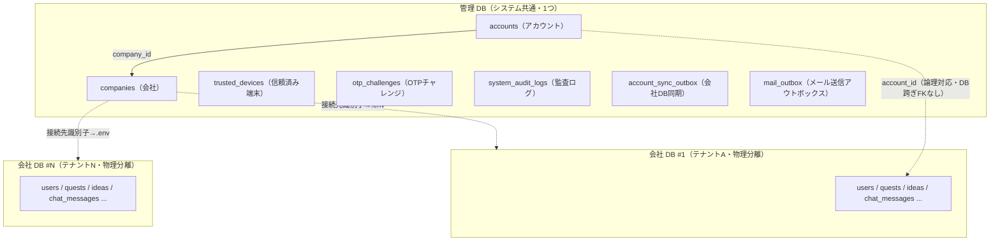
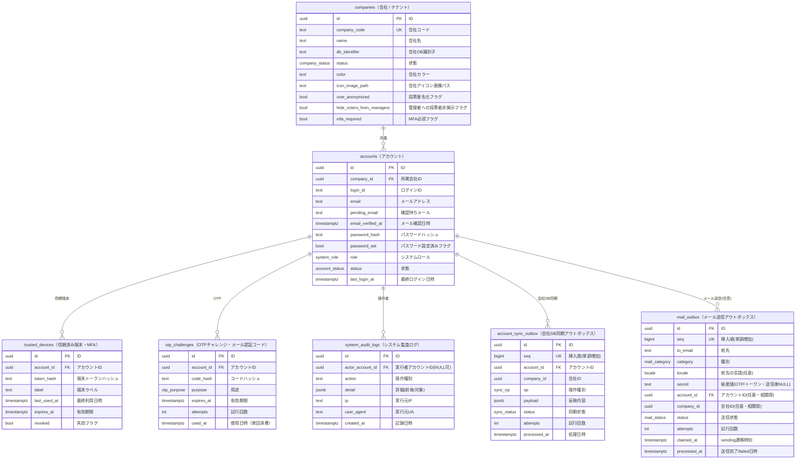
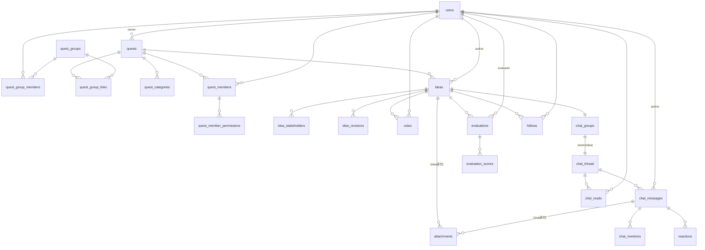
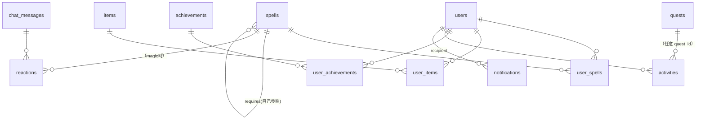

# ideaquest データモデル詳細

> **位置づけ**: 本ファイルは要件定義書 `doc/要件定義/README.md` 第9節「データモデル」を、実装（PostgreSQL スキーマ／SQLAlchemy モデル）に落とし込むための **詳細設計**（ER 図・テーブル定義・型・制約・インデックス）。
> **正典は README**。齟齬があれば README を優先し、確定した変更は README ＋ 本ファイル ＋ handoff を同時更新する。
>
> - 最終更新: 2026-07-19
> - 対象フェーズ: データモデル詳細（画面設計フェーズ完了後の次フェーズ第1段）
> - 次段: API 設計 → 実装（compose / スキャフォールド）

---

## 0. 目次

1. 全体構成（2 層 DB）
2. 命名規約・共通方針
3. Enum（列挙型）一覧
4. 管理 DB（コントロールプレーン）
5. 会社 DB（データプレーン）
6. 全文検索の索引（FR-31）
7. 集計・派生値の扱い（XP/コイン/SP/ランキング）
8. データモデル関連の決定事項（旧 TBD・確定済み）
9. 次アクション

---

## 1. 全体構成（2 層 DB）

エンティティは **2 種類の DB** に分かれて格納される（README 第9節）。

- **管理 DB（コントロールプレーン / システム共通・1 つ）**
  認証・テナント振り分けに必要な情報を全社横断で保持。ログイン時にここで所属会社を判定し、当該 **会社 DB** へ動的ルーティングする。
- **会社 DB（データプレーン / 会社ごとに物理分離・別コンテナ）**
  各社のクエスト・アイデア・チャット・ゲーミフィケーション等の機密データを隔離して保持。

```mermaid
flowchart TB
  subgraph CP["管理 DB（システム共通・1つ）"]
    companies["companies（会社）"]
    accounts["accounts（アカウント）"]
    trusted_devices["trusted_devices（信頼済み端末）"]
    otp_challenges["otp_challenges（OTPチャレンジ）"]
    system_audit_logs["system_audit_logs（監査ログ）"]
    account_sync_outbox["account_sync_outbox（会社DB同期）"]
    mail_outbox["mail_outbox（メール送信アウトボックス）"]
  end
  subgraph DP1["会社 DB #1（テナントA・物理分離）"]
    UserA["users / quests / ideas / chat_messages ..."]
  end
  subgraph DP2["会社 DB #N（テナントN・物理分離）"]
    UserN["users / quests / ideas / chat_messages ..."]
  end
  accounts -->|company_id| companies
  companies -.->|接続先識別子→.env| DP1
  companies -.->|接続先識別子→.env| DP2
  accounts -.->|account_id（論理対応・DB跨ぎFKなし）| UserA
```

**DB 跨ぎの参照は物理 FK を張れない**（別インスタンスのため）。管理 DB の `accounts` と 会社 DB の `users` は **`account_id`（UUID）で論理的に対応付け**る。整合はアプリ層で担保し、**認証系属性（`login_id`/`email`/`status`/`password_set`/`system_role`/`last_login_at`）は `accounts` を源泉に `users` へ一方向ミラー**する（アウトボックス＝§4.6 `account_sync_outbox`・冪等/結果整合）。これによりユーザ一覧は会社 DB 単独で描画できる（§5.3・§8-①）。

---

## 2. 命名規約・共通方針

- **物理テーブル名**: スネークケースの **複数形**（例: `quests`, `idea_revisions`, `evaluation_scores`）。
- **論理名（日本語）**: 各テーブル定義の見出しに「物理テーブル名（複数形 snake_case）＋日本語論理名」を、各カラムに「物理名＋日本語論理名」を併記する。ER 図のエンティティ名も物理テーブル名（複数形）に揃える。
- **カラム名**: スネークケース（英小文字）。
- **主キー**: `id UUID PRIMARY KEY DEFAULT gen_random_uuid()`。
  - 理由: マルチテナント・列挙耐性（連番推測を避ける）・MinIO オブジェクトキーや URL への露出耐性。`pgcrypto`（or PG13+ の `gen_random_uuid()`）前提。
- **タイムスタンプ**: `timestamptz`（UTC 保存・表示層で JST 変換）。
- **共通監査カラム（全テーブル共通装備）**: どのレコードも「**だれが・いつ・どのプログラムで**」登録／最終更新したかを追えるよう、**登録3点**（`created_at`/`created_by_id`/`created_program`）と**更新3点**（`updated_at`/`updated_by_id`/`updated_program`）を **全テーブルに必ず持たせる**。詳細は **§2.1**。
- **論理削除**: アカウントは無効化（`status=disabled`）＝論理削除（入力履歴は残す）。**`quests`/`ideas` は `deleted_at`＋`deleted_by_id` トゥームストーン**（一覧/参照は `deleted_at IS NULL` で絞る）、`quest_group_members`／`quest_members` は `removed_at`、`chat_messages` は `is_deleted`。その他も原則物理削除しない設計を優先（監査・履歴保持）。
- **外部キー**: 会社 DB 内は物理 FK を張る。**DB 跨ぎ**（accounts↔users＝`account_id` の論理対応）は **論理参照**（FK なし・アプリ整合）。**FK カラムの命名規則は §2.2** に定める。
- **Enum**: PostgreSQL の `ENUM` 型 or `text + CHECK`。本書では値集合を §3 に集約。実装ではマイグレーション容易性から `text + CHECK` を推奨（値追加が軽い）。
- **金額/ポイント**: XP・コイン・SP は `integer`（残高系は 0 以上を保証＝`CHECK (>= 0)`）。
- **添付/画像パス**: MinIO オブジェクトキー（ハッシュ名）を `text` で保持。バケット/プレフィックスは会社ごとに論理分離（実体名は元ファイル名と別）。

### 2.1 共通監査カラム（全テーブル共通装備）

**方針**: **すべてのテーブル**（管理 DB・会社 DB とも）に、以下の **6 カラムを共通装備**する。目的は「**どのレコードも、だれがいつどのプログラムで登録し、最後に更新したかが分かる**」こと。

| 物理名 | 論理名 | 型 | 制約 / 既定 | 説明 |
| --- | --- | --- | --- | --- |
| `created_at` | 登録日時 | timestamptz | NOT NULL, default now() | レコード作成時刻（UTC） |
| `created_by_id` | 登録者ID | uuid | NULL 可 | 登録した操作者。**会社 DB→`users`／管理 DB→`accounts`**。システム/バッチ登録は NULL（`created_program` で識別） |
| `created_program` | 登録プログラム | text | NOT NULL | 登録元プログラム識別子（例: API エンドポイント名・バッチ名・画面 ID `SC-xx`・`migration`・`seed`） |
| `updated_at` | 更新日時 | timestamptz | NOT NULL, default now() | **更新の都度** now() に更新（作成時は登録日時と同値） |
| `updated_by_id` | 更新者ID | uuid | NULL 可 | 最終更新の操作者。参照先は `created_by_id` と同じ。システム/バッチ更新は NULL |
| `updated_program` | 更新プログラム | text | NOT NULL | 最終更新元プログラム識別子（作成時は `created_program` と同値） |

- **命名**: `created_by_id`/`updated_by_id` は §2.2 の操作者規則（`<動作>_by_id`）に従う。プログラム列は `_program` サフィックス（`text`）。
- **参照先**: `created_by_id`/`updated_by_id` は会社 DB では `users`、管理 DB では `accounts` を指す。会社 DB 内は物理 FK（`ON DELETE RESTRICT`）、`accounts` を跨ぐ管理 DB 側は原則同一 DB 内 FK。**利用者を伴わない登録**（メール OTP 発行・監査ログ・プロビジョニング等）は `*_by_id` を NULL とし、`*_program` に処理主体を必ず残す。
- **更新の担保**: `updated_at`/`updated_by_id`/`updated_program` はアプリ層で更新の都度必ずセットする（または `BEFORE UPDATE` トリガで `updated_at` を強制）。監査ログ（`system_audit_logs`）や版管理（`idea_revisions`）は変更内容の履歴、本 6 カラムは各行の最終状態のメタ、と役割を分ける。
- **記載の省略**: 本 6 カラムは全テーブル共通のため、以降の各テーブル定義（§4・§5）および ER 図では **一律に列挙を省略**する（6 カラムは本規約によりすべてのテーブルに自動付与される）。各定義表・ER 図に監査カラムは記載しない。なお `created_at` を並び順・集計キーに使うインデックス定義（例: `(chat_group_id, created_at)`）は、カラムが本規約で存在することを前提にそのまま記す。

### 2.2 外部キー（FK）の命名規則

**基本規則**: FK カラム名 ＝ **`<参照先テーブル名の単数形>_id`**。

- 例: `company_id`→`companies` / `quest_id`→`quests` / `idea_id`→`ideas` / `evaluation_id`→`evaluations` / `chat_group_id`→`chat_groups`。
- **単数化**: 複数形を素直に単数化する。不規則・複合語は以下に従う。
  - `companies`→`company`（`company_id`）、`activities`→`activity`（`activity_id`）
  - `quest_categories`→`quest_category`、`idea_stakeholders`→`idea_stakeholder`、`chat_messages`→`chat_message`（複合語は末尾のみ単数化）

**例外規則（役割名を付ける場合）**: 参照先が一意に決まらない／意味を明確にしたい場合は **役割名** を用いる。命名は原則 `<役割>_<参照先単数形>_id`、慣用的に参照先が自明なものに限り `<役割>_id` を許容し、**定義表に参照先（`FK→<table>`）を必ず明記**する。

1. **意味的な役割 / 同一テーブルへ複数 FK**:
   - `<役割>_id`（参照先が自明なもの）: `owner_id` / `author_id` / `editor_id` / `evaluator_id` / `recipient_id`（いずれも→`users`）
   - `<役割>_<単数形>_id`（明確化）: `mentioned_user_id`（→`users`）、`actor_account_id`（→`accounts`）
2. **自己参照**: `<役割>_<単数形>_id`。例: `requires_spell_id`（→`spells`）、`reply_to_message_id`（→`chat_messages`）
3. **操作者（誰が〜したか）**: `<動作>_by_id`（**末尾は必ず `_id`**）。例: `uploaded_by_id`（→`users`）、`granted_by_id`（→`users`）
4. **任意・多態的な参照**（1 カラムで種別により参照先が変わり得る／複数の参照候補を並べる通知等）: 接頭辞 `ref_` ＋ `<単数形>_id`。例: `ref_idea_id` / `ref_chat_message_id` / `ref_idea_revision_id` / `ref_achievement_id`。型を持たず ID のみの汎用参照は `ref_id`（FK なし）＋判別列 `ref_type`（enum・参照先テーブル名）で表す（多態参照の discriminator。例: `activities.ref_type`/`ref_id`・§5.27）。

**共通ルール**:

- FK カラムは **必ず `_id` で終える**（`_by` 単独等は使わない）。
- **参照先は定義表の `FK→<table>` 表記または説明で必ず明示**（役割名から参照先が読み取れない場合の曖昧さ回避）。
- **DB 跨ぎの参照**（`accounts`↔`users` の `account_id` 対応）は物理 FK を張らない **論理参照**。カラム名は同一規則に従い、定義表に「論理参照→…」と明記する。
- 会社 DB 内は物理 FK を張り、`ON DELETE` は原則 **`RESTRICT`**（履歴保持のため物理削除を避け、論理削除/トゥームストーンを優先）。

---

## 3. Enum（列挙型）一覧

| Enum | 値 | 用途 |
| --- | --- | --- |
| `system_role` | `system_admin` / `company_account_admin` / `general` | accounts のシステムロール（会社DB `users.system_role` にミラー）。**会社スコープの管理役割**＝`system_admin`（運営・全社）／**`company_account_admin`（会社アカウント管理者＝自社全アカウントの発行/無効化/identity/PW を担う・会社設定/プロビジョニングは不可）**／`general`（一般）。**クエストグループ管理者は system_role では表さず、会社DB `quest_group_members.role=admin`（per-group）で表現**（B案・2026-07-27）。`company_account_admin` の追加は**職務分離（SoD）決定・2026-08-01・§8-⑯**＝アカウントのライフサイクル管理を QG 管理者から分離 |
| `quest_group_role` | `admin`（グループ管理者） / `member`（一般） | quest_group_members のグループ内ロール。**QG管理者の唯一の表現**（SC-90 のアクセス可否＝`admin` の有効所属を 1 つ以上持つこと・SC-90/92 の権限判定に使用） |
| `company_status` | `active` / `suspended` | 会社（テナント）状態 |
| `account_status` | `active` / `disabled`（論理削除） | accounts 状態 |
| `locale` | `ja`（日本語） / `en`（英語） | 表示言語（accounts のユーザー設定・users にミラー）。未設定(NULL)は Accept-Language→システム既定でフォールバック |
| `otp_purpose` | `login`（MFA） / `password_setup`（初回/再設定） / `email_change`（メール変更確認リンク・ADR-0008） / `email_verify`（現アドレスの到達/所有確認リンク・ADR-0009） | OTP チャレンジ用途 |
| `quest_status` | `draft`（下書き） / `recruiting`（募集中） / `in_progress`（進行中） / `evaluating`（評価中） / `completed`（完了） | quests ステータス |
| `join_request_status` | `pending`（申請中） / `approved`（承認・member 化済み） / `rejected`（却下・**非終端**＝後日承諾可） / `withdrawn`（申請者が取消） | クエスト参加リクエスト状態（`quest_join_requests`・FR-40）。遷移＝`pending→approved`／`pending→rejected`／`pending→withdrawn`／**`rejected→approved`（後日承諾・作成者/quest_admin のみ）**。`rejected→pending`（申請者からの再申請）は当面不可 |
| `idea_status` | `draft`（下書き） / `published`（公開） | ideas ステータス |
| `permission_type` | `owner`（所有者） / `quest_admin`（クエスト管理） / `evaluator`（評価者） / `vote`（投票） / `idea_create`（アイデア作成） / `comment`（コメント） | クエスト内 6 権限 |
| `vote_type` | `approve`（賛成） / `oppose`（反対） | 投票種別 |
| `reaction_type` | `normal`（絵文字） / `magic`（魔法） | チャットリアクション種別 |
| `spell_effect` | `fire` / `ice` / `thunder` / `sparkle` / `rainbow` / `aura` | 魔法エフェクト（`.spell-fx--*` と対応） |
| `spell_line` | `flame`（烈火系: 炎→雷→虹） / `quiet_light`（静輝系: 氷→キラキラ→オーラ） | 魔法系統（スキルツリー） |
| `rarity` | `common`（コモン） / `standard`（標準） / `rare`（レア） | 装備・魔法のレアリティ |
| `equipment_slot` | `head`（頭） / `face`（顔） / `body`（体） / `hand`（手持ち） / `background`（背景） | 装備スロット（各 1 点） |
| `avatar_base` | `male`（男性） / `female`（女性） | 3D アバターのベース体（男女 2 体・SC-31 §9.2）。将来 `animal_*` を追加予定（§9.6） |
| `evaluation_status` | `draft`（下書き・付与なし） / `submitted`（確定・XP/コイン付与） | 評価の状態 |
| `evaluation_visibility` | `party`（パーティー全員・既定） / `limited`（投稿者＋評価者＋所有者/管理） | 評価結果の公開範囲 |
| `evaluation_aspect` | `novelty`（新規性） / `impact`（影響度） / `feasibility`（実現度） / `fit`（適合性） / `cost`（コスト・低いほど高得点） | 評価の 5 観点 |
| `achievement_tier` | `bronze`（銅 ◆20） / `silver`（銀 ◆50） / `gold`（金 ◆150） | 実績ティア＋報酬コイン |
| `notification_type` | `mention` / `idea_comment`（自アイデアへ新規コメント） / `follow_comment` / `follow_evaluation` / `follow_selection` / `idea_updated`（版追加・投票見直し FR-34） / `achievement`（実績獲得） / `magic_reaction`（魔法リアクション受領） / `quest_party_invited`（クエスト公開時のパーティー招集・C.2 publish／宛先＝追加されたパーティーメンバー） / `join_request_received`（参加リクエスト受信・C.9／宛先＝作成者+quest_admin） / `join_request_decided`（参加リクエスト承認/却下・C.9／宛先＝申請者・params.result） / `quest_watch_update`（フォロー中クエストのメタ更新・C.9/FR-40／宛先＝フォロワー・params.event） / **`security_new_device`（新しい端末からのログイン）** / **`security_password_changed`（パスワード変更完了）** | 通知種別（SC-02）。**`security_*` は認証イベント由来のセキュリティ通知＝オプトアウト不可**（A.9-⑧） |
| `activity_kind` | `xp_gain` / `coin_gain` / `coin_spend` / `sp_gain` / `sp_spend` | XP/コイン/SP の増減履歴種別 |
| `activity_ref_type` | `ideas` / `evaluations` / `items` / `chat_messages` / `spells` / `achievements` / `concepts` | `activities.ref_id` の参照先テーブル判別（物理テーブル名。`ref_id` が NULL の事由〔login/levelup_sp〕では NULL）。`concepts`＝コンセプト投票 XP（`reason='concept_vote'`・§5.46・FR-42） |
| `sync_op` | `upsert`（発行/編集） / `disable`（無効化） / `enable`（再有効化） | account_sync_outbox の操作種別 |
| `sync_status` | `pending` / `done` / `failed` | account_sync_outbox の同期状態 |
| `mail_category` | `otp`（MFA認証コード） / `password_setup`（初回/再設定リンク） / `lock_notification`（一時ロック通知） / `email_change_confirm`（メール変更確認リンク＝新メール宛） / `email_change_notice`（メール変更通知＝旧メール宛・乗っ取り検知） / `email_verify_link`（現アドレス確認リンク＝現メール宛・ADR-0009） | mail_outbox のメール種別（送信時のテンプレ選択・§4.7・ADR-0007／ADR-0008／ADR-0009） |
| `mail_status` | `pending` / `sending` / `done` / `failed` | mail_outbox の送信状態（`sending`＝送信中の確保・重複緩和・§4.7・ADR-0007 §2.5） |
| `info_status` | `raw`（未判定・登録直後） / `curated`（属性付与/判定済み） / `archived`（アーカイブ＝論理削除） | 情報インプット `info_items` の状態（[情報インプット機能](設計ドラフト/情報インプット機能_設計.md) §3）。低摩擦登録は `raw`／`info_curator` が属性付与で `curated`／判定後のアーカイブも `info_curator`（物理削除なし・監査保持） |
| `info_priority` | `highest`（最高） / `high`（高い） / `normal`（普通） / `low`（低い） / `lowest`（最低） | 情報の優先度（#1） |
| `info_source` | `public_data`（公的機関） / `market_research`（民間調査/企業データ提供） / `news`（新聞・ネットニュース） / `event`（展示会・勉強会・セミナー） / `customer`（取引先・顧客） / `personal`（親族・友人・交友） / `competitor`（競合） / `investor`（株主・投資家） / `org_decision`（組織の決定事項） / `employee`（従業員） / `legal`（弁護士・法律専門家） / `research`（技術研究機関・コミュニティ） / `other` | 情報ソース（#2・出典の信頼性重み付けに使用・§7） |
| `info_classification` | `information`（情報） / `idea`（アイデア） / `request`（要望・要求） / `knowledge`（ナレッジ） / `proposal`（提案） / `other` | 情報分類（#3・**単一**） |
| `info_scope` | `external`（外部） / `internal`（内部） / `other` | 大分類（#6）。自社技術知見＝`internal`＋情報カテゴリ `internal_tech`/`internal_capability` で表現 |
| `info_target_business` | `innovation` / `bpo` / `generative_provider` / `it_infra_network` / `software_dev` / `it_service_ops` / `other` | 対象事業（#7・MVP 固定／会社拡張は Phase2） |
| `info_category` | 外部系: `ext_economy` / `ext_politics_law` / `ext_society_culture` / `ext_industry` / `ext_competitor` / `ext_technology` / `ext_geography` / `ext_other`／内部系: `internal_tech` / `internal_capability` / `internal_process` / `internal_people` / `internal_customer` / `internal_partner` / `internal_finance` / `internal_culture` / `internal_hr` | 情報カテゴリ（#8・**複数可**＝`info_item_categories` M:N・§5.34） |
| `info_impact_level` | `unknown`（判断できない） / `none`（影響なし） / `minor`（軽度） / `moderate`（中度） / `major`（重度） / `severe`（過大） | 影響度（#9・環境スキャン） |
| `info_impact_class` | `opportunity`（機会） / `threat`（脅威） / `other` | 影響分類（#10・**情報本体の一般的性質**）。リンク種別 `info_link_kind`（per-link）とは別軸で併用（§5.35・[情報インプット機能](設計ドラフト/情報インプット機能_設計.md) §11-⑤） |
| `info_impact_timing` | `unknown`（不明） / `within_3y` / `within_1y` / `within_6m` / `within_3m` / `already`（すでに発生） | 影響発生時期（#11・事象の予測時期。期限日 `due_date`〔対応/有効期限〕とは別軸） |
| `info_triage` | `innovation`（イノベーション活動） / `improve_business`（カイゼン〔ビジネス〕） / `improve_ops`（カイゼン〔業務事務〕） / `task`（タスク活動） / `share`（情報共有活動） / `other` / `no_action`（対応不要） | 情報判定（#13・トリアージ） |
| `info_link_kind` | `related`（関連・中立＝既定） / `supporting`（裏付け） / `refuting`（反証・脅威） | 情報↔成果物リンクの種別（**per-link・特定の相手との関係**）。`refuting`（manual）で通知＋要再評価が発火（§5.35・§11-⑤） |
| `info_link_origin` | `auto`（類似度で自動生成・既定=related） / `manual`（人が手動追加） | 情報リンクの由来（§5.35） |
| `info_link_target` | `ideas` / `concepts` / `quests` / `assumptions` | 情報リンクの相手テーブル判別（多態参照 discriminator・§2.2 #4）。`concepts`/`assumptions` は[コンセプト機能](設計ドラフト/コンセプト機能_ISO56001_再設計.md)段で実体化 |
| `info_link_disposition` | `pending`（未処理・既定） / `adopted`（採用） / `declined`（不採用） | 成果物側の採否（FR-41 Phase2・per-link・§5.35）。設定は成果物側の管理権限者のみ。`pending` 以外はリンクの棄却/種別変更をロック |
| `concept_status` | `draft`（下書き・本人のみ） / `active`（有効＝議論/評価の対象） / `archived`（アーカイブ＝論理削除） | コンセプト `concepts` の状態（FR-42・[コンセプト機能](設計ドラフト/コンセプト機能_ISO56001_再設計.md)・§5.38）。`ideas` の draft/published を踏襲しつつ複数候補運用のため active/archived に拡張。選定は `is_selected` 列・判定は `decision` 列で別に持つ |
| `concept_decision` | `undecided`（未判定・既定） / `go`（推進） / `pivot`（方向転換） / `kill`（中止） | コンセプト自身の総合判定（§3.3・**"Go/Pivot/Kill" は当社ラベル**＝ISO は反復検証＋選定で表現）。評価者の推奨は `concept_evaluations.recommendation` に別途持つ |
| `assumption_verdict` | `inconclusive`（保留・既定） / `supported`（支持） / `refuted`（反証） | 前提の検証判定（§3.5）。`assumptions.current_verdict`＝最新の `assumption_validations` から導出したキャッシュ。`refuted` はリンク先コンセプトへ波及（要再評価・§5.41/5.42） |
| `concept_criticality` | `critical`（致命的） / `major`（重要） / `minor`（補助的） | コンセプト↔前提リンクの重要度（§3.5・**リンク単位**＝同じ前提でもコンセプトごとに重みが違う）。評価・判定の重み付けに使う |
| `concept_eval_aspect` | 中核: `desirability`（望ましさ） / `feasibility`（実現可能性） / `viability`（採算・事業性） / `assumption_strength`（前提検証の強さ） / `differentiation`（差別化）／補助: `novelty`（新規性） / `sustainability`（持続可能性） / `ip`（知的財産） | コンセプト評価の観点（§3.6・**ISO 56001 §8.3.3 準拠**＝中核5＋補助3）。アイデアの `evaluation_aspect`（5観点）とは別軸 |
| `concept_chat_scope_kind` | `overall`（総合ルーム・1） / `group`（グループ＝意味の束・3〜5） / `assumption`（前提スレッド＝前提1件=1スレッド） | コンセプト議論ルームの種別（§3.7・§5.45）。`assumption` スコープは `assumption_id` で前提に紐付く |

---

## 4. 管理 DB（コントロールプレーン）

```mermaid
erDiagram
  companies ||--o{ accounts : "所属"
  accounts ||--o{ trusted_devices : "信頼端末"
  accounts ||--o{ otp_challenges : "OTP"
  accounts ||--o{ system_audit_logs : "操作者"
  accounts ||--o{ account_sync_outbox : "会社DB同期"
  accounts ||--o{ mail_outbox : "メール送信(任意)"

  companies["companies（会社 / テナント）"] {
    uuid id PK "ID"
    text company_code UK "会社コード"
    text name "会社名"
    text db_identifier "会社DB識別子"
    company_status status "状態"
    text color "会社カラー"
    text icon_image_path "会社アイコン画像パス"
    bool vote_anonymized "投票匿名化フラグ"
    bool hide_voters_from_managers "管理者への投票者非開示フラグ"
    bool mfa_required "MFA必須フラグ"
  }
  accounts["accounts（アカウント）"] {
    uuid id PK "ID"
    uuid company_id FK "所属会社ID"
    text login_id "ログインID"
    text email "メールアドレス"
    text pending_email "確認待ちメール"
    timestamptz email_verified_at "メール確認日時"
    text password_hash "パスワードハッシュ"
    bool password_set "パスワード設定済みフラグ"
    system_role role "システムロール"
    account_status status "状態"
    timestamptz last_login_at "最終ログイン日時"
  }
  trusted_devices["trusted_devices（信頼済み端末・MFA）"] {
    uuid id PK "ID"
    uuid account_id FK "アカウントID"
    text token_hash "端末トークンハッシュ"
    text label "端末ラベル"
    timestamptz last_used_at "最終利用日時"
    timestamptz expires_at "有効期限"
    bool revoked "失効フラグ"
  }
  otp_challenges["otp_challenges（OTPチャレンジ・メール認証コード）"] {
    uuid id PK "ID"
    uuid account_id FK "アカウントID"
    text code_hash "コードハッシュ"
    otp_purpose purpose "用途"
    timestamptz expires_at "有効期限"
    int attempts "試行回数"
    timestamptz used_at "使用日時（単回消費）"
  }
  system_audit_logs["system_audit_logs（システム監査ログ）"] {
    uuid id PK "ID"
    uuid actor_account_id FK "実行者アカウントID(NULL可)"
    text action "操作種別"
    jsonb detail "詳細(前後/対象)"
    text ip "実行元IP"
    text user_agent "実行元UA"
    timestamptz created_at "記録日時"
  }
  account_sync_outbox["account_sync_outbox（会社DB同期アウトボックス）"] {
    uuid id PK "ID"
    bigint seq UK "挿入順(単調増加)"
    uuid account_id FK "アカウントID"
    uuid company_id "会社ID"
    sync_op op "操作種別"
    jsonb payload "反映内容"
    sync_status status "同期状態"
    int attempts "試行回数"
    timestamptz processed_at "処理日時"
  }
  mail_outbox["mail_outbox（メール送信アウトボックス）"] {
    uuid id PK "ID"
    bigint seq UK "挿入順(単調増加)"
    text to_email "宛先"
    mail_category category "種別"
    locale locale "宛先の言語(任意)"
    text secret "秘匿値(OTP/トークン・送信後NULL)"
    uuid account_id FK "アカウントID(任意・相関用)"
    uuid company_id "会社ID(任意・相関用)"
    mail_status status "送信状態"
    int attempts "試行回数"
    timestamptz claimed_at "sending遷移時刻"
    timestamptz processed_at "送信完了/failed日時"
  }
```

### 4.1 companies（会社 / テナント）

会社（テナント）。**会社単位の設定フラグ**（投票匿名化・管理者への開示・MFA 必須）を保持する（SC-92 会社設定で編集）。**参照タイミング**＝`mfa_required` はログインフロー時／`vote_anonymized`・`hide_voters_from_managers` は**表示時に都度参照**（投票表示＝API設計ドメイン D）。実行時は本テーブルを毎回引かず **Redis `company_config:{company_id}` キャッシュ経由**で読み、**設定変更（`PATCH .../settings` 等）時にキャッシュを無効化して次リクエストから即時反映**する（キャッシュ内容・無効化契機の一覧＝API設計 §1.14）。

| 物理名 | 論理名 | 型 | 制約 / 既定 | 説明 |
| --- | --- | --- | --- | --- |
| `id` | ID | uuid | PK | |
| `company_code` | 会社コード | text | NOT NULL, UNIQUE | 業務上の会社識別コード（全社で一意）。ログイン時の会社指定・管理表示に使用（`db_identifier` とは別の対人向けコード） |
| `name` | 会社名 | text | NOT NULL | |
| `db_identifier` | 会社DB識別子 | text | NOT NULL, UNIQUE | 会社 DB の識別子（接続情報の実体は `.env`。ここはキー/参照のみ） |
| `status` | 状態 | company_status | NOT NULL, default `active` | active / suspended（メンテ中）。**カラム既定は `active`（定常状態）だが、会社作成 API は作成時に明示的に `suspended` を渡す**＝MVP は DBプロビジョニングが手動（compose 手編集）で作成時点では会社DBが未整備のため。プロビジョニング完了後に運営が `active` へ切替（SC-91 §4.2/§5・API設計 B） |
| `color` | 会社カラー | text | NOT NULL, default（既定色） | プリセットパレットの hex（クエストカラーと同方式） |
| `icon_image_path` | 会社アイコン画像パス | text | NULL 可 | 会社アバター/アイコン（MinIO キー・任意）。未設定時は「頭文字＋会社カラー」タイル |
| `vote_anonymized` | 投票匿名化フラグ | boolean | NOT NULL, default `true` | ON=集計数のみ表示 |
| `hide_voters_from_managers` | 管理者への投票者非開示フラグ | boolean | NOT NULL, default `true` | 匿名時に所有者/管理者へも投票者を隠す |
| `mfa_required` | MFA必須フラグ | boolean | NOT NULL, default `true` | メール OTP による MFA を必須化 |
| `game_mode_default` | ゲームモード会社既定 | boolean | NOT NULL, default `true` | 会社全体のゲーム層UI（演出・ショップ/きせかえ/魔法・実績・ランキング・ゲーム系通知・チャット魔法）の**既定** ON/OFF（SC-91 会社設定で編集・レビュー#2）。`true`＝ゲーム層あり（現行挙動）。**個人の実効値は `accounts.game_mode_override` が非 NULL ならそれを優先し、NULL なら本既定を継承**（未操作の個人＝本既定に即追従＝会社統制点）。**ゲームのロジック（XP/コイン付与・レベル計算等）は本フラグと無関係に据え置き**＝UI 表示の出し分けのみ（レビュー#2 §6）。`vote_anonymized` 等と同様 `company_config:{company_id}` キャッシュ経由で参照 |

- インデックス: `UNIQUE(company_code)`、`UNIQUE(db_identifier)`、`(status)`。
- **会社コードのフォーマット規約（初期値・調整可）**: 半角英大文字・数字・ハイフン（`A–Z` / `0–9` / `-`）、**4〜20 文字**、**先頭は英字**、**全社で一意**、**大小文字は区別しない**（入力を大文字へ正規化して保存・照合）。原則**作成時に確定し以後不変**（対人向け識別子のため変更は運用影響大）。
- 注: `hide_voters_from_managers` は `vote_anonymized=false`（記名モード）のとき意味を持たない（アプリ側で無効化表示・SC-92）。
- **運営テナント（プラットフォーム管理用の予約会社）＝ seed で 1 社（§8-⑮）**: system_admin アカウントの収容先。会社コードは予約値（例 `OPS`）・`status=active`・専用会社DB を持つ。**一般テナントと同じ物理構造**だが業務利用しない（クエスト等を作らない）＝**用途で分離**。「会社レス（`company_id` を持たない）アカウント」は非採用（案A）＝`accounts.company_id` の `NOT NULL` を維持。運営テナント自体は削除/無効化不可（ロックアウト防止・API設計 B.6）。

### 4.2 accounts（アカウント）

**ログイン ID とメールは別カラム**（README 2026-07-19 変更）。ログイン ID は英数字等の任意識別子でも可、メール変更でログイン ID は不変。

| 物理名 | 論理名 | 型 | 制約 / 既定 | 説明 |
| --- | --- | --- | --- | --- |
| `id` | ID | uuid | PK | 会社 DB の `users.account_id` と論理対応 |
| `company_id` | 所属会社ID | uuid | NOT NULL, FK→companies | 所属会社（テナント） |
| `login_id` | ログインID | text | NOT NULL | ログイン識別子。**会社内で一意**（`UNIQUE(company_id, login_id)`） |
| `email` | メールアドレス | text | NOT NULL | OTP 送信・初回パスワード設定リンク・将来の外部通知の宛先。**会社内で一意**（`UNIQUE(company_id, email)`） |
| `pending_email` | 確認待ちメール | text | NULL 可 | メール変更（ドメイン K・`POST /me/email`）で**確定待ち**の新メール。確認リンク（`otp_challenges.purpose=email_change`）到達で `email` へ確定しクリア（ダブルオプトイン・API設計 K.3／ADR-0008）。**一意制約なし**（確定時に会社内一意を再検証＝first-confirm-wins）。未確認は NULL |
| `email_verified_at` | メール確認日時 | timestamptz | NULL 可 | 現 `email` が到達/所有確認済みになった日時（管理者 opt-in「確認メール送信」→本人クリックで確定・**ADR-0009**／自己変更 K.3 の確定でも now を刻む）。**未確認は NULL**。**`email` が変わったら必ず NULL リセット**（管理者/自己の直接変更）。一覧の「未確認/確認済み」バッジの源泉（`email_verified = email_verified_at != null`） |
| `display_name` | 氏名（表示名） | text | NOT NULL | 氏名（表示名）。**源泉（source of truth）＝本テーブル**（会社 DB `users.display_name` へ §4.6 outbox でミラー）。発行時に設定・プロフィール編集（ドメイン K・`PATCH /me`）で変更可（accounts 更新＋同一Tx で outbox）。**2026-08-08 決定（ドメインK・1b）＝identity（login_id/email/locale/display_name）を accounts に源泉一元化**（会社DB側を源泉にせず DRY・上書き競合を排除） |
| `password_hash` | パスワードハッシュ | text | NULL 可 | 初回ログイン前は NULL。ハッシュ（Argon2id 等） |
| `password_set` | パスワード設定済みフラグ | boolean | NOT NULL, default `false` | 初回パスワード設定済みか |
| `role` | システムロール | system_role | NOT NULL, default `general` | `system_admin`（運営）/ **`company_account_admin`（会社アカウント管理者＝自社全アカウントの発行/無効化/identity/PW・会社設定は不可）** / `general`（一般）。**QG管理者はここでは表さない**（会社DB `quest_group_members.role=admin` で表現・B案）。`company_account_admin` は §8-⑯（SoD・2026-08-01） |
| `status` | 状態 | account_status | NOT NULL, default `active` | active / disabled（論理削除＝無効化） |
| `last_login_at` | 最終ログイン日時 | timestamptz | NULL 可 | 管理画面の「最終ログイン」表示に使用 |
| `locale` | 表示言語 | locale | NULL 可 | ユーザーの表示言語設定（`ja`/`en`）。未設定は Accept-Language→システム既定でフォールバック。会社 DB `users` へミラー。**プロフィール編集で変更可**。OTP/通知等のシステム生成メールの言語にも使用 |
| `reduce_motion` | アニメ演出の抑制 | boolean | NOT NULL, default `false` | UI アニメ演出のユーザー別 OFF（プロフィール編集 `PATCH /me` で変更可・デザイン標準 §4.9）。`true`＝この人は演出を抑制。**実効 = OS `prefers-reduced-motion` OR 本フラグ**（OS が最優先の下限＝OS が reduce なら本値に関係なく常に抑制）。**UI 個人設定＝会社 DB `users` へはミラーしない**（identity/認証系ではないため・`accounts` のみで完結）。既定 `false`（演出あり） |
| `mascot_follow` | アバター追従アニメの表示 | boolean | NOT NULL, default `true` | ダッシュボードでアバター（暫定＝アイコン #20）がカードに追従する演出のユーザー別 ON/OFF（`PATCH /me` で変更可・§4.9 系）。`true`＝表示（既定＝現行挙動）。**実効表示 = 本フラグ AND NOT `reduce_motion` 実効**（＝OS reduce OR `reduce_motion` が立てば追従も出さない）。かなり目立つ演出のため、動きを全部は止めたくないユーザーでも追従だけ切れるよう独立設定。`reduce_motion` 同様 `users` へはミラーしない（`accounts` のみ） |
| `game_mode_override` | ゲームモード個人上書き | boolean | NULL 可, default `NULL` | ゲーム層UIの個人 ON/OFF **上書き**（プロフィール編集 `PATCH /me` で変更可・レビュー#2）。**三値**＝`NULL`（未指定＝会社既定 `companies.game_mode_default` を継承）／`true`（個人で ON）／`false`（個人で OFF）。**実効値 = 本値が非 NULL ならそれ、NULL なら会社既定**（`effective = override ?? company.game_mode_default`）。会社既定が効くのは**個人が未指定（NULL）の間**＝一度操作すると以後は個人値が優先。SC-03 の3選セグメント（会社設定に従う／ON／OFF）の「会社設定に従う」が本値の NULL 化。双方向自由（会社 OFF でも個人 ON 可）。**UI 個人設定＝会社 DB `users` へはミラーしない**（`reduce_motion` と同様・`accounts` のみで完結）。既定 `NULL`（会社既定に従う） |

- インデックス: `UNIQUE(company_id, login_id)`、`UNIQUE(company_id, email)`、`(company_id, status)`。
- 注: `login_id`・`email` はいずれも**会社内で一意**（会社跨ぎでは重複可＝独立テナント。グローバル一意は要件外）。**ログインは「会社コード（`companies.company_code`）で会社を特定 → その会社内で login_id → password」の流れ**（全社同一 URL・会社選択式にはしない＝§8-② 決定）。会社コードは端末に記憶してプリフィル可。
- **会社 DB `users` へのミラー（源泉＝本テーブル）**: `login_id` / `email` / `display_name` / `status` / `password_set` / `role`（→users.`system_role`） / `last_login_at` / `locale` は会社 DB `users` に**一方向でミラー複製**し、ユーザ一覧を会社 DB 単独で描画できるようにする（API 往復を避ける）。**源泉（source of truth）は本 `accounts`** で一意検証もここで行い、変更は §4.6 `account_sync_outbox` 経由で会社 DB へ反映する。詳細は §8-①。
- **system_admin アカウントの所属＝運営テナント（§4.1・§8-⑮）**: `company_id` は運営テナント（予約会社・例 `OPS`）を指す（会社レスは非採用＝案A）。**認可は所属ではなく `role=system_admin`（コントロールプレーン）で判定**するため、運営者は業務クエストに参加しなくてよい。**最初の system_admin は seed で作成**（ブートストラップ・§8-⑮／API設計 B.5）。**最後の system_admin は剥奪/無効化不可**（ロックアウト防止・API設計 B.6）。

### 4.3 trusted_devices（信頼済み端末・MFA）

パスワード成功後に照合し、有効なら OTP をスキップ（有効期限 30 日）。

| 物理名 | 論理名 | 型 | 制約 / 既定 | 説明 |
| --- | --- | --- | --- | --- |
| `id` | ID | uuid | PK | |
| `account_id` | アカウントID | uuid | NOT NULL, FK→accounts | |
| `token_hash` | 端末トークンハッシュ | text | NOT NULL | 端末 Cookie 値のハッシュ |
| `label` | 端末ラベル | text | NULL 可 | UA 由来の表示名 |
| `last_used_at` | 最終利用日時 | timestamptz | NULL 可 | |
| `expires_at` | 有効期限 | timestamptz | NOT NULL | 発行から 30 日 |
| `revoked` | 失効フラグ | boolean | NOT NULL, default `false` | パスワード変更/リセット・全端末サインアウト・管理操作で失効 |

- インデックス: `(account_id)`、`(token_hash)`。
- 失効トリガ: パスワード変更/リセット時は当該アカウントの全レコードを `revoked=true`。

### 4.4 otp_challenges（OTP チャレンジ・メール認証コード）

**実体は Redis 等の TTL 付き一時ストアを基本（§8-⑨ 決定）**。10 分 TTL で自動失効・試行回数もそこで管理し、管理 DB のテーブルとしては持たない（バッチ削除不要）。以下の定義は **Redis を導入しない構成で DB 化する場合の代替**（この場合は期限切れのバッチ削除が必要）。

| 物理名 | 論理名 | 型 | 制約 / 既定 | 説明 |
| --- | --- | --- | --- | --- |
| `id` | ID | uuid | PK | |
| `account_id` | アカウントID | uuid | NOT NULL, FK→accounts | |
| `code_hash` | コードハッシュ | text | NOT NULL | `login`＝6 桁コードのハッシュ／`password_setup`・`email_change`＝リンクトークンのハッシュ |
| `purpose` | 用途 | otp_purpose | NOT NULL | login / password_setup / email_change |
| `expires_at` | 有効期限 | timestamptz | NOT NULL | **`login`＝発行から 10 分／`password_setup`（初回/再設定リンク）＝発行から 72 時間／`email_change`（メール変更確認リンク）＝発行から 24 時間**（`email_change_ttl_seconds`・ADR-0008）（SC-90 発行フロー決定 2026-07-20・失効時は管理者が再送） |
| `attempts` | 試行回数 | int | NOT NULL, default 0 | 上限で失効 |
| `used_at` | 使用日時 | timestamptz | NULL 可 | 単回使用＝`complete`／`confirm` 成功で打刻し以後は無効（`verify`/`complete`/`confirm` とも 410）。NULL＝未使用。`password_setup`・`email_change` で共用 |

- インデックス: `(account_id, purpose)`。
- **初回パスワード設定フロー（SC-93 会社アカウント管理者 / SC-92 システム管理者 のアカウント発行・PWリセット）**: `purpose=password_setup` の単回トークンをメールリンクで送付（TTL 72h）。送信基盤は dev=MailHog／prod=SMTP（SES 等）をアダプタで抽象化。`login` の 6 桁 OTP（TTL 10 分）とは用途・期限が異なる。
- **メール変更確認フロー（ドメイン K・`POST /me/email`・ダブルオプトイン・ADR-0008）**: `purpose=email_change` の単回トークンを**新メール**へリンク送付（TTL 24h・`email_change_ttl_seconds`）。到達確認（リンククリック＝`POST /me/email/confirm`）で `accounts.pending_email`→`email` を確定。最新要求のみ有効（旧 `email_change` チャレンジは失効）。

> **クエストグループ所属は管理 DB に持たない（§8-① 決定・2026-07-20）**: ユーザー × クエストグループの所属は **会社 DB `quest_group_members`（§5.5）を唯一の正**とする。ログイン時の参照範囲判定は会社 DB 接続後に行うため管理 DB 側の保持は不要（かつては `account_quest_groups` を管理 DB に置く案があったが、二重管理・機密性の観点で廃止）。割当操作（SC-90/SC-92）は対象会社の DB `quest_group_members` に対して行う。

### 4.5 system_audit_logs（システム監査ログ）

会社作成/設定変更・アカウントのライフサイクル/ロール変更・クエストグループ CRUD・所属変更等の**特権操作**を監査（API設計 B.6・§2-⑬）。**append-only**（更新/削除しない）。

| 物理名 | 論理名 | 型 | 制約 / 既定 | 説明 |
| --- | --- | --- | --- | --- |
| `id` | ID | uuid | PK | |
| `actor_account_id` | 実行者アカウントID | uuid | **NULL 可**, FK→accounts | 実行者。**利用者を伴わない処理（bootstrap/program）は NULL**（§4 監査規約） |
| `action` | 操作種別 | text | NOT NULL | 例: `account.issue`/`account.edit`/`account.disable`/`account.enable`/`account.password_reset`/`company.create`/`company.update`/`company.settings_update`/`quest_group.create`/`quest_group.rename`/`quest_group.delete`/`membership.add`/`membership.remove` |
| `detail` | 詳細 | jsonb | NULL 可 | 対象 ID・変更前後・memberships 等。**PW/トークン等の機密は入れない**（§15・A.9-⑥） |
| `ip` | 実行元IP | text | NULL 可 | 確定クライアント IP（ADR-0006） |
| `user_agent` | 実行元UA | text | NULL 可 | User-Agent |
| `created_at` | 記録日時 | timestamptz | NOT NULL, default now() | |

- インデックス: `(actor_account_id)`・`(action)`・`(created_at)`。**IP/UA は middleware が確定してリクエストコンテキスト（contextvar）に載せ、記録 helper が読む**（application のシグネチャを汚さず全操作で自動記録）。**読み取り系 EP は監査しない**（変更系のみ）。
- **監査するのは成功した変更系操作のみ**＝認可失敗（403）・入力検証エラー（422）・競合（409）等で**操作が確定しなかった場合は監査行を作らない**（操作が起きていないため）。記録は操作の成功確定（同一Tx 相乗 or post-commit）に紐づけ、途中で弾かれた試行は残さない。

### 4.6 account_sync_outbox（会社DB同期アウトボックス）

`accounts` の `login_id`/`email`/`status`/`password_set`/`role`(→`system_role`)/`last_login_at`（および氏名等の付随情報）を**会社 DB `users` へ一方向ミラー**するためのアウトボックス。**アカウント発行/編集/無効化/PWリセット、および本人のプロフィール編集**で `accounts` を更新するのと**同一トランザクション**で 1 行 INSERT し、常駐ワーカ（または定期ジョブ）が対象会社 DB の `users` へ冪等に適用する（会社 DB は別インスタンスのため 2 相コミットは行わず、アウトボックス＋再試行で結果整合を担保）。

| 物理名 | 論理名 | 型 | 制約 / 既定 | 説明 |
| --- | --- | --- | --- | --- |
| `id` | ID | uuid | PK | 行識別（ランダム・順序は表さない） |
| `seq` | 連番 | bigint | NOT NULL, Identity, UNIQUE | 挿入順の単調増加キー。取り出し/直列適用の順序に使う（uuid `id` は生成順を表さないため） |
| `account_id` | アカウントID | uuid | NOT NULL, FK→accounts | 対象アカウント |
| `company_id` | 会社ID | uuid | NOT NULL, FK→companies | 反映先会社 DB の特定に使用 |
| `op` | 操作種別 | sync_op | NOT NULL | `upsert`（発行/編集）/ `disable`（無効化）/ `enable`（再有効化） |
| `payload` | 反映内容 | jsonb | NOT NULL | `users` へ反映する値（`login_id`/`email`/`status`/`password_set`/`system_role`/`last_login_at`/`locale`/`display_name` 等）。会社 DB 側で **`account_id` をキーに upsert**（冪等） |
| `status` | 同期状態 | sync_status | NOT NULL, default `pending` | `pending` / `done` / `failed` |
| `attempts` | 試行回数 | int | NOT NULL, default 0 | 失敗時のリトライ回数（上限超で `failed`＝要手動対応） |
| `processed_at` | 処理日時 | timestamptz | NULL 可 | 反映完了時刻 |

- インデックス: `(status, seq)`（未処理の取り出し順）、`(account_id)`、`(company_id, status)`。
- **処理フロー（ワーカ・実装で固定する仕様）**:
  1. **書込側（同一トランザクション）**: エンドポイント処理が `accounts` を更新するのと**同一 Tx**で本テーブルへ 1 行 INSERT（`status=pending`）。両方コミット or 両方ロールバック＝「反映すべき仕事」の記録が原子的に残る（＝dual-write を避ける）。
  2. **取り出し**: 常駐ワーカ（`worker.py`・コーディング規約 §3.4）が `status=pending` を **`seq`（挿入順の単調増加）昇順**で読む。
  3. **接続先解決**: 行の **`company_id` → 管理DB `companies.db_identifier` → `.env` の接続情報**で反映先の会社 DB を解決（`get_tenant_session`）。※接続情報の実体は `.env`、管理DB `companies` は参照キー（§4.1）。
  4. **適用（冪等）**: 会社 DB で `payload` を **`account_id` をキーに `users` へ upsert**。発行（初期所属を相乗する場合）は **`users` → `quest_group_members` の順**で適用＝FK 順序を保証（API設計 B.5）。
  5. **消し込み/リトライ**: 成功で `status=done`・`processed_at` 記録。失敗は `attempts++` でリトライ、上限超で `status=failed`（要手動対応・監視/アラート対象）。
- **冪等性**: 会社 DB 側は `account_id` をキーに upsert（同一イベントの再適用が安全＝**at-least-once** 配信を前提）。反映先 `users` 行が未作成でも upsert で作成される（プロビジョニング直後の初回同期を兼ねる）。
- **順序（厳密・実装で固定）**: **同一 `account_id` は `seq`（＝挿入順＝因果順。壁時計ではない）で直列適用**。**失敗時はその `account_id` の後続を先に進めない（ヘッドオブライン・ブロッキング）**＝#3 が失敗したら #4 以降を待たせる（古い状態が新しい状態を上書きする退行を防ぐため）。**異なる `account_id` 間は独立**＝並列処理可（1 アカウントの `failed` 滞留が他アカウントを止めない）。
- `otp_challenges` 同様、実体を Redis/ジョブキューにする案もあるが、確実性重視で管理 DB にアウトボックステーブルを持つ本方式を基本とする（§8-①）。
- **適用対象＝発行/編集/無効化/PW/プロフィール（新規ミラー含む）**。**既存アカウントの所属変更（B.3）は user ミラー済みのため outbox を介さず会社 DB へ直接 upsert/トゥームストーン**（順序問題がなく直書きで十分・API設計 B.5）。

### 4.7 mail_outbox（メール送信アウトボックス）

認証系のシステム生成メール（**MFA の OTP／初回・再設定パスワード設定リンク／アカウント一時ロック通知**）を**非同期送信**するためのアウトボックス（[`ADR/ADR-0007_メール送信の非同期化.md`](ADR/ADR-0007_メール送信の非同期化.md)）。§4.6 `account_sync_outbox` と**型は同じ**（積む→常駐ワーカが処理→再試行→`attempts` 上限で `failed`）**だが用途は別**＝DB ミラーではなく**メール送信**で、**会社 DB を跨がない**（宛先は enqueue 時に確定）。application 層は SMTP を叩かず本テーブルへ 1 行 INSERT して即応答し、**専用のメールワーカ（account_sync とは別プロセス `mail_worker.py`）**が取り出して SMTP 送信する。これで同期送信が生む弱いタイミングオラクル・SMTP 失敗時の 500・列挙耐性の綻びを解消する（ADR-0007 §1）。

| 物理名 | 論理名 | 型 | 制約 / 既定 | 説明 |
| --- | --- | --- | --- | --- |
| `id` | ID | uuid | PK | 行識別（ランダム・順序は表さない） |
| `seq` | 連番 | bigint | NOT NULL, Identity, UNIQUE | 挿入順の単調増加キー。取り出しの**安定順序**に使う（uuid `id` は生成順を表さない＝§4.6 の `seq` と同じ思想） |
| `to_email` | 宛先 | text | NOT NULL | 送信先メールアドレス（enqueue 時に確定） |
| `category` | 種別 | mail_category | NOT NULL | `otp` / `password_setup` / `lock_notification`（テンプレ選択・可視化・監視） |
| `locale` | 言語 | locale | NULL 可 | enqueue 時に確定した宛先の言語（`accounts.locale`・i18n）。NULL＝システム既定 |
| `secret` | 秘匿値 | text | NULL 可 | OTP コード／設定リンクのトークンを**単独で**保持。`lock_notification` は NULL。**送信成功／端末失敗で NULL 化**（完成本文は保存しない・下記） |
| `account_id` | アカウントID | uuid | NULL 可, FK→accounts | 監視/相関用（任意）。送信自体は本列に依存しない |
| `company_id` | 会社ID | uuid | NULL 可 | 監視/相関用（任意） |
| `status` | 送信状態 | mail_status | NOT NULL, default `pending` | `pending` / `sending` / `done` / `failed` |
| `attempts` | 試行回数 | int | NOT NULL, default 0 | 送信失敗リトライ回数（`mail_outbox_max_attempts` 超で `failed`） |
| `claimed_at` | 確保日時 | timestamptz | NULL 可 | `sending` へ遷移した時刻（滞留再送の判定に使用・下記 4） |
| `created_at` | 生成日時 | timestamptz | NOT NULL, default now | enqueue 時刻 |
| `processed_at` | 処理日時 | timestamptz | NULL 可 | 送信完了（または `failed` 確定）時刻 |

- インデックス: `(status, seq)`（未処理の取り出し順）、`(account_id)`（相関）。
- **件名・本文は列に持たない**＝`category`＋`locale`＋`secret`＋設定（有効期限等）から**メールワーカが送信時にレンダリング**する（テンプレは実装 1 箇所に集約）。これにより **OTP や設定リンクを埋め込んだ完成本文を DB に残さない**（秘匿値の at-rest 最小化・ADR-0007 §2.7）。
- **処理フロー（メールワーカ・実装で固定する仕様・ADR-0007 §2.4/§2.5）**:
  1. **enqueue（積むだけ）**: application 層が本テーブルへ 1 行 INSERT（`status=pending`）して即応答。`password-setup/request` は `otp_challenges` 作成と**同一 Tx**に相乗せて原子化。OTP 送信・ロック通知は周辺に DB 書込が無いため**単独 INSERT**。
  2. **確保→送信**: `pending` を `seq` 昇順で取り出し、`UPDATE ... SET status='sending', claimed_at=now WHERE id=? AND status='pending'` で**該当 1 行を原子的に確保**してから SMTP 送信（多重巡回でも二重取得しない）。
  3. **消し込み/リトライ**: 成功で `status=done`＋`secret=NULL`＋`processed_at`。失敗は `attempts++`・`status=pending` へ戻す（上限超で `status=failed`＋`secret=NULL`）。
  4. **滞留の再送**: `sending` のまま `mail_outbox_sending_reclaim_seconds`（既定 60 秒）を超えた行（＝SMTP 成功〜`done` 書込の間でクラッシュした疑い）だけを `pending` へ戻す。
  5. **掃除**: `done` かつ `processed_at` が `mail_outbox_done_retention_seconds`（既定 7 日）より古い行を**メールワーカが**削除（間引いて DELETE・別 cron を立てない）。`failed` 行は自動削除しない（要手動対応の異常シグナル）。
- **配送保証＝at-least-once**: 「SMTP 送信」と「`done` 書込」は単一 Tx にできないため、クラッシュ窓で**まれに重複送信**し得る（OTP/通知/リンクの重複受信は無害・トークンは単回/TTL）。exactly-once は採らない（ADR-0007 §2.5）。**順序保証・HOL ブロッキングは無い**＝各メールは独立事象で、1 通の失敗が他を止めない（§4.6 の直列適用とは対照的）。
- **§4.6 account_sync_outbox との違い（要点）**: (a) 会社 DB を**跨がない**（宛先確定のみ・ワーカは SMTP だけ）／(b) **順序不要・独立処理**（因果順が無い）／(c) 秘匿値を `secret` 列に隔離し送信後破棄／(d) 別プロセスの**メールワーカ**が処理（障害隔離）。
- `otp_challenges`・`account_sync_outbox` 同様、実体を Redis/ジョブキューにする案もあるが、**確実配送重視で管理 DB にアウトボックステーブルを持つ本方式を基本**とする（ADR-0007 §2.1）。

---

## 5. 会社 DB（データプレーン・会社ごとに物理分離）

会社 DB は **1 会社 = 1 DB（別インスタンス/コンテナ）**。以下のテーブルは各会社 DB 内に同一スキーマで存在する。会社を跨ぐ参照は存在しない（会社は暗黙）。

### 5.1 ER 図（コア: クエスト → アイデア → 評価 / チャット）

```mermaid
erDiagram
  users ||--o{ quest_group_members : ""
  quest_groups ||--o{ quest_group_members : ""
  quests ||--o{ quest_group_links : ""
  quest_groups ||--o{ quest_group_links : ""
  users ||--o{ quests : "owner"
  quests ||--o{ quest_categories : ""
  quests ||--o{ quest_members : ""
  users ||--o{ quest_members : ""
  quest_members ||--o{ quest_member_permissions : ""
  quests ||--o{ ideas : ""
  users ||--o{ ideas : "author"
  ideas ||--o{ idea_stakeholders : ""
  ideas ||--o{ idea_revisions : ""
  ideas ||--o{ attachments : "（idea添付）"
  ideas ||--o{ votes : ""
  users ||--o{ votes : ""
  ideas ||--|| chat_groups : ""
  chat_groups ||--|| chat_thread : "owner(idea)"
  chat_thread ||--o{ chat_messages : ""
  users ||--o{ chat_messages : "author"
  chat_messages ||--o{ attachments : "（chat添付）"
  chat_messages ||--o{ chat_mentions : ""
  chat_messages ||--o{ reactions : ""
  chat_thread ||--o{ chat_reads : ""
  users ||--o{ chat_reads : ""
  ideas ||--o{ evaluations : ""
  users ||--o{ evaluations : "evaluator"
  evaluations ||--o{ evaluation_scores : ""
  ideas ||--o{ follows : ""
  users ||--o{ follows : ""
```

### 5.2 ER 図（ゲーミフィケーション / 通知）

```mermaid
erDiagram
  users ||--o{ user_spells : ""
  spells ||--o{ user_spells : ""
  spells ||--o{ spells : "requires(自己参照)"
  chat_messages ||--o{ reactions : ""
  spells ||--o{ reactions : "（magic時）"
  users ||--o{ user_items : ""
  items ||--o{ user_items : ""
  users ||--o{ user_achievements : ""
  achievements ||--o{ user_achievements : ""
  users ||--o{ activities : ""
  quests ||--o{ activities : "（任意 quest_id）"
  users ||--o{ notifications : "recipient"
```

---

### 5.3 users（ユーザー）

会社 DB 内のユーザー。管理 DB の `accounts` と `account_id` で論理対応。プロフィール・ゲーミフィケーション残高を保持。

| 物理名 | 論理名 | 型 | 制約 / 既定 | 説明 |
| --- | --- | --- | --- | --- |
| `id` | ID | uuid | PK | |
| `account_id` | アカウントID | uuid | NOT NULL, UNIQUE（論理参照→管理DB.accounts） | |
| `login_id` | ログインID（ミラー） | text | NOT NULL | **管理DB `accounts.login_id` のミラー**（源泉＝accounts・一方向反映）。一覧表示用 |
| `email` | メールアドレス（ミラー） | text | NOT NULL | **管理DB `accounts.email` のミラー**（源泉＝accounts・一方向反映）。一覧表示用 |
| `status` | 状態（ミラー） | account_status | NOT NULL, default `active` | **管理DB `accounts.status` のミラー**。一覧は `status='active'` のみ表示（列としては非表示・フィルタキー） |
| `password_set` | パスワード設定済みフラグ（ミラー） | boolean | NOT NULL, default `false` | **管理DB `accounts.password_set` のミラー**。未設定（初回招待中）バッジ表示等に使用 |
| `system_role` | システムロール（ミラー） | system_role | NOT NULL, default `general` | **管理DB `accounts.role` のミラー**（`system_admin`/`company_account_admin`/`general`）。QG管理者は本列ではなく `quest_group_members.role=admin` で判定（B案）。`company_account_admin`＝会社アカウント管理者（§8-⑯）。※会社内ロール `role`（下記・一般/評価者）とは別概念。運営判定・一覧表示に使用 |
| `last_login_at` | 最終ログイン日時（ミラー） | timestamptz | NULL 可 | **管理DB `accounts.last_login_at` のミラー**。SC-93/SC-92 のアカウント一覧の「最終ログイン」表示に使用 |
| `locale` | 表示言語（ミラー） | locale | NULL 可 | **管理DB `accounts.locale` のミラー**。UI/通知の言語表示に使用（未設定は Accept-Language→既定でフォールバック） |
| `display_name` | 氏名（表示名・ミラー） | text | NOT NULL | **管理DB `accounts.display_name` のミラー**（源泉＝accounts・一方向反映・§4.6・2026-08-08 決定〔ドメインK・1b〕）。表示・一覧・氏名順ソートに使用 |
| `avatar_image_path` | アバター画像パス | text | NULL 可 | プロフィールアバター（MinIO キー・任意・会社DB所有＝K が `PUT /me/avatar-image` で更新） |
| `avatar_base` | アバターベース体 | avatar_base | NOT NULL, default `male` | 3D アバターのベース（男女 2 体＝`male`/`female`・SC-31 §9.2）。SC-31 ビューアの「ベース切替」で本人が変更。将来 `animal_*` を追加。会社 DB 単独列（管理 DB からのミラー対象外） |
| `role` | 会社内ロール | text | NOT NULL, default `general` | 一般/評価者（※権限はクエスト単位が主。ここは補助。QG管理者は本列ではなく `quest_group_members.role=admin` で表す） |
| `xp` | 累計XP | int | NOT NULL, default 0, CHECK(>=0) | |
| `level` | レベル | int | NOT NULL, default 1, CHECK(>=1) | XP から算出・キャッシュ |
| `coin_balance` | コイン残高 | int | NOT NULL, default 0, CHECK(>=0) | |
| `skill_point_balance` | スキルポイント残高 | int | NOT NULL, default 0, CHECK(>=0) | レベルアップで付与・魔法解放で消費 |
| `background_image_path` | 背景画像パス | text | NULL 可 | コンテンツ背景（MinIO キー・個人設定・全認証画面に適用） |

- インデックス: `UNIQUE(account_id)`、`(status, display_name)`（一覧: 有効ユーザの氏名順）、`(login_id)`、`(email)`。
- `level` は `xp` の従属値（Lv n→n+1 必要 XP = 100+(n-1)×50）。整合はアプリ層で更新（§7）。
- **`login_id`/`email`/`status`/`password_set`/`system_role`/`last_login_at`/`locale` はミラー列**（源泉＝管理DB `accounts`・一方向反映）。ユーザ一覧は本テーブルのみで描画し（`WHERE status='active'`）、管理DBへの API 往復を行わない。**変更契機＝①管理者のアカウント発行/編集/無効化/PWリセット（SC-93 会社アカウント管理者/SC-92 システム管理者）②本人のプロフィール編集（`login_id`/`email`/`locale`）③認証イベント（`password_set`＝初回PW設定完了時／`last_login_at`＝ログイン成功時）**。いずれも管理DB `accounts` を先に更新（一意検証込み）し、§4.6 `account_sync_outbox` 経由で本テーブルへ反映（冪等・再試行）。会社DB 側でこれらを直接編集しない（ミラーの上書き防止）。`system_role` は `system_role` enum（`account_status` と同様、管理DB定義の enum を会社DBにも定義）。

### 5.4 quest_groups（クエストグループ）

| 物理名 | 論理名 | 型 | 制約 / 既定 | 説明 |
| --- | --- | --- | --- | --- |
| `id` | ID | uuid | PK | |
| `quest_group_code` | クエストグループコード | text | NOT NULL, 部分 UNIQUE | 業務上のグループ識別コード（会社内で一意＝会社 DB 内で一意）。対人向けの識別子（`companies.company_code` と同方式）。**作成時に確定・以後不変**（リネームは `name` のみ・API設計 B.3） |
| `name` | グループ名 | text | NOT NULL | 表示名。**リネーム可**（system_admin・B.3 `PATCH`） |
| `deleted_at` | 削除日時 | timestamptz | NULL 可 | **グループ削除の論理削除（トゥームストーン）**。NULL＝有効。値あり＝削除済み（物理削除しない＝解除済み所属〔`quest_group_members.removed_at` 済〕の FK と監査を保持・§5.1）。一覧/候補/所属追加は `deleted_at IS NULL` で絞る。削除は**空グループ限定**（有効所属・クエストがあれば不可＝API設計 B.3 `DELETE`＝409 `in_use`） |

- インデックス: **`UNIQUE(quest_group_code) WHERE deleted_at IS NULL`**（有効グループのコードは会社内一意・削除後の同コード再作成を許容）。
- **コードのフォーマット規約（初期値・調整可）**: 半角英大文字・数字・ハイフン（`A–Z` / `0–9` / `-`）、**2〜20 文字**、**先頭は英字**、**会社内で一意**、**大小文字は区別しない**（入力を大文字へ正規化して保存・照合）。会社コードと同方針。
- **ライフサイクル（API設計 B.3・2026-08-11）**: 作成（`POST`・system_admin）／リネーム（`PATCH`＝`name` のみ・`quest_group_code` 不変）／削除（`DELETE`＝トゥームストーン・空グループ限定・有効所属やクエストがあれば 409 `in_use`）。いずれも system_admin 専用（会社構造の変更）。

### 5.5 quest_group_members（クエストグループ所属）

ユーザーは複数グループに所属可。パーティー候補・クエスト参照範囲の基礎。**ユーザー×クエストグループ所属の唯一の正**（§8-① 決定。管理 DB `account_quest_groups` は廃止）。ログイン後の参照範囲判定・SC-90/SC-92 の所属割当はいずれも本テーブルを更新/参照する。

| 物理名 | 論理名 | 型 | 制約 / 既定 | 説明 |
| --- | --- | --- | --- | --- |
| `id` | ID | uuid | PK | |
| `quest_group_id` | クエストグループID | uuid | NOT NULL, FK→quest_groups | |
| `user_id` | ユーザーID | uuid | NOT NULL, FK→users | |
| `role` | グループ内ロール | quest_group_role | NOT NULL, default `member` | `admin`（グループ管理者）/ `member`（一般）。**QG管理者の唯一の表現**（system_role では表さない・B案 2026-07-27）。SC-90 のアクセス可否＝`admin` の有効所属を 1 つ以上、および SC-90/92/93 の権限判定に使用。**`admin` への付与/剥奪は system_admin＋会社アカウント管理者（自社スコープ・2026-08-02 改定）**（QG 管理者は member 参加追加/除外のみで `admin` 昇格は不可・§8-①／API設計 B.2.1/B.7.2） |
| `removed_at` | 所属解除日時 | timestamptz | NULL 可 | **所属の論理削除（トゥームストーン）**。NULL＝有効な所属。値あり＝解除済み（監査保持・参照範囲判定や一覧からは除外）。アカウント無効化（`accounts.status`）とは独立に「グループから外す」操作で設定 |

- インデックス: **`UNIQUE(quest_group_id, user_id) WHERE removed_at IS NULL`**（同一ユーザーの有効な所属は 1 行のみ・解除後の再所属を許容）、`(user_id) WHERE removed_at IS NULL`（ユーザの有効な所属グループ引き＝参照範囲判定）。
- 参照範囲判定・SC-90 一覧・パーティー候補はすべて `removed_at IS NULL` で絞る。

### 5.6 quests（クエスト）

| 物理名 | 論理名 | 型 | 制約 / 既定 | 説明 |
| --- | --- | --- | --- | --- |
| `id` | ID | uuid | PK | |
| `owner_id` | 所有者（作成者）ID | uuid | NOT NULL, FK→users | 作成者＝既定で所有者・剥奪不可。**別格**＝どのクエストグループにも縛られない（クエストの参加部署に作成者が所属している必要はない・2026-09-11 再決定・§5.6b/C.0） |
| `title` | 件名 | text | NOT NULL | アイコン頭文字・一覧表示に不可欠 |
| `color` | クエストカラー | text | NOT NULL, default（既定色） | プリセットパレット hex |
| `purpose` | 目的・テーマ | text | NULL 可 | |
| `deadline` | 期限日 | date | NULL 可 | |
| `status` | ステータス | quest_status | NOT NULL, default `draft` | 下書き/募集中/進行中/評価中/完了 |
| `icon_image_path` | アイコン画像パス | text | NULL 可 | MinIO キー・任意。未設定時は「件名頭文字＋所有者アバター」 |
| `discoverable` | 発見公開フラグ | boolean | NOT NULL, default `false` | **参加メンバー以外にも掲示板（発見カタログ SC-13）で公開してよいか**の per-quest opt-in（作成者が設定・既定 OFF＝現状の party-only）。ON でも**中身（アイデア/チャット/評価）は非公開＝メタのみ**（発見門番 `can_discover_quest`・FR-40）。§5.6b の参加部署と **AND** で可視範囲を決める（参加部署 0 件＝discoverable ON で社内全員・`can_access_quest` の全社対称） |
| `deleted_at` | 削除日時 | timestamptz | NULL 可 | **論理削除（トゥームストーン）**。NULL＝有効。値あり＝削除済み（監査保持・一覧/参照から除外） |
| `deleted_by_id` | 削除者ID | uuid | NULL 可, FK→users | 削除実行者（所有者/管理権限者）。`deleted_at` と対で設定 |

- インデックス: `(status) WHERE deleted_at IS NULL`、`(owner_id)`。クエストはグループFKを持たない＝関連部署は `quest_group_links`（§5.6b）に多対多（0..N）で保持する。
- カテゴリは複数のため別テーブル `quest_categories`（5.7）。
- 表示/参照対象＝「**自分がパーティー参加中** かつ **現在いずれかの参加部署（`quest_group_links`・§5.6b）に所属**」のクエスト（参加部署が 0 件なら部署条件なし＝パーティー所属のみ）。`draft` は `owner_id` 本人のみ。**作成者（owner）は別格**＝部署条件を課さず常に全参照可（2026-09-11 再決定）。**参加部署はアクセス条件（門番）＝アクセスの都度、現在の所属で再判定**（異動で全参加部署を外れたら、名指しパーティー員でも参照不可）。**詳細・チャット・アイデア・評価・一覧のすべてを同一門番に揃える**（C.0）。**一覧/詳細/検索は `deleted_at IS NULL` で絞る**（削除済みは非表示・子データ〔カテゴリ/パーティー/アイデア等〕は物理削除せず監査保持）。物理削除は行わない（`ON DELETE RESTRICT`・§2）。

### 5.6b quest_group_links（クエスト×クエストグループ＝参加部署／アクセス条件・複数部署横断）

**1クエストに紐づく「参加部署（クエストグループ）」の多対多（0..N・2026-09-11 再決定・FR-38）**。役割は**アクセス条件（門番）**＝*参照するには、作成者を除き、いずれかの参加部署に現在所属していること*。**主グループ（primary）の概念は廃止**（フラットな 0..N・すべて同格）。

- **アクセス条件（門番）である**＝可視性・詳細・チャット・アイデア・評価すべてで「現在いずれかの参加部署に所属」を要求（§5.6/C.0）。**アクセスの都度、現在の所属で再判定**（異動で外れたら参照不可＝動的失効）。
- **参加者（候補）の範囲を縛る**＝パーティー候補は参加部署の有効所属者に限定（会社全体ではない）。参加資格のない部署のユーザーの追加は 422（§5.8/C.3）。
- **メンバーピッカーの部署フィルタも参加部署のみ**（参加部署に無い部署の人は追加できない＝そもそも候補に出さない）。
- **作成者の所属は不問**＝作成者は別格で、参加部署のどれにも所属していなくてよい（PM 的関与など。部署選択は会社の全部署ディレクトリから可）。
- **可変**＝作成後も追加/除外できる（`owner`/`quest_admin`・API C.2）。**0 件も可**＝その場合は部署条件なしで、**参照可は作成者＋名指しパーティー員のみ**（名指しは会社の有効ユーザー全体から選べる・異動失効なし）。1 件以上設定すると、以降は候補・アクセスがその参加部署に絞られる。
- **部署を外すと**、その部署にしか所属しないパーティー員は**再判定で参照不可**になる（除外自体は許容＝異動と同じ扱い。UI は影響人数を警告）。

| 物理名 | 論理名 | 型 | 制約 / 既定 | 説明 |
| --- | --- | --- | --- | --- |
| `id` | ID | uuid | PK | |
| `quest_id` | クエストID | uuid | NOT NULL, FK→quests | |
| `quest_group_id` | クエストグループID | uuid | NOT NULL, FK→quest_groups | 参加部署（クエストグループ） |
| `created_at` | 追加日時 | timestamptz | NOT NULL, default now() | 部署を関連付けた日時 |

- インデックス: **`UNIQUE(quest_id, quest_group_id)`**（同一部署の重複関連付け防止）、`(quest_group_id)`（部署→クエスト逆引き＝一覧の部署絞込）。**主グループの部分 UNIQUE は廃止**。
- **関連部署の追加/除外は行の挿入/削除**（軽量な関係行・監査は `system_audit_logs`／クエスト編集履歴）。
- **【将来拡張フック】動的メンバーシップ導出**＝本モデルは既に**アクセスを現所属で再判定**するため、異動による**失効**は自動。将来さらに部署所属者を**自動でパーティー追加**（既定権限付与・参加通知 H・チャット購読）まで踏み込む場合の**アンカーは本テーブル**で、実装時に `quest_members.source`（`manual`／`group:<id>`）等の provenance 列を追加する。**現時点では追加は名指し（`manual`）のみ**（投機的な列は今は置かない）。

### 5.7 quest_categories（クエストカテゴリー・複数可）

事前定義＋自由入力。1 クエストに複数付与可（README 2026-07-18 変更）。

| 物理名 | 論理名 | 型 | 制約 / 既定 | 説明 |
| --- | --- | --- | --- | --- |
| `id` | ID | uuid | PK | |
| `quest_id` | クエストID | uuid | NOT NULL, FK→quests | |
| `label` | カテゴリー名 | text | NOT NULL | 事前定義値 or 自由入力の正規化後 |
| `is_custom` | 自由入力フラグ | boolean | NOT NULL, default `false` | 自由入力由来か |

- インデックス: `(quest_id)`、`UNIQUE(quest_id, label)`（同一クエスト内の重複防止）。
- **別テーブルで確定（§8-⑧）**: 検索・集計・将来のマスタ昇格に有利なため配列案は不採用。自由入力ラベルは**アプリでトリム＋大小文字/全半角を正規化**し、`UNIQUE(quest_id, label)` で重複防止。`idea_stakeholders` も同方針。

### 5.8 quest_members（パーティー / クエスト参加者）

| 物理名 | 論理名 | 型 | 制約 / 既定 | 説明 |
| --- | --- | --- | --- | --- |
| `id` | ID | uuid | PK | |
| `quest_id` | クエストID | uuid | NOT NULL, FK→quests | |
| `user_id` | ユーザーID | uuid | NOT NULL, FK→users | 候補・追加可否は**アクセス条件と同一**＝**参加部署が 0 件なら会社の有効ユーザー全体**（`users.status='active'`）、**1 件以上なら当該参加部署（`quest_group_links`・§5.6b）のいずれかの有効所属者に限定**（範囲外は 422・C.3）。作成者は**別格**＝常に所有者・剥奪不可・部署非依存。**アクセスは所属の都度再判定**＝参加部署ありのときは、名指しでも異動で全参加部署を外れたら参照不可（§5.6b／C.0）。（将来の動的追加で `source`＝`manual`/`group:<id>` 列を追加予定・§5.6b フック） |
| `joined_at` | 参加日時 | timestamptz | NOT NULL, default now() | 再追加（トゥームストーン復活）時は `now()` に更新＝現在の参加開始を表す |
| `removed_at` | 除外日時 | timestamptz | NULL 可 | **パーティー除外の論理削除（トゥームストーン）**。NULL＝有効なパーティー参加。値あり＝除外済み（行は物理削除しない・監査/入力保持）。門番・参照範囲・候補判定はすべて `removed_at IS NULL` で絞る（`quest_group_members.removed_at` と同方式） |

- インデックス: **`UNIQUE(quest_id, user_id) WHERE removed_at IS NULL`**（同一ユーザーの有効なパーティー参加は 1 行のみ・除外後の再追加を許容）。
- **パーティーから外す＝`removed_at` を設定（論理削除・トゥームストーン）**。権限（`quest_member_permissions`）は削除して失うが、入力（アイデア/投票/評価/コメント）は削除しない（表示継続）。
- **再追加＝既存のトゥームストーン行を再利用**（`removed_at` を NULL に戻し `joined_at=now()` に更新・既定権限を再付与・`id`＝`quest_member_id` は保持）。新規行の作り直しはしない。

### 5.8b quest_join_requests（クエスト参加リクエスト・FR-40）

発見カタログ（SC-13）から出す参加申請。作成者/`quest_admin` が承認/却下し、承認で `quest_members` に追加。**1ユーザー1行（全体一意）**で status 遷移により「却下→後日承諾」を1行で表現する（部分ユニークにしない＝却下行を残す）。

| 物理名 | 論理名 | 型 | 制約 / 既定 | 説明 |
| --- | --- | --- | --- | --- |
| `id` | ID | uuid | PK | |
| `quest_id` | クエストID | uuid | NOT NULL, FK→quests | |
| `user_id` | 申請者ID | uuid | NOT NULL, FK→users | 発見可能（`can_discover_quest`）なクエストにのみ申請可（C.8） |
| `status` | 状態 | join_request_status | NOT NULL, default `pending` | pending/approved/rejected/withdrawn（§3 enum・遷移規則） |
| `message` | 申請メッセージ | text | NULL 可 | 任意の一言（申請時） |
| `created_at` | 申請日時 | timestamptz | NOT NULL, default now() | |
| `decided_at` | 決定日時 | timestamptz | NULL 可 | 承認/却下した日時 |
| `decided_by_id` | 決定者ID | uuid | NULL 可, FK→users | 承認/却下を実行した作成者 or `quest_admin` |

- インデックス: **`UNIQUE(quest_id, user_id)`**（1ユーザー1行・全体一意＝却下行を残して後日 `rejected→approved` するため**部分ユニークにしない**）、`(quest_id, status)`（クエスト×状態＝パーティータブの pending/rejected 一覧）、`(user_id, status)`（申請者ダッシュボード）。
- **承認（`→approved`）**＝同一 UoW で `quest_members` に追加（既定権限 comment/vote/idea_create・トゥームストーン再利用）＋`decided_at`/`decided_by_id` 記録。post-commit で申請者へ通知（H `join_request_decided`）。
- **却下（`→rejected`）は非終端**＝行を残し一覧下部に表示。`rejected→approved`（後日承諾）は作成者/`quest_admin` のみ。`rejected→pending`（申請者の再申請）は当面不可。
- **取消（`→withdrawn`）**＝申請者本人が `pending` を取り下げ。

### 5.8c quest_follows（クエストフォロー＝watch・FR-40）

発見したクエストを参加せず watch し、メタ級の更新を通知で受け取る関心表明。**アイデアの `follows`（§5.12）とは別テーブル**（対象が別・集計/通知の混線回避）。

| 物理名 | 論理名 | 型 | 制約 / 既定 | 説明 |
| --- | --- | --- | --- | --- |
| `id` | ID | uuid | PK | |
| `quest_id` | クエストID | uuid | NOT NULL, FK→quests | |
| `user_id` | フォロワーID | uuid | NOT NULL, FK→users | 非メンバー（参加したら自動「参加中」化＝表示は参加中優先） |
| `created_at` | フォロー日時 | timestamptz | NOT NULL, default now() | |

- インデックス: **`UNIQUE(quest_id, user_id)`**、`(user_id)`（ダッシュボードのフォロー中一覧）。
- **フォロー可＝`can_discover_quest(viewer, quest)` が真のときのみ**（draft/非 discoverable/部署外は不可＝発見と同じ門番の流用・C.8）。発見不可（discoverable OFF/異動で部署外）になったら**行は残しつつ**掲示板/通知から動的に外す（`can_access_quest` と同じ都度再判定）。復活で再表示。
- **報酬なし**（watch は関心表明であって貢献ではない）。通知は H `quest_watch_update`（ステータス変化/結果確定/締切/新着件数のみ・すべてメタ級）。参加リクエスト承認で member になったら自動「参加中」化。

### 5.9 quest_member_permissions（クエスト参加者権限）

`quest_members` に対し多。6 権限（§3 `permission_type`）。

| 物理名 | 論理名 | 型 | 制約 / 既定 | 説明 |
| --- | --- | --- | --- | --- |
| `id` | ID | uuid | PK | |
| `quest_member_id` | クエスト参加者ID | uuid | NOT NULL, FK→quest_members | |
| `permission` | 権限種別 | permission_type | NOT NULL | 6 権限のいずれか |
| `granted_by_id` | 付与者ID | uuid | NULL 可, FK→users | |
| `granted_at` | 付与日時 | timestamptz | NOT NULL, default now() | |

- インデックス: `UNIQUE(quest_member_id, permission)`。
- 新規参加者の既定権限＝`vote`＋`idea_create`＋`comment`（アプリで自動付与）。作成者の `owner` は剥奪不可。`owner` 付与は作成者のみ。

### 5.10 ideas（アイデア）

| 物理名 | 論理名 | 型 | 制約 / 既定 | 説明 |
| --- | --- | --- | --- | --- |
| `id` | ID | uuid | PK | |
| `quest_id` | クエストID | uuid | NOT NULL, FK→quests | |
| `author_id` | 投稿者ID | uuid | NOT NULL, FK→users | |
| `title` | 件名 | text | NOT NULL | 必須 |
| `body` | アイデア本文 | text | NOT NULL | 必須 |
| `value` | 価値 | text | NOT NULL | 必須 |
| `time_limit` | タイムリミット | date | NULL 可 | 任意 |
| `note` | 備考・特記事項 | text | NULL 可 | 任意 |
| `status` | ステータス | idea_status | NOT NULL, default `draft` | 下書き/公開 |
| `is_selected` | 選定フラグ | boolean | NOT NULL, default `false` | 採用＝XP200/選定通知 |
| `current_revision` | 現在の版番号 | int | NOT NULL, default 1 | idea_revisions と対応 |
| `deleted_at` | 削除日時 | timestamptz | NULL 可 | **論理削除（トゥームストーン）**。NULL＝有効。値あり＝削除済み（監査保持・一覧/参照から除外） |
| `deleted_by_id` | 削除者ID | uuid | NULL 可, FK→users | 削除実行者（投稿者本人/クエスト管理権限者）。`deleted_at` と対で設定 |

- インデックス: `(quest_id, status) WHERE deleted_at IS NULL`、`(author_id)`。
- 必須 3 項目（件名/本文/価値）が揃うまで投稿不可。`draft` は本人のみ表示。公開時に XP 付与（コインは評価連動）。
- **削除は論理削除（FR-02 の CRUD「削除」）**: `deleted_at` を設定し、一覧/詳細/全文検索/集計は `deleted_at IS NULL` で絞る。従属（`chat_groups`/`votes`/`evaluations`/`idea_revisions`/`attachments`/`follows`・`activities` の元帳）は物理削除せず監査保持（`ON DELETE RESTRICT`・§2）。**削除可否範囲＝投稿者本人＋クエスト管理権限者（owner/quest_admin）**（SC-21 §9 の可否範囲 TBD をこの方針で解消）。
- 利害関係者は複数のため別テーブル `idea_stakeholders`（5.11）。

### 5.11 idea_stakeholders（アイデア利害関係者・複数可）

事前定義＋自由入力・複数可（README 2026-07-18）。

| 物理名 | 論理名 | 型 | 制約 / 既定 | 説明 |
| --- | --- | --- | --- | --- |
| `id` | ID | uuid | PK | |
| `idea_id` | アイデアID | uuid | NOT NULL, FK→ideas | |
| `label` | 利害関係者名 | text | NOT NULL | |
| `is_custom` | 自由入力フラグ | boolean | NOT NULL, default `false` | 自由入力由来か |

- インデックス: `(idea_id)`、`UNIQUE(idea_id, label)`。

### 5.12 attachments（添付ファイル）

アイデアまたはチャットメッセージに紐づく。実体は MinIO（S3 互換）。物理名はハッシュ、元名は別カラム。

| 物理名 | 論理名 | 型 | 制約 / 既定 | 説明 |
| --- | --- | --- | --- | --- |
| `id` | ID | uuid | PK | |
| `idea_id` | アイデアID | uuid | NULL 可, FK→ideas | アイデア添付のとき |
| `chat_message_id` | チャットメッセージID | uuid | NULL 可, FK→chat_messages | チャット添付のとき |
| `object_key` | オブジェクトキー（物理名） | text | NOT NULL | MinIO オブジェクトキー（ハッシュ名） |
| `original_name` | 元ファイル名 | text | NOT NULL | 元アップロードファイル名 |
| `size_bytes` | ファイルサイズ | bigint | NOT NULL | バイト数 |
| `mime_type` | MIMEタイプ | text | NOT NULL | |
| `uploaded_by_id` | アップロード者ID | uuid | NOT NULL, FK→users | |
| `uploaded_at` | アップロード日時 | timestamptz | NOT NULL, default now() | |

- 制約: `CHECK (idea_id IS NOT NULL OR chat_message_id IS NOT NULL)`（どちらか一方に紐づく）、`CHECK (size_bytes > 0 AND size_bytes <= 20*1024*1024)`（1ファイル 20MB 上限・§8-⑦）。
- インデックス: `(idea_id)`、`(chat_message_id)`、**PGroonga 全文検索索引 `(original_name)`（§6・添付ファイル名検索）**。
- ダウンロードは権限検証＋署名付き URL 想定。
- **上限・許可形式（§8-⑦ 決定・初期値）**: 1ファイル **20MB**／1投稿（アイデア・メッセージ）あたり **10 件**まで。**許可 MIME（allowlist）**＝画像(`png`/`jpeg`/`gif`/`webp`)・`pdf`・Office(`docx`/`xlsx`/`pptx`)・テキスト(`txt`/`csv`/`md`)・`zip`。実行ファイル等は拒否。検証はアプリ層（MIME スニッフィング＋拡張子）＋上記 `size_bytes` の CHECK。会社別の上限設定は将来（当面は全社共通の既定値）。

### 5.13 votes（投票）

| 物理名 | 論理名 | 型 | 制約 / 既定 | 説明 |
| --- | --- | --- | --- | --- |
| `id` | ID | uuid | PK | |
| `idea_id` | アイデアID | uuid | NOT NULL, FK→ideas | |
| `user_id` | 投票者ID | uuid | NOT NULL, FK→users | 常に内部保持 |
| `type` | 投票種別 | vote_type | NOT NULL | 賛成/反対（締切まで変更可・再クリックで取消） |
| `voted_revision` | 投票時点の版 | int | NOT NULL | 陳腐化判定用 |
| `voted_at` | 投票日時 | timestamptz | NOT NULL, default now() | |

- インデックス: `UNIQUE(idea_id, user_id)`（1 人 1 票）。
- 表示上の記名/匿名は `companies.vote_anonymized` に従う（データは常に保持）。自分のアイデアへの投票も可。**投票で XP+5 は各アイデア初回のみ**（賛成/反対の切替・取消・再投票では追加なし＝§7 の冪等ルール）。日次上限＝初回投票 5 回/日。
- `voted_revision < ideas.current_revision` なら「更新前に投票」＝SC-22 で差分見直し導線。

### 5.14 idea_revisions（アイデア変更履歴・版）

編集（保存）ごとに 1 版追加。投票者＋フォロワーへ通知（FR-34）。

| 物理名 | 論理名 | 型 | 制約 / 既定 | 説明 |
| --- | --- | --- | --- | --- |
| `id` | ID | uuid | PK | |
| `idea_id` | アイデアID | uuid | NOT NULL, FK→ideas | |
| `revision` | 版番号 | int | NOT NULL | ideas.current_revision と整合 |
| `editor_id` | 編集者ID | uuid | NOT NULL, FK→users | |
| `changes` | 変更内容（版スナップショット） | jsonb | NOT NULL | **その版時点の対象フィールド全値のスナップショット**（§8-⑤ 決定）＝`title`/`value`/`body`/`time_limit`/`note`/`stakeholders`＋**`attachments`（添付ファイル名の一覧・昇順／2026-09-14 追加）**。差分は表示時に前版と比較して算出（添付の追加/削除も更新履歴の差分に出る＝フォロワーが気づける）。**添付は保存（updateIdea）時にスナップショットへ取り込む（1保存1版）**＝添付の追加/削除だけでも公開中は版が増える。旧スナップ（`attachments` 無し=None）は誤検知回避で差分対象外 |
| `memo` | 変更メモ | text | NULL 可 | 任意 |
| `created_at` | 版の記録日時 | timestamptz | NOT NULL, default now() | 版タイムライン（SC-22 更新履歴）の表示・議論アクティビティの更新マーカー元データ（API設計 D.4 §D.4）。版は不変のため更新列は持たない |

- インデックス: `UNIQUE(idea_id, revision)`。
- **差分方式（§8-⑤ 決定）**: 版ごとに**スナップショット**（対象フィールドの全値）を保存し、差分は**表示時にサーバーが前版と比較して算出**（後から差分アルゴリズムを変更可能・監査に強い）。語句差分の事前保存は行わない。

### 5.14b chat_thread（チャットスレッド・会話の単一の親／ホスト非依存）

**チャット中核（`chat_messages`/`chat_reads`/`reactions`＋従属の mentions/quotes/attachments）の唯一の所属**。中核は `thread_id` ただ一つで動く＝**ホスト非依存の自己完結サブシステム**（§3.8「ループ機構は一般化して共有」・FR-42・migration 0035）。将来どの機能にチャットを足しても**中核の migration/分岐は不要**＝ホスト側が `chat_thread` を 1 本持つだけでよい（＝二度と分離しない）。

| 物理名 | 論理名 | 型 | 制約 / 既定 | 説明 |
| --- | --- | --- | --- | --- |
| `id` | ID | uuid | PK | |
| `owner_type` | ホスト種別 | text | NOT NULL, CHECK in (`idea`,`concept_scope`) | ポリモーフィック所有者の種別。将来拡張は**値を足すだけ** |
| `owner_id` | ホストPK | uuid | NOT NULL | ホストのリンク表 PK（`idea`→`chat_groups.id` / `concept_scope`→`concept_chat_scopes.id`）。**ソフト参照**（逆引き用・FK は張らない） |

- 制約: `UNIQUE(owner_type, owner_id)`（1 ホスト 1 スレッド・冪等生成 `ensure_chat_thread`）。インデックス `(owner_type, owner_id)`。
- **非対称の設計意図**: 中核の子テーブル（message/read/reaction）→ `chat_thread` は**堅い FK**。thread → ホストは owner_type/owner_id の**ソフト参照 1 箇所のみ**（案X）。これにより中核はホストの意味を知らずに済み、ホスト種別の分岐は application の門番 resolver（`_resolve_host`）1 箇所に閉じる。
- 門番（購読 L.2・投稿/編集/削除/リアクション）は owner_type で分岐＝`idea`＝公開+パーティー / `concept_scope`＝draft 可視性+パーティー。realtime 購読トピックは `chat:{thread_id}`。

### 5.15 chat_groups（チャットグループ・ideas と 1:1／idea ホストの owner adapter）

| 物理名 | 論理名 | 型 | 制約 / 既定 | 説明 |
| --- | --- | --- | --- | --- |
| `id` | ID | uuid | PK | |
| `idea_id` | アイデアID | uuid | NOT NULL, UNIQUE, FK→ideas | アイデアと 1:1（投稿時に自動作成） |

- 閲覧＝パーティー全員、投稿＝既定でコメント権限あり。**チャット独立化（§5.14b）後は idea ホストの owner adapter**＝`chat_thread(owner_type='idea', owner_id=chat_groups.id)` を 1 本持つ。メッセージ等は `chat_group_id` ではなく `thread_id` で紐付く。

### 5.16 chat_messages（チャットメッセージ）

| 物理名 | 論理名 | 型 | 制約 / 既定 | 説明 |
| --- | --- | --- | --- | --- |
| `id` | ID | uuid | PK | |
| `thread_id` | スレッドID | uuid | NOT NULL, FK→chat_thread | **チャット中核の唯一の所属**（§5.14b・FR-42・migration 0035）。ホスト（idea/concept_scope/将来）は `chat_thread.owner_*` で解決 |
| `author_id` | 投稿者ID | uuid | NOT NULL, FK→users | |
| `body` | 本文 | text | NOT NULL | 簡易書式=Markdown ライト。空は送信不可 |
| `is_edited` | 編集済みフラグ | boolean | NOT NULL, default `false` | 「編集済み」表示。**編集履歴は保持しない**（本文上書き＋フラグのみ・§8-⑪） |
| `is_deleted` | 削除フラグ | boolean | NOT NULL, default `false` | 削除トゥームストーン（論理削除・本文は監査用に保持し UI 非表示） |
| `deleted_by_id` | 削除者ID | uuid | NULL 可, FK→users | 削除実行者（本人 or 管理者）。§8-⑪ |
| `deleted_at` | 削除日時 | timestamptz | NULL 可 | 削除時刻 |
| `is_pinned` | ピン留めフラグ | boolean | NOT NULL, default `false` | **FR-39 (b) 議論の要点**＝重要メッセージ。owner/quest_admin がキュレーション。最終結果（§5.32）に集約（migration 0026） |
| `pinned_at` | ピン日時 | timestamptz | NULL 可 | 監査（ピン集約の並び＝pinned_at 昇順） |
| `pinned_by` | ピン実行者ID | uuid | NULL 可, FK→users | 監査 |

- インデックス: `(thread_id, created_at, id)`（E.1 keyset ペジネーション・ホスト非依存）。
- **所属は `thread_id` ただ一つ**（§5.14b・migration 0035 で旧 `chat_group_id`/`concept_chat_scope_id` 2 列＋排他 CHECK を巻き取り）。**チャット一般化（§5.45・DRY・§3.8）**＝reactions/mentions/chat_message_quotes/attachments は本テーブルにぶら下がるため、どのホストのチャットにも**無改修で効く**。`is_pinned`（FR-39）はアイデア結果集約用で、コンセプト側では当面未使用（将来の結果集約で再利用可）。
- 添付は attachments、メンションは chat_mentions、リアクションは reactions、**引用返信は chat_message_quotes（複数可・§5.16b）**で分離。投稿で XP+5（日次上限対象）。
- **引用返信（複数可・SC-24 §3 決定 2026-08-18）**: 1 メッセージが複数のメッセージを引用できる（旧 `reply_to_message_id` 単一列は撤去し、`chat_message_quotes` 結合テーブルへ）。同一チャットグループ内のメッセージのみ引用可。
- **編集/削除ポリシー（§8-⑪ 決定）**: 編集は**本人のみ**・本文上書き＋`is_edited`（履歴は残さない）。削除は**論理削除**（トゥームストーン「このメッセージは削除されました」・添付/リアクション/メンションは表示除去、本文は監査用に保持）。**削除できるのは本人＋クエスト管理権限者（owner/quest_admin）＋QG管理者/システム管理者**（`deleted_by_id`で区別）。**クエスト完了（`quests.status=completed`）後は投稿/編集/削除/リアクションを不可**（読み取り専用に凍結・サーバー判定）。

### 5.16b chat_message_quotes（引用返信・複数可）

1 メッセージが引用する引用元メッセージ（複数可・SC-24 §3 決定 2026-08-18）。旧 `chat_messages.reply_to_message_id`（単一）を置換。

| 物理名 | 論理名 | 型 | 制約 / 既定 | 説明 |
| --- | --- | --- | --- | --- |
| `id` | ID | uuid | PK | |
| `chat_message_id` | 返信メッセージID | uuid | NOT NULL, FK→chat_messages | 引用を含む側（返信本体） |
| `quoted_message_id` | 引用元メッセージID | uuid | NOT NULL, FK→chat_messages | 引用される側（同一 chat_group 内） |

- インデックス: `UNIQUE(chat_message_id, quoted_message_id)`（同一メッセージの重複引用を防ぐ）、`(chat_message_id)`。
- 引用元は**同一チャットグループ内**のみ（他アイデア/他チャットは不可・アプリ検証）。削除済み引用元はトゥームストーン文言で表示（本体は残す）。

### 5.17 chat_mentions（メンション）

| 物理名 | 論理名 | 型 | 制約 / 既定 | 説明 |
| --- | --- | --- | --- | --- |
| `id` | ID | uuid | PK | |
| `chat_message_id` | チャットメッセージID | uuid | NOT NULL, FK→chat_messages | |
| `mentioned_user_id` | メンション対象ユーザーID | uuid | NOT NULL, FK→users | `@` メンション対象 |

- インデックス: `UNIQUE(chat_message_id, mentioned_user_id)`、`(mentioned_user_id)`（通知生成用）。

### 5.18 reactions（チャットリアクション）

通常（絵文字）＋魔法（SP 解放・エフェクト）の 2 層。**装飾/社交演出のみ**（XP/評価/投票に非影響）。

| 物理名 | 論理名 | 型 | 制約 / 既定 | 説明 |
| --- | --- | --- | --- | --- |
| `id` | ID | uuid | PK | |
| `chat_message_id` | チャットメッセージID | uuid | NOT NULL, FK→chat_messages | |
| `thread_id` | スレッドID | uuid | NOT NULL, FK→chat_thread | 魔法の「1 チャット 1 回」制約に使用（§5.14b・migration 0035・旧 `chat_group_id` から張替）。ホスト非依存 |
| `user_id` | ユーザーID | uuid | NOT NULL, FK→users | |
| `type` | リアクション種別 | reaction_type | NOT NULL | normal / magic |
| `emoji` | 絵文字コード | text | NULL 可 | 通常時の絵文字 |
| `spell_id` | 魔法ID | uuid | NULL 可, FK→spells | 魔法時の Spell 参照 |

- 制約:
  - `CHECK ((type='normal' AND emoji IS NOT NULL AND spell_id IS NULL) OR (type='magic' AND spell_id IS NOT NULL AND emoji IS NULL))`
  - **魔法①**: `UNIQUE(thread_id, user_id, spell_id) WHERE type='magic'`（1 チャット〔thread〕につき「同一ユーザー × 同一 Spell」1 件・ホスト非依存）
  - **魔法②**: `UNIQUE(chat_message_id) WHERE type='magic'`（1 メッセージに魔法は 1 件・早い者勝ち）
  - 通常は上記制限対象外（複数・複数人可）。※同一ユーザーが同一メッセージへ同一絵文字を二重付与しない `UNIQUE(chat_message_id, user_id, emoji) WHERE type='normal'` を推奨。
- インデックス: `(chat_message_id)`。
- 注: `thread_id` は `chat_message_id` から辿れるが、部分ユニーク制約に用いるため非正規化して保持（§5.14b）。
- **通常リアクションの絵文字（§8-⑪ 決定）**: 候補・バリデーションは **`reaction_emojis` マスタ（`is_active=true`）を正**とする（任意絵文字ピッカーにはしない）。`emoji` は絵文字文字を保持（後で無効化しても過去分は残る）。**同一ユーザー×同一絵文字は不可**（上記 UNIQUE）＝1 ユーザーが 1 メッセージに付けられる通常リアクションは最大でセットの種類数。魔法は既存ルール（1 メッセージ 1 魔法・早い者勝ち）。

### 5.19 spells（魔法マスタ）

系統×段階のスキルツリー。上位解放は前提魔法の解放が必要。

| 物理名 | 論理名 | 型 | 制約 / 既定 | 説明 |
| --- | --- | --- | --- | --- |
| `id` | ID | uuid | PK | |
| `code` | 安定コード | text | NOT NULL, UNIQUE | 全社共通のカタログ自然キー（例: `flame_1`/`flame_2`/`flame_3`）。シードの upsert キー |
| `name_ja` | 名称（日本語） | text | NOT NULL | 例: 炎/雷/虹 |
| `name_en` | 名称（英語） | text | NOT NULL | 例: Flame/Thunder/Rainbow |
| `icon` | アイコン | text | NOT NULL | 絵文字等 |
| `effect` | エフェクト種別 | spell_effect | NOT NULL | fire/ice/thunder/sparkle/rainbow/aura |
| `sp_cost` | SPコスト | int | NOT NULL, CHECK(>0) | |
| `rarity` | レアリティ | rarity | NOT NULL | common/standard/rare |
| `line` | 系統 | spell_line | NOT NULL | flame / quiet_light |
| `requires_spell_id` | 前提魔法ID | uuid | NULL 可, FK→spells（自己参照） | 同系統 1 つ下位。起点は NULL |
| `description_ja` | 説明（日本語） | text | NULL 可 | |
| `description_en` | 説明（英語） | text | NULL 可 | |
| `sort_order` | 並び順 | int | NOT NULL, default 0 | 系統内の並び |

- 初期カタログ（初期値）: 烈火系 炎🔥(common1SP)→雷⚡(standard2SP)→虹🌈(rare3SP)／静輝系 氷❄️(common1SP)→キラキラ✨(standard2SP)→オーラ🌟(rare3SP)。
- インデックス: `UNIQUE(code)`。
- **配置（§8-③ 決定）**: マスタは**各会社 DB に同一シードを配布**（バージョン管理したシードをプロビジョニング時＋リリース時に適用・`code` を upsert キーに冪等）。中央マスタ・DB 跨ぎ参照は持たない（`user_spells`/`reactions` からは同一 DB 内 FK）。全社同一カタログ（会社ごとカスタムは当面対象外）。

### 5.20 user_spells（解放済み魔法）

| 物理名 | 論理名 | 型 | 制約 / 既定 | 説明 |
| --- | --- | --- | --- | --- |
| `id` | ID | uuid | PK | |
| `user_id` | ユーザーID | uuid | NOT NULL, FK→users | |
| `spell_id` | 魔法ID | uuid | NOT NULL, FK→spells | |
| `unlocked_at` | 解放日時 | timestamptz | NOT NULL, default now() | 入手＝SP 消費のみ・恒久所有 |

- インデックス: `UNIQUE(user_id, spell_id)`。

### 5.21 evaluations（評価）

| 物理名 | 論理名 | 型 | 制約 / 既定 | 説明 |
| --- | --- | --- | --- | --- |
| `id` | ID | uuid | PK | |
| `idea_id` | アイデアID | uuid | NOT NULL, FK→ideas | |
| `evaluator_id` | 評価者ID | uuid | NOT NULL, FK→users | |
| `overall_comment` | 総評 | text | NULL 可 | 確定時必須／下書きは空可 |
| `status` | 状態 | evaluation_status | NOT NULL, default `draft` | draft / submitted |
| `visibility` | 公開範囲 | evaluation_visibility | NOT NULL, default `party` | party / limited |
| `submitted_at` | 確定日時 | timestamptz | NULL 可 | XP/コイン付与の起点 |

- インデックス: `UNIQUE(idea_id, evaluator_id)`（評価者 1 人 1 評価）、`(idea_id, status)`。
- 評価者＝クエスト作成者＋付与された参加メンバー。`submitted` 時に全 5 観点＋総評をサーバー検証、評価実施 XP+30 付与、コインは平均点連動（§7）。

### 5.22 evaluation_scores（評価観点スコア）

| 物理名 | 論理名 | 型 | 制約 / 既定 | 説明 |
| --- | --- | --- | --- | --- |
| `id` | ID | uuid | PK | |
| `evaluation_id` | 評価ID | uuid | NOT NULL, FK→evaluations | |
| `aspect` | 観点 | evaluation_aspect | NOT NULL | novelty/impact/feasibility/fit/cost |
| `score` | 点数 | int | NOT NULL, CHECK(1..5) | cost は低コストほど高得点 |
| `comment` | 観点別コメント | text | NULL 可 | 任意 |

- インデックス: `UNIQUE(evaluation_id, aspect)`（各観点 1 スコア）。
- 5 観点は均等（重みなし）平均。

### 5.23 follows（アイデアフォロー）

| 物理名 | 論理名 | 型 | 制約 / 既定 | 説明 |
| --- | --- | --- | --- | --- |
| `id` | ID | uuid | PK | |
| `user_id` | ユーザーID | uuid | NOT NULL, FK→users | |
| `idea_id` | アイデアID | uuid | NOT NULL, FK→ideas | フォロー可＝自分がパーティー参加中のクエストのアイデア |

- インデックス: `UNIQUE(user_id, idea_id)`。
- ダッシュボードのフォローパネルの表示源。対象の動き（コメント/評価/選定/更新）を通知。

### 5.24 notifications（通知）

| 物理名 | 論理名 | 型 | 制約 / 既定 | 説明 |
| --- | --- | --- | --- | --- |
| `id` | ID | uuid | PK | |
| `recipient_id` | 宛先ユーザーID | uuid | NOT NULL, FK→users | |
| `type` | 種別 | notification_type | NOT NULL | §3 参照 |
| `ref_idea_id` | 参照アイデアID | uuid | NULL 可, FK→ideas | 種別による |
| `ref_chat_message_id` | 参照チャットメッセージID | uuid | NULL 可, FK→chat_messages | |
| `ref_idea_revision_id` | 参照版ID | uuid | NULL 可, FK→idea_revisions | |
| `ref_achievement_id` | 参照実績ID | uuid | NULL 可, FK→achievements | |
| `ref_quest_id` | 参照クエストID | uuid | NULL 可, FK→quests | `quest_party_invited` の遷移先（SC-02→SC-12）。§5.6 quests |
| `params` | レンダリング用パラメータ | jsonb | NULL 可 | **取得時レンダリング用の可変値（イベント時点のスナップショット）**＝`actor_name`/`count`/`xp`/`coin`/実績 `tier`/security の `device`/`ip`/`at` 等。テンプレに差し込む（§8-⑳・API設計 H） |
| `body` | 本文（フォールバック） | text | NULL 可 | **取得時レンダリングが正**（H がテンプレ×`recipient.locale`×`params`＋`ref_*` から生成）。本列は既定ロケールのフォールバック/キャッシュ（レンダリング不可時の保険・§8-⑳） |
| `is_read` | 既読フラグ | boolean | NOT NULL, default `false` | ヘッダーベルバッジと同期 |

- インデックス: `(recipient_id, is_read, created_at)`。
- MVP はアプリ内のみ（外部通知は将来）。SC-02 が一覧。
- **本文の多言語化＝取得時レンダリング（§8-⑳ 決定）**: `body` を発火時に確定保存せず、`GET /notifications` で**受信者の現在 `locale`** に応じてテンプレ（H のメッセージカタログ・§8-⑬）＋`params`＋`ref_*`（idea 件名・`achievements.name_{locale}` 等）から組み立てる。ロケール切替で既存通知も追従。actor 名・付与額・security の端末情報など ref から辿れない/後で変わりうる値は `params` に凍結。
- **セキュリティ通知（`security_new_device`/`security_password_changed`・A.9-⑧）**: 認証イベント（新端末ログイン成功／PW変更完了）由来。**発生源はコントロールプレーン（管理DB `accounts`）だが、通知レコードは本テーブル（会社DB）に作る**＝認証フローがログインで確定した `company_id`（PW変更完了はトークン→account→company_id）でテナントDBへ書き込む。参照系 `ref_*` は使わず、端末/日時等は `params`（`device`/`ip`/`at`）に持ち取得時レンダリング（§8-⑳）。`security_password_changed` は**メールも送る**（会社DB書込に加えメール実送信）／`security_new_device` のメールは将来（`mfa_required=false` の会社は前倒し）。オプトアウト不可。

### 5.25 items（装備アイテム）

| 物理名 | 論理名 | 型 | 制約 / 既定 | 説明 |
| --- | --- | --- | --- | --- |
| `id` | ID | uuid | PK | |
| `code` | 安定コード | text | NOT NULL, UNIQUE | 全社共通のカタログ自然キー。シードの upsert キー |
| `name_ja` | 名称（日本語） | text | NOT NULL | |
| `name_en` | 名称（英語） | text | NOT NULL | |
| `slot` | スロット | equipment_slot | NOT NULL | 頭/顔/体/手持ち/背景 |
| `rarity` | レアリティ | rarity | NOT NULL | コモン/標準/レア |
| `price_coin` | 価格（コイン） | int | NOT NULL, CHECK(>=0) | 帯: コモン10〜30/標準50〜150/レア300〜800 |
| `part_ref` | 装備パーツ参照 | text | NULL 可 | VRM 用装備パーツ（メッシュ）の参照 |
| `sort_order` | 並び順 | int | NOT NULL, default 0 | 表示順 |

- 入手はコイン購入のみ（レベル解放・実績報酬なし。実績報酬はコインで統一）。
- インデックス: `UNIQUE(code)`。
- **配置（§8-③ 決定）**: 各会社 DB に同一シードを配布（`code` を upsert キーに冪等・スキーマと同じ経路）。中央マスタ・DB 跨ぎ参照なし（`user_items` は同一 DB 内 FK）。全社同一カタログ。

### 5.26 user_items（所有・装備アイテム）

| 物理名 | 論理名 | 型 | 制約 / 既定 | 説明 |
| --- | --- | --- | --- | --- |
| `id` | ID | uuid | PK | |
| `user_id` | ユーザーID | uuid | NOT NULL, FK→users | |
| `item_id` | アイテムID | uuid | NOT NULL, FK→items | |
| `slot` | スロット（非正規化） | equipment_slot | NOT NULL | `items.slot` のミラー。部分ユニークで「同スロット1点装備」を保証するため保持（§8-⑩） |
| `is_equipped` | 装備中フラグ | boolean | NOT NULL, default `false` | 各スロット 1 点 |
| `acquired_at` | 入手日時 | timestamptz | NOT NULL, default now() | 入手＝コイン購入のみ |

- インデックス: `UNIQUE(user_id, item_id)`、**`UNIQUE(user_id, slot) WHERE is_equipped`（部分ユニーク＝各スロットの装備は1点・§8-⑩ 決定）**。
- `slot` は `items.slot` の非正規化コピー（アイテムのスロットは不変のため、購入時に確定コピー）。二重装備の競合を DB 制約で防止する。

### 5.27 activities（XP/コイン/SP 履歴）

付与・消費の監査・不正防止・クエスト内ランキング集計の元帳。

| 物理名 | 論理名 | 型 | 制約 / 既定 | 説明 |
| --- | --- | --- | --- | --- |
| `id` | ID | uuid | PK | |
| `user_id` | ユーザーID | uuid | NOT NULL, FK→users | |
| `kind` | 種別 | activity_kind | NOT NULL | xp_gain/coin_gain/coin_spend/sp_gain/sp_spend |
| `amount` | 増減量 | int | NOT NULL | 消費は正の量＋kind で方向を表す |
| `reason` | 事由 | text | NOT NULL | 例: `idea_post`/`vote`/`chat`/`login`/`selection`/`evaluation`/`evaluation_coin`/`shop_purchase`/`spell_unlock`/`achievement_reward`/`levelup_sp` |
| `quest_id` | 関連クエストID | uuid | NULL 可, FK→quests | クエスト内ランキング集計用（SP はランキング対象外） |
| `ref_type` | 参照先テーブル | activity_ref_type | NULL 可 | `ref_id` の参照先テーブル判別（多態参照の discriminator）。`ref_id` と対で設定・`ref_id` が NULL なら NULL |
| `ref_id` | 関連エンティティID | uuid | NULL 可 | Idea/Evaluation/Item 等。参照先は `ref_type` で判別（物理 FK は張れない＝多態参照・整合はアプリ層） |

- インデックス: `(user_id, created_at)`、`(quest_id, created_at)`（クエスト内ランキング）、`(kind, reason, created_at)`（日次上限判定）、`(ref_type, ref_id)`（対象エンティティからの逆引き）。
- 日次上限（投票/チャット/ログイン）は `(user_id, reason, created_at の JST 日付)` 集計で判定（§8-⑥ 決定＝投票5/チャット10/ログイン1）。**日境界は JST（Asia/Tokyo）＝§7 ランキング週起点と同一基準**（`created_at` は UTC 保存・判定時に JST 換算・§7）。投票 XP は `reason='vote', ref_type='ideas', ref_id=idea_id` の存在で各アイデア初回のみ付与（冪等・§7）。**ログイン XP は `reason='login'` が「その JST 日に無いこと」を存在チェックして付与（ユーザー×JST日で1回）＝付与契機は「新しい JST 日の最初の認証済みリクエスト」**（ログイン成功に限らない・API設計 A.1／G.6）。
- **`ref_type` は `ref_id` の参照先を自己記述する判別列**（`reason` からの暗黙導出に依存しない）。主な対応＝`idea_post`/`vote`/`selection`/`evaluation_coin`→`ideas`（`selection`=選定 XP+200・`evaluation_coin`=評価連動コインを投稿者へ／いずれもアイデア参照）、`evaluation`→`evaluations`（評価者本人の実施 XP+30）、`shop_purchase`→`items`、`chat`→`chat_messages`、魔法解放（`spell_unlock`）→`spells`、実績報酬（`achievement_reward`）→`achievements`。`login`/`levelup_sp` 等は `ref_id`/`ref_type` とも NULL。`ref_type` と `ref_id` は必ず対でセット（片方のみは不可・アプリ強制）。

### 5.28 achievements（実績マスタ）

| 物理名 | 論理名 | 型 | 制約 / 既定 | 説明 |
| --- | --- | --- | --- | --- |
| `id` | ID | uuid | PK | |
| `code` | 安定コード | text | NOT NULL, UNIQUE | 全社共通のカタログ自然キー。シードの upsert キー・判定ロジックの参照キー |
| `category` | カテゴリ | text | NOT NULL | 投稿/採用/評価/投票/議論/継続/成長/魔法/装備/シークレット 等 |
| `tier` | ティア | achievement_tier | NOT NULL | bronze/silver/gold |
| `icon` | アイコン | text | NOT NULL | |
| `name_ja` | 名称（日本語） | text | NOT NULL | |
| `name_en` | 名称（英語） | text | NOT NULL | |
| `description_ja` | 説明（日本語） | text | NOT NULL | |
| `description_en` | 説明（英語） | text | NOT NULL | |
| `condition` | 達成条件 | jsonb | NOT NULL | 判定に使う構造化定義（表示文言ではなくロジック定義） |
| `target_value` | 数値目標 | int | NULL 可 | 進捗系 |
| `is_secret` | シークレットフラグ | boolean | NOT NULL, default `false` | 達成まで内容を伏せる |
| `coin_reward` | 報酬コイン | int | NOT NULL | bronze20/silver50/gold150・初期値 |

- 付与はサーバーが活動から判定・冪等（一度きり）。
- インデックス: `UNIQUE(code)`。
- **配置（§8-③ 決定）**: 各会社 DB に同一シードを配布（`code` を upsert キーに冪等・スキーマと同じ経路）。中央マスタ・DB 跨ぎ参照なし（`user_achievements` は同一 DB 内 FK）。全社同一カタログ。

### 5.29 user_achievements（獲得実績）

| 物理名 | 論理名 | 型 | 制約 / 既定 | 説明 |
| --- | --- | --- | --- | --- |
| `id` | ID | uuid | PK | |
| `user_id` | ユーザーID | uuid | NOT NULL, FK→users | |
| `achievement_id` | 実績ID | uuid | NOT NULL, FK→achievements | |
| `progress_current` | 進捗（現在） | int | NOT NULL, default 0 | 数値系 cur |
| `progress_target` | 進捗（目標） | int | NULL 可 | 数値系 max |
| `unlocked_at` | 獲得日時 | timestamptz | NULL 可 | 未獲得は NULL |

- インデックス: `UNIQUE(user_id, achievement_id)`。獲得時に `coin_reward` を付与＋通知（冪等）。

### 5.30 reaction_emojis（リアクション絵文字マスタ）

通常リアクションの候補セット（キュレーション）。**マスタは各会社 DB に同一シードを配布**（§8-③ と同方式・`code` を upsert キーに冪等）。追加/変更＝シード更新のみ（全社同一・将来は運営管理UIや会社別にも拡張可）。

| 物理名 | 論理名 | 型 | 制約 / 既定 | 説明 |
| --- | --- | --- | --- | --- |
| `id` | ID | uuid | PK | |
| `code` | 安定コード | text | NOT NULL, UNIQUE | 例: `thumbsup`/`heart`/`tada`。シード upsert キー |
| `emoji` | 絵文字 | text | NOT NULL, UNIQUE | `👍` 等 |
| `label_ja` | ラベル（日本語） | text | NOT NULL | ツールチップ/読み上げ用（例: いいね） |
| `label_en` | ラベル（英語） | text | NOT NULL | ツールチップ/読み上げ用（例: Like） |
| `sort_order` | 並び順 | int | NOT NULL, default 0 | ピッカー表示順 |
| `is_active` | 有効フラグ | boolean | NOT NULL, default `true` | 無効化は物理削除せず false |

- インデックス: `UNIQUE(code)`、`UNIQUE(emoji)`、`(is_active, sort_order)`。
- 初期シード（6種・§8-⑪）: `👍 いいね(thumbsup)／❤️ ありがとう(heart)／😄 わらい(smile)／🎉 おめでとう(tada)／🙏 感謝(pray)／👀 確認(eyes)`。
- `reactions.emoji` は絵文字文字を保持（本マスタへの FK は張らず、ピッカー候補と入力バリデーションを `is_active=true` の本マスタで行う）。過去のリアクションは絵文字を無効化しても残る。

### 5.31 chat_reads（チャット既読位置）

各ユーザーのチャットグループ内の**最終既読位置**。未読セパレータ（「ここから未読」）と未読件数の算出に用いる（SC-24・§8-⑰ 決定）。

| 物理名 | 論理名 | 型 | 制約 / 既定 | 説明 |
| --- | --- | --- | --- | --- |
| `id` | ID | uuid | PK | |
| `thread_id` | スレッドID | uuid | NOT NULL, FK→chat_thread | **チャット中核の唯一の所属**（§5.14b・migration 0035 で旧 `chat_group_id`/`concept_chat_scope_id` 2 列＋排他 CHECK を巻き取り）。ホスト非依存 |
| `user_id` | ユーザーID | uuid | NOT NULL, FK→users | |
| `last_read_message_id` | 最終既読メッセージID | uuid | NULL 可, FK→chat_messages | 「ここから未読」の境界（このメッセージまで既読）。行が無い/NULL＝全件未読（初回閲覧） |
| `updated_at` | 更新日時 | timestamptz | NOT NULL, default now() | 既読更新時刻 |

- インデックス: `UNIQUE(thread_id, user_id)`（スレッド別にユーザー1行・既読更新は upsert・ホスト非依存）。
- **未読件数/セパレータはこの行を基準にアプリで算出**（`last_read_message_id` の `created_at`（同時刻は `id`）より後のメッセージを未読とする）。行が無い＝全件未読。集計値は保持しない（§7 の派生値方針）。
- **既読更新（`POST /ideas/{idea_id}/chat/read`・ドメイン E）は読み取り系の副作用**＝クエスト完了（`completed`）後も許可する（共有コンテンツを変更せず、完了後も未読の消し込みは必要なため凍結対象外。書き込み凍結の全体像は API設計 C.5）。

### 5.32 quest_outcomes（クエスト最終結果の総括・FR-39・クエストと 0..1）

> クエスト完了時の「アイデア選別の申し送り」（[FR-39](設計ドラフト/FR-39_クエスト最終結果_ISO56001.md)・ISO 56001）のうち、**人手記入分と自動要約キャッシュ**のみを保持（migration 0025）。①選定アイデア/②評価・選別サマリ/③意思決定は既存集計（`ideas.is_selected`・`evaluations`・投票・`quest_members`）の合成で導出＝本テーブルには持たない。

| 物理名 | 論理名 | 型 | 制約 / 既定 | 説明 |
| --- | --- | --- | --- | --- |
| `quest_id` | クエストID | uuid | PK, FK→quests | クエストと 0..1 |
| `summary` | 成果（総括） | text | NULL 可 | ④振り返り＝何を得たか |
| `learnings` | 学び・課題 | text | NULL 可 | ISO56001 §10 改善 |
| `next_actions` | 次アクション | text | NULL 可 | ⑥（後続クエスト複製の入口） |
| `metrics` | 成果の指標 | jsonb | NOT NULL, default `'[]'` | KPI 自由記述 `[{label,value}]` |
| `chat_summary` | 自動要約キャッシュ | text | NULL 可 | (c) 抽出型・オフライン要約（外部API不使用・再生成可） |
| `chat_summary_at` | 要約生成時刻 | timestamptz | NULL 可 | |
| `updated_by` | 最終更新者 | uuid | NULL 可, FK→users | 監査 |
| `updated_at` | 更新日時 | timestamptz | NOT NULL, default now() | |

- 編集＝owner/quest_admin（API設計 C.8 `PUT /quests/{id}/result`・`POST .../chat-summary`）。総括初回記入で XP+20（`activities.reason=quest_result_summary`・冪等）。

### 5.33 info_items（情報インプット＝外部情報の知識レイヤ・[情報インプット機能](設計ドラフト/情報インプット機能_設計.md)）

> 参加者が外部 WEB 情報を**手動貼り付け**で登録する会社横断の知識レイヤ（**サーバフェッチ無し＝SSRF 対象外**・§7）。本文は**リッチテキスト**＝**保存時＋表示時に許可リストサニタイズ**（`nh3`・XSS・コーディング規約 §2.2・[情報インプット機能](設計ドラフト/情報インプット機能_設計.md) §12-4）、貼付画像は **MinIO 再ホスト**（外部 img src は除去/再ホスト）、`source_url` は http/https のみ。
>
> **編集権限（2026-09-21 確定・[API N.0](API設計/N_情報インプット.md)）＝フィールド群でオーナーが違う**（従来の「curated 後は curator のみ編集」を上書き）:
> - **内容**（`title`/`body_html`/`source_url`/参考資料）＝**作成者のみ**（`status` 非依存・curator も不可）。新規作成は会社内 active 全員（＝各自が作成者）。**内容の編集履歴を保持**（下記 Phase C 追加）。
> - **キュレーション**（属性値・`triage`/`triaged_on`/`triage_reason`・`status` 遷移・アーカイブ/解除・`info_item_categories`）＝**`info_curator` のみ**（§5.37）。属性/triage 付与で `raw→curated`。
> - **関連リンク（情報側）**（`info_links`・§5.35）＝**会社内 active 全員**（追加/種別変更/自分の棄却・curator 管轄外）。**採否・統制は成果物側の管理権限者に委任**（各ドメイン C/D/コンセプトの別スコープ）。
>
> **Phase C 追加テーブル**（実装済み・migration `0029`/`0030`）:
> - **参考資料（info 添付）**＝内容群の一部（**作成者のみ**編集・curator も不可・MinIO 保存・マジックバイト検証＝§1.10）。`info_attachments`（migration `0030`）＝`info_item_id` FK・`object_key`（MinIO 物理名〔ハッシュ・元名非露出〕）・`original_name`・`size_bytes`・`mime_type`・`uploaded_by_id` FK・`uploaded_at`（attachments §5.12 と同型）。1情報10件まで。参照は短TTL 署名 URL（§1.10・詳細を閲覧できるユーザーが取得可）。
> - **内容の編集履歴（revisions）**＝`title`/`body_html`/`source_url`＋**`attachments`（参考資料の表示名一覧・昇順／2026-09-22 追加＝§17 で参考資料も「内容」）**のスナップショット＋編集者＋日時（アイデア版管理と同型）。判定後も作成者が内容を編集できるため、triage 時点の内容を追跡可能にする。`info_item_revisions`（migration `0029`）＝`info_item_id` FK・`revision`（版番号）・`editor_id` FK・`changes`（JSONB スナップショット）・`created_at`。**更新履歴は「何が変わったか」を見せる**＝前版比の変更フィールド（`changed_fields`）と差分（テキストは語句差分・参考資料は旧→新）を**表示時にサーバーが前版と比較して算出**（`GET /info-items/{id}/revisions/{revision}/diff`・§85・アイデア §5.14 と同方式）。旧スナップ（`attachments` 無し=None）は誤検知回避で差分対象外。**参考資料の追加/削除だけでも保存単位で1版**（DFT-N-002）。

| 物理名 | 論理名 | 型 | 制約 / 既定 | 説明 |
| --- | --- | --- | --- | --- |
| `id` | ID | uuid | PK | |
| `parent_info_id` | 親情報ID（続報元） | uuid | NULL 可, FK→info_items | **続報（follow-up）**＝この情報が続報する元情報。NULL=根。登録時に親の `info_links` を `origin=auto` でスナップショット複製（§12-1） |
| `title` | タイトル | text | NOT NULL | 低摩擦登録の必須（全ユーザー可） |
| `body_html` | 内容・説明（リッチ） | text | NULL 可 | 貼付本文の**サニタイズ済み HTML**（許可リスト・nh3・保存時＋表示時・§12-4・§7） |
| `body_text` | 内容・説明（プレーン派生） | text | NULL 可 | `body_html` からタグ除去した平文（検索/トークン化/要約に使用・§5.36・§12-2/12-3） |
| `summary` | 要約（派生） | text | NULL 可 | 抽出型 `summarize_text`（janome・オフライン・決定的）を保存時に同期生成＝選別（トリアージ）用。本文編集で再生成（§12-3） |
| `summary_generated_at` | 要約生成日時 | timestamptz | NULL 可 | 要約の鮮度（本文更新との突合で stale 判定） |
| `source_url` | 出典 URL | text | NULL 可 | http/https のみ許可（`javascript:` 等を弾く・§7・#4） |
| `due_date` | 期限日 | date | NULL 可 | 対応/有効期限（鮮度目安・#5）。`impact_timing`（事象の予測時期）とは別軸 |
| `status` | 状態 | info_status | NOT NULL, default `raw` | raw（未判定）/curated（判定済み）/archived（§3 enum） |
| `priority` | 優先度 | info_priority | NULL 可 | #1（curated 属性） |
| `source` | 情報ソース | info_source | NULL 可 | #2（出典の信頼性重み付け・§7） |
| `classification` | 情報分類 | info_classification | NULL 可 | #3（単一） |
| `scope` | 大分類 | info_scope | NULL 可 | #6（外部/内部/その他） |
| `target_business` | 対象事業 | info_target_business | NULL 可 | #7 |
| `impact_level` | 影響度 | info_impact_level | NULL 可 | #9（環境スキャン） |
| `impact_class` | 影響分類 | info_impact_class | NULL 可 | #10（機会/脅威/その他＝**本体の一般的性質**・per-link 種別とは別軸・§5.35） |
| `impact_timing` | 影響発生時期 | info_impact_timing | NULL 可 | #11（事象の予測時期） |
| `triaged_on` | 情報判定日 | date | NULL 可 | #12 |
| `triage` | 情報判定 | info_triage | NULL 可 | #13（トリアージ） |
| `triage_reason` | 判定理由 | text | NULL 可 | #14 |
| `archived_at` | アーカイブ日時 | timestamptz | NULL 可 | 論理削除（`status=archived`）＝`info_curator` のみ・物理削除なし（監査保持） |

- **情報カテゴリ（#8・複数可）は `info_item_categories`（§5.34）に M:N**。関連（成果物リンク）は `info_links`（§5.35）。本文トークン（派生）は `info_tokens`（§5.36）。
- **続報スレッド（§12-1）**＝`parent_info_id` の自己参照でチェーン。根（`parent_info_id IS NULL`）でグルーピングし時系列表示。続報登録時に**親の未棄却 `info_links` を `origin=auto` で複製**（以後は続報側で独立編集・親変更に追随しない＝スナップショット）。続報の属性は親からプリフィル（編集可）。
- 登録者＝共通監査 `created_by_id`（§2.1）。低摩擦登録は全 `active` ユーザー可（`title` のみ必須）。**属性付与/判定/アーカイブは `info_curator`**（サーバー再検証）。
- インデックス: `(status) WHERE archived_at IS NULL`（curated 一覧）、`(impact_class) WHERE status='curated'`、`(created_by_id)`、`(parent_info_id) WHERE parent_info_id IS NOT NULL`（続報スレッド）。**全文検索（FR-31）**＝`title`/`body_text` を PGroonga 索引（§6 に準拠・HTML でなく平文を索引）。
- テナント分離＝会社 DB（会社横断の知識プール・門番は既存に準拠）。

### 5.34 info_item_categories（情報カテゴリ・複数可＝#8 の M:N）

`info_items` に対し多。情報カテゴリ（#8）のみ複数選択（他の分類は単一で `info_items` の列）。

| 物理名 | 論理名 | 型 | 制約 / 既定 | 説明 |
| --- | --- | --- | --- | --- |
| `id` | ID | uuid | PK | |
| `info_item_id` | 情報ID | uuid | NOT NULL, FK→info_items | |
| `category` | 情報カテゴリ | info_category | NOT NULL | 外部/内部の各カテゴリ（§3 enum） |

- インデックス: `UNIQUE(info_item_id, category)`、`(category)`（カテゴリ横断の集計/絞り込み）。

### 5.35 info_links（情報↔成果物の動的リンク＝関連/裏付け/反証）

情報と アイデア/コンセプト/クエスト/前提 の関連づけ。**自動（類似度）**は既定 `kind=related`・`origin=auto`、**人が種別変更/手動追加/棄却**できる。多態参照（`target_type`＋`target_id`・§2.2 #4）。

| 物理名 | 論理名 | 型 | 制約 / 既定 | 説明 |
| --- | --- | --- | --- | --- |
| `id` | ID | uuid | PK | |
| `info_item_id` | 情報ID | uuid | NOT NULL, FK→info_items | |
| `target_type` | 相手種別 | info_link_target | NOT NULL | ideas/concepts/quests/assumptions（discriminator） |
| `target_id` | 相手ID | uuid | NOT NULL | 多態参照＝物理 FK なし（§2.2 #4） |
| `kind` | 種別 | info_link_kind | NOT NULL, default `related` | related/supporting/refuting（**per-link**・§11-⑤） |
| `origin` | 由来 | info_link_origin | NOT NULL | auto（類似度）/manual（人が追加） |
| `score` | 一致度 | numeric(4,3) | NULL 可 | auto の類似度（0..1・§5.36 で事前計算・`info_links.score` に保存） |
| `rejected_at` | 棄却日時 | timestamptz | NULL 可 | 自動リンクを人が「不要」と棄却（非表示・**行は残す**＝物理削除しない）。**再計算の upsert は既存行の `rejected_at` を尊重＝棄却済み auto リンクは復活しない**（[API N.6](API設計/N_情報インプット.md)） |
| `created_by_id` | 関連付けた人 | uuid | NULL 可, FK→users | **手動リンク（`origin=manual`）を関連付けた人**。成果物側パネル（C.8b／D＝`GET /{quest,idea}/related-info`）の `linked_by` として氏名/アバターを表示。`auto` は system 生成＝NULL（既存行も NULL＝表示なしにフォールバック）。マイグレーション `0031_info_link_created_by` |
| `disposition` | 処理状態 | info_link_disposition | NOT NULL, default `pending` | **成果物側の採否（FR-41 Phase2）**＝`pending`（未処理）/`adopted`（採用）/`declined`（不採用）。**設定は成果物側の管理権限者のみ**（クエスト owner/quest_admin・アイデア作成者＋所属クエスト owner/quest_admin）。**`pending` 以外の間はロック**＝棄却/棄却解除/種別変更を 409 で拒否（処理済みの解除→再関連付けで蒸し返るのを防ぐ）。管理者が `pending` に戻すとロック解除・状態は管理者が変更可。マイグレーション `0032_info_link_disposition` |
| `disposition_note` | 処理メモ | text | NULL 可 | 採用/不採用時に「どう処理・反映したか」を記録。採用分は成果物側の全画面「採用」グループ＋クエスト「🏁 結果」タブに情報とともに表示 |
| `disposed_by_id` | 状態設定者 | uuid | NULL 可, FK→users | 直近に `disposition` を設定した管理権限者。`pending`（未設定）は NULL |
| `disposed_at` | 状態設定日時 | timestamptz | NULL 可 | 直近の `disposition` 設定時刻。`pending` は NULL |

- **棄却（`rejected_at`）と不採用（`disposition=declined`）は別概念**＝棄却は会社内全員が「ノイズ」として外す（非表示・復活可）／不採用は管理権限者の採否判断（ロックがかかる終端・管理者が `pending` に戻せば解除）。related-info read は棄却（`rejected_at IS NOT NULL`）を除外し、不採用（`declined`）は**返す**（クライアントが既定パネルで隠し件数表示・全画面でグループ化）。
- インデックス: `UNIQUE(info_item_id, target_type, target_id)`、`(target_type, target_id) WHERE rejected_at IS NULL`（成果物→関連情報パネル）、`(info_item_id)`、`(kind) WHERE kind='refuting'`（反証の抽出）。
- **`kind=refuting`（手動）で「根底を揺さぶる」＝post-commit で flag＋通知（作成者＋評価者・要再評価）**（[コンセプト機能](設計ドラフト/コンセプト機能_ISO56001_再設計.md) §3.5）。`impact_class=threat` は種別の初期サジェストに使うのみ（自動発火しない・§11-⑤）。
- 自動リンク＝閾値＋上位 N で件数を抑える・**通知は出さない**（低コミット・§5-1）。

### 5.36 info_tokens（本文トークン・派生＝ワードクラウド/類似度）

`info_items.body_text`/`title` の形態素トークン（`janome` 再利用・ストップワード除去・DRY／HTML でなく平文の `body_text` を対象・§12-2）。**派生キャッシュ**＝情報保存時に**同期**再生成（単一情報は軽量＝バックグラウンド不要）。ワードクラウド表示（一覧集約＝保存済みトークンを集計／入力ダイアログ内プレビュー＝草稿を同期トークン化する ephemeral・§12-2）と一致度（TF-IDF）計算に使う。

| 物理名 | 論理名 | 型 | 制約 / 既定 | 説明 |
| --- | --- | --- | --- | --- |
| `id` | ID | uuid | PK | |
| `info_item_id` | 情報ID | uuid | NOT NULL, FK→info_items | |
| `token` | トークン | text | NOT NULL | 正規化済み語 |
| `weight` | 重み | numeric(6,4) | NULL 可 | TF-IDF 等（NULL なら頻度は `count`） |
| `count` | 出現数 | int | NOT NULL, default 1 | ワードクラウドの頻度 |

- インデックス: `UNIQUE(info_item_id, token)`、`(token)`（語→情報の逆引き・類似度/ワードクラウド集計）。
- 再計算トリガ＝情報の追加/更新（アイデア/コンセプト側は本文保存時に一致度を再計算して `info_links.score` へ・§5-73）。**MVP＝キーワード/TF-IDF**／Phase2＝埋め込みベクトル（別テーブル・意味的類似）。

### 5.37 info_curators（情報判定権限＝会社/テナント単位・§11-①）

属性付与・情報判定・判定後アーカイブができる会社レベル権限。quest 系権限（`quest_member_permissions`）とは**別軸**。付与＝会社アカウント管理者（`system_role=company_account_admin`）／`system_admin`。

| 物理名 | 論理名 | 型 | 制約 / 既定 | 説明 |
| --- | --- | --- | --- | --- |
| `id` | ID | uuid | PK | |
| `user_id` | ユーザーID | uuid | NOT NULL, FK→users | 情報判定権限を持つ会社内ユーザー |
| `granted_by_id` | 付与者ID | uuid | NULL 可, FK→users | 会社アカウント管理者/system_admin |
| `granted_at` | 付与日時 | timestamptz | NOT NULL, default now() | |
| `revoked_at` | 剥奪日時 | timestamptz | NULL 可 | 論理剥奪（行は残す・監査） |

- インデックス: `UNIQUE(user_id) WHERE revoked_at IS NULL`（有効な付与は1行）、`(user_id)`。
- 判定＝`info_items` の curated 属性の付与/変更・`status` 遷移（raw→curated→archived）。**低摩擦登録（title/body/url）は権限不要**（§3）。

### 5.38〜5.45 コンセプト段（FR-42・[コンセプト機能 ISO56001 再設計](設計ドラフト/コンセプト機能_ISO56001_再設計.md)）

> **第一版（2026-09-24）**。ISO 56001 ②コンセプトの創造＋③コンセプトの検証（原本 §8.3.3/§8.3.4）を担う新ドメイン。**ループ機構（議論/評価/情報リンク/版）はアイデア段と同型を一般化して共有**（§3.8・DRY）＝チャットは §5.16/§5.31 を最小侵襲拡張（§5.45）、評価は `evaluation_status`/`evaluation_visibility` enum を共有、情報リンクは `info_links`（`target_type='concepts'/'assumptions'`）を流用。**中身（入力項目 §3.3・評価観点 §3.6）はコンセプト固有に別設計**。権限はクエスト権限（FR-27）を踏襲（詳細は [API設計 P](API設計/P_コンセプト.md)）。
> **スコープ境界（[コンセプト機能 ISO56001 再設計](設計ドラフト/コンセプト機能_ISO56001_再設計.md) §1.1）**＝`concepts.quest_id`／`assumptions.quest_id` は**クエスト内（ホームスコープ／検証プールのスコープ）**を指す（将来 `initiative_id` へ一般化しうる継ぎ目）。**クエストをまたぐコンセプトは直接持たず**、横断は「収束クエスト」（複数ソース取り込みの後続クエスト）で実現。**④ソリューション開発・⑤導入はクエスト外＝PM/WBS 領域**（本テーブル群は go 判定まで）。**ER 図・画面（SC-xx）は本テーブル群を基に別途起こす（次アクション）**。

### 5.38 concepts（コンセプト＝アイデアからの昇華）

> ②コンセプトの創造の成果物（§3.3）。**クエスト（＝イニシアチブ/検証プール）に属す**。1アイデア群から N 候補が競い、owner が勝ち残りを選定（`is_selected`）。粒度＝「経営が投資判断できる証拠」まで（機能仕様/計画はソリューション段＝持たない）。`ideas`（§5.10）と同型。

| 物理名 | 論理名 | 型 | 制約 / 既定 | 説明 |
| --- | --- | --- | --- | --- |
| `id` | ID | uuid | PK | |
| `quest_id` | クエストID | uuid | NOT NULL, FK→quests | 所属イニシアチブ（検証プールの単位） |
| `author_id` | 作成者ID | uuid | NOT NULL, FK→users | |
| `title` | 名称 | text | NOT NULL | 必須 |
| `problem` | 課題・機会 | text | NULL 可 | 由来アイデア群が捉えた機会 |
| `value_proposition` | 狙う価値（価値提案） | text | NULL 可 | ISO §8.3.3 value proposition |
| `target` | 対象 | text | NULL 可 | ユーザ/既存顧客/市場 |
| `differentiation` | 競合・差別化 | text | NULL 可 | |
| `solution_form` | 解の形態＋必要能力（粗） | text | NULL 可 | "Xができる"レベル（仕様に踏み込まない＝境界） |
| `viability` | 採算・事業性（価値実現モデル） | jsonb | NOT NULL, default `'{}'` | ISO §8.3.3 value realization model＝コスト/収益モデル/ROI 等の柔軟構造（**確定時の必須検証は API 層**） |
| `decision` | 総合判定 | concept_decision | NOT NULL, default `undecided` | コンセプト自身の Go/Pivot/Kill（§3.3） |
| `decision_rationale` | 判定の根拠 | text | NULL 可 | 経営説得の結論 |
| `status` | ステータス | concept_status | NOT NULL, default `draft` | draft/active/archived |
| `is_selected` | 選定フラグ | boolean | NOT NULL, default `false` | owner が勝ち残りを選定（→将来のソリューション段へ） |
| `current_revision` | 現在の版番号 | int | NOT NULL, default 1 | 版管理はアイデア機構を一般化して共有（§3.8）＝スナップショット版テーブル（`concept_revisions`）は実装時に必要になれば新設 |
| `deleted_at` | 削除日時 | timestamptz | NULL 可 | 論理削除（監査保持） |
| `deleted_by_id` | 削除者ID | uuid | NULL 可, FK→users | |

- インデックス: `(quest_id, status) WHERE deleted_at IS NULL`、`(quest_id) WHERE is_selected`、`(author_id)`。
- 権限＝クエスト権限（FR-27）踏襲：作成/編集＝所属クエストの owner/quest_admin＋作成者、選定（`is_selected`）＝owner/quest_admin、評価＝evaluator。情報リンク＝`info_links`（`target_type='concepts'`）・反証で要再評価（§5.35・§3.5）。

### 5.39 concept_source_ideas（コンセプトの由来アイデア・M:N）

コンセプトがどの**選別済みアイデア**から昇華したか（§3.1・複数アイデア→収束）。

| 物理名 | 論理名 | 型 | 制約 / 既定 | 説明 |
| --- | --- | --- | --- | --- |
| `id` | ID | uuid | PK | |
| `concept_id` | コンセプトID | uuid | NOT NULL, FK→concepts | |
| `idea_id` | アイデアID | uuid | NOT NULL, FK→ideas | 由来（同一クエストの選別済みアイデア） |

- インデックス: `UNIQUE(concept_id, idea_id)`、`(idea_id)`（アイデア→派生コンセプトの逆引き）。
- アイデアの結果タグ（選定/評価平均）は集計から導出＝ここには持たない。

### 5.40 assumptions（前提＝クエスト単位の検証プール・第一級・§3.5）

> ③コンセプトの検証の中核（原本 §8.3.3 out/§8.3.4「critical uncertainties or **assumptions**」）。**クエスト（イニシアチブ）単位の検証プール**として持ち、コンセプトへ M:N（§5.42）。競合する複数コンセプトが同じ前提を共有し、1回の検証を再利用（DRY）。

| 物理名 | 論理名 | 型 | 制約 / 既定 | 説明 |
| --- | --- | --- | --- | --- |
| `id` | ID | uuid | PK | |
| `quest_id` | クエストID | uuid | NOT NULL, FK→quests | 検証プールの単位 |
| `statement` | 前提の記述 | text | NOT NULL | 「〜が成り立つはず」 |
| `current_verdict` | 現在の判定 | assumption_verdict | NOT NULL, default `inconclusive` | **最新の `assumption_validations`（§5.41）から導出したキャッシュ**。イベント追記で更新 |
| `created_by_id` | 作成者ID | uuid | NULL 可, FK→users | 共通監査（§2.1） |
| `created_at` | 作成日時 | timestamptz | NOT NULL, default now() | |

- インデックス: `(quest_id)`、`(quest_id, current_verdict)`（反証の抽出）。
- 編集権限＝**検証プール所有（クエスト owner/quest_admin）に寄せる**（個別コンセプト owner が他コンセプトの根拠を勝手に変えない・§3.5）。情報リンク＝`info_links`（`target_type='assumptions'`）・反証で要再評価。

### 5.41 assumption_validations（検証イベント・追記型で履歴・§3.5）

1前提に**1件以上**。検証手段＝ISO §8.3.4 tests/experiments/pilots/studies。**追記型**＝再検証は新イベントを足して履歴を残す（なぜ・いつ判定が変わったか辿れる）。前提の現在判定＝最新イベント。

| 物理名 | 論理名 | 型 | 制約 / 既定 | 説明 |
| --- | --- | --- | --- | --- |
| `id` | ID | uuid | PK | |
| `assumption_id` | 前提ID | uuid | NOT NULL, FK→assumptions | |
| `method` | 検証方法 | text | NOT NULL | tests/experiments/pilots/studies 等の記述 |
| `result` | 結果 | text | NULL 可 | 得られた事実・データ |
| `verdict` | 判定 | assumption_verdict | NOT NULL | supported/refuted/inconclusive（§3.5） |
| `validated_on` | 検証実施日 | date | NOT NULL | **エビデンスの古さ**（古い前提は再検証を促す・ISO56001 §9.1 継続的モニタリング） |
| `scale` | 規模 | text | NULL 可 | サンプル数/対象の記述＝**検証の強さ**（n=3 と n=50 の重み差） |
| `created_by_id` | 記録者ID | uuid | NULL 可, FK→users | 監査 |
| `created_at` | 記録日時 | timestamptz | NOT NULL, default now() | 監査（`validated_on`〔実施日〕とは別＝記録日を区別） |

- インデックス: `(assumption_id, validated_on DESC)`（最新イベント＝現在判定の導出）、`(assumption_id, created_at)`。
- **反証波及**＝`verdict=refuted` の追記で、リンク先の全 `concept_assumption_links.is_stale=true`＋各コンセプトの作成者/評価者へ通知（post-commit・§5.42・§3.5）。前提の `current_verdict` も更新。

### 5.42 concept_assumption_links（コンセプト↔前提 M:N＋重要度・§3.5）

前提を複数コンセプトで共有しつつ、**重要度はリンク単位**（同じ前提でもコンセプトごとに致命/補助が違う）。エビデンス（方法/結果/判定）は前提側の単一ソース。

| 物理名 | 論理名 | 型 | 制約 / 既定 | 説明 |
| --- | --- | --- | --- | --- |
| `id` | ID | uuid | PK | |
| `concept_id` | コンセプトID | uuid | NOT NULL, FK→concepts | |
| `assumption_id` | 前提ID | uuid | NOT NULL, FK→assumptions | 同一クエストの検証プール |
| `criticality` | 重要度 | concept_criticality | NOT NULL, default `major` | critical/major/minor（評価・判定の重み付け） |
| `is_stale` | 要再評価フラグ | boolean | NOT NULL, default `false` | 共有前提が反証に転じたら true（§5.41 波及）。再評価で解除 |
| `created_by_id` | リンク作成者ID | uuid | NULL 可, FK→users | 監査 |

- インデックス: `UNIQUE(concept_id, assumption_id)`、`(assumption_id)`（反証波及の逆引き）、`(concept_id) WHERE is_stale`（要再評価の抽出）。

### 5.43 concept_evaluations（コンセプト評価・§3.6）

`evaluations`（§5.21）と同型。**評価者の Go/Pivot/Kill 推奨**を持つ（候補比較・選定の道具）。評価対象＝コンセプト。

| 物理名 | 論理名 | 型 | 制約 / 既定 | 説明 |
| --- | --- | --- | --- | --- |
| `id` | ID | uuid | PK | |
| `concept_id` | コンセプトID | uuid | NOT NULL, FK→concepts | |
| `evaluator_id` | 評価者ID | uuid | NOT NULL, FK→users | |
| `overall_comment` | 総評 | text | NULL 可 | 確定時必須／下書きは空可 |
| `recommendation` | 推奨判定 | concept_decision | NULL 可 | 評価者の Go/Pivot/Kill 推奨（§3.6）。確定時必須 |
| `status` | 状態 | evaluation_status | NOT NULL, default `draft` | draft/submitted（`evaluations` と enum 共有） |
| `visibility` | 公開範囲 | evaluation_visibility | NOT NULL, default `party` | party/limited（enum 共有） |
| `submitted_at` | 確定日時 | timestamptz | NULL 可 | |

- インデックス: `UNIQUE(concept_id, evaluator_id)`（評価者1人1評価）、`(concept_id, status)`。
- 観点スコアは `concept_evaluation_scores`（§5.44）。XP/コイン付与の是非（アイデア評価と同型か）は実装時に確定。

### 5.44 concept_evaluation_scores（コンセプト評価観点スコア・§3.6）

| 物理名 | 論理名 | 型 | 制約 / 既定 | 説明 |
| --- | --- | --- | --- | --- |
| `id` | ID | uuid | PK | |
| `concept_evaluation_id` | コンセプト評価ID | uuid | NOT NULL, FK→concept_evaluations | |
| `aspect` | 観点 | concept_eval_aspect | NOT NULL | 中核5＋補助3（ISO §8.3.3 準拠） |
| `score` | 点数 | int | NOT NULL, CHECK(1..5) | |
| `comment` | 観点別コメント | text | NULL 可 | 任意 |

- インデックス: `UNIQUE(concept_evaluation_id, aspect)`。
- **中核5は必須・補助3（novelty/sustainability/ip）は任意**（未採点可＝2段運用・§3.6）。集計の重み付けは実装時に確定。

### 5.45 concept_chat_scopes（コンセプト議論ルーム・§3.7／concept_scope ホストの owner adapter）

> コンセプトは多面的なので**複数ルーム**＝総合1＋グループ3〜5＋前提スレッド。**チャット機構はアイデアと同型を一般化して共有**（§3.8・DRY）＝各スコープが `chat_thread`（§5.14b・`owner_type='concept_scope'`・`owner_id=concept_chat_scopes.id`）を 1 本持ち、チャット中核（`chat_messages`§5.16 / `chat_reads`§5.31 / `reactions`§5.18）は `thread_id` ただ一つで動く。

| 物理名 | 論理名 | 型 | 制約 / 既定 | 説明 |
| --- | --- | --- | --- | --- |
| `id` | ID | uuid | PK | |
| `concept_id` | コンセプトID | uuid | NOT NULL, FK→concepts | 親コンセプト |
| `kind` | 種別 | concept_chat_scope_kind | NOT NULL | overall/group/assumption（§3 enum） |
| `label` | ルーム名 | text | NULL 可 | group の束名（例〔価値・対象・競合〕）。overall/assumption は導出可 |
| `assumption_id` | 前提ID | uuid | NULL 可, FK→assumptions | `kind=assumption` のとき紐付く前提（前提1件=1スレッド） |
| `position` | 並び順 | int | NOT NULL, default 0 | ルーム表示順 |

- インデックス: `(concept_id, position)`、`UNIQUE(concept_id, kind, assumption_id)`（同一前提スレッドの重複防止・overall は concept 内 1 件）、`(assumption_id) WHERE assumption_id IS NOT NULL`。
- **overall は必須1**（コンセプト作成時に自動生成＝スコープ生成時に `chat_thread` も冪等生成）。group は 3〜5 の小さな固定集合（自由増殖させない・§3.7）。assumption スレッドは前提リンク時に用意。
- **チャット独立化（案X・2026-09-26 改訂・migration 0035）**: 当初の「`chat_messages`/`chat_reads` に `concept_chat_scope_id` を足す最小侵襲拡張（2026-09-24）」は、ホストを増やすたびに中核の migration/分岐が要る**閉じた列挙**だった。これを `chat_thread`（§5.14b）に一般化し、中核は `thread_id` ただ一つで動く**自己完結サブシステム**へ（＝将来どのホストにも無改修で載る・二度と分離しない）。**reactions/mentions/chat_message_quotes/attachments は `chat_messages` にぶら下がるため無改修で共有**。未読/メンション/活発度は**コンセプト単位ロールアップ＋各ルーム個別**の二段（§3.7・アプリ集計）。

### 5.46 concept_votes（コンセプト投票・賛成/反対・§3.4）

`votes`（§5.13）と同型＝パーティー員がコンセプトに賛成/反対（1人1票・変更/取消可）。**評価者の正式評価（§5.43）とは別層＝競合コンセプトの母集団の選好シグナル**（§3.4「投票・評価・結果タグはコンセプト単位」）。

| 物理名 | 論理名 | 型 | 制約 / 既定 | 説明 |
| --- | --- | --- | --- | --- |
| `id` | ID | uuid | PK | |
| `concept_id` | コンセプトID | uuid | NOT NULL, FK→concepts | |
| `user_id` | 投票者ID | uuid | NOT NULL, FK→users | 常に内部保持 |
| `type` | 投票種別 | vote_type | NOT NULL | 賛成/反対（`vote_type` 共有・完了まで変更可・再クリックで取消） |
| `voted_at` | 投票日時 | timestamptz | NOT NULL, default now() | |

- インデックス: `UNIQUE(concept_id, user_id)`（1人1票）。
- **投票で XP+5（各コンセプト初回のみ・日次上限は §機能要件「XP 付与ルール」の投票枠に準拠＝初期値）**＝**参加を促す軽アクション（2026-09-24 決定）**。アイデア投票（§5.13）の冪等ルール踏襲＝賛成/反対の切替・取消・再投票では追加付与なし（トグル稼ぎ防止）。`activities.reason='concept_vote'`・`ref_type=concepts`（§5.27・§3）。付与検証は G ドメイン委譲。
- 記名/匿名の表示は `companies.vote_anonymized` に従う（アイデア投票と同じ・データは常に保持）。**投票権限＝`vote`**（新規参加者の既定権限）。**完了（`completed`）で凍結**。

### 5.47 concept_revisions（コンセプト内容の版・変更履歴標準 §3.1・migration 0037）

コンセプト成果物スキーマの版スナップショット（アイデア `idea_revisions`§5.14 と同型・共通エンジン `app/tenant/_shared/revisions.py`）。ISO 56001 の反復更新で「当時の内容と判断材料」を追える。

| 物理名 | 論理名 | 型 | 制約 / 既定 | 説明 |
| --- | --- | --- | --- | --- |
| `id` | ID | uuid | PK | |
| `concept_id` | コンセプトID | uuid | NOT NULL, FK→concepts | |
| `revision` | 版番号 | int | NOT NULL | 初版=1（作成時） |
| `editor_id` | 編集者ID | uuid | NOT NULL, FK→users | |
| `changes` | スナップショット | jsonb | NOT NULL | 版時点の追跡フィールド全値（title/problem/value_proposition/target/differentiation/solution_form/viability） |
| `memo` | 変更理由 | text | NULL可 | なぜ変えたか（§3.4） |
| `context_snapshot` | 判断材料サマリ | jsonb | NULL可 | その版時点の投票/評価/前提の検証状況（§3.3・数値のみ凍結） |

- インデックス: `UNIQUE(concept_id, revision)`。**作成で初版・内容編集（PATCH）ごとに版+1・無変更は版を作らない**（`current_revision` を +1）。差分は表示時にサーバーが前版と比較（`GET /concepts/{id}/revisions`・`/revisions/{n}/diff`・P.11）。

### 5.48 concept_decision_log（意思決定/ステータスの遷移ログ・変更履歴標準 §3.2・migration 0037）

総合判定（Go/Pivot/Kill）とステータス（draft/active/archived）の**追記型タイムライン**。内容版とは別軸で「いつ・誰が・なぜ その判断をしたか」を残す（前提の `assumption_validations`§5.42 と同じ追記型思想）。

| 物理名 | 論理名 | 型 | 制約 / 既定 | 説明 |
| --- | --- | --- | --- | --- |
| `id` | ID | uuid | PK | |
| `concept_id` | コンセプトID | uuid | NOT NULL, FK→concepts | |
| `kind` | 種別 | text | NOT NULL | `status` / `decision` |
| `from_value` | 遷移前 | text | NULL可 | |
| `to_value` | 遷移後 | text | NOT NULL | |
| `actor_id` | 判断者ID | uuid | NOT NULL, FK→users | |
| `reason` | 判断理由 | text | NULL可 | decision の rationale 等（§3.4） |
| `context_snapshot` | 判断材料サマリ | jsonb | NULL可 | 判断時の投票/評価/前提の検証状況（§3.3） |

- インデックス: `(concept_id, created_at)`。総合判定変更（`PUT /concepts/{id}/decision`）・活性化/保管（`activate`/`archive`）で1件追記。`GET /concepts/{id}/decision-log`（P.11・新しい順）。

---

## 6. 全文検索の索引（FR-31）

- 対象（会社 DB）: `ideas`（`title`/`body`/`value`/`note`）＋ `chat_messages`（`body`）＋ **`attachments`（`original_name`＝添付ファイル名・§8-④ 決定）**。
- **エンジン ＝ 決定（2026-07-20）: PGroonga**（日本語の分かち書き不要・`pgroonga_score`・`pgroonga_snippet_html`。DB 内完結・追加コンテナ不要）。代替＝**pg_bigm**（採用しない・記録のみ）。将来高精度化＝Meilisearch / OpenSearch＋kuromoji（別コンテナ・同期要）。
  - **導入**: 検索は会社スコープのため**拡張は会社 DB のみ**に導入（管理 DB は不要）。会社 DB の migration で `CREATE EXTENSION pgroonga` ＋ 索引作成。Postgres イメージに PGroonga を同梱（カスタムイメージ）。
- 索引例（PGroonga）:
  - `CREATE INDEX idx_ideas_fts ON ideas USING pgroonga ((title || ' ' || body || ' ' || value || ' ' || coalesce(note,'')));`
  - `CREATE INDEX idx_chat_messages_fts ON chat_messages USING pgroonga (body);`
  - `CREATE INDEX idx_attachments_fts ON attachments USING pgroonga (original_name);`
- 検索は「**アイデア / チャット / 添付**」の 3 種別フィルタ＋ハイライトスニペット（SC-12 全文検索タブ）。**添付ヒットは紐づく親（`idea_id`→SC-22 ／ `chat_message_id`→SC-24）へ遷移**。
- **権限**: いずれの対象も当該クエスト（パーティー閲覧範囲）内に限定して検索（会社跨ぎ・範囲外は対象外）。

---

## 7. 集計・派生値の扱い（XP/コイン/SP/ランキング）

数値は初期値・調整可（README 第6節）。

- **XP 付与**: 自アイデア選定=200 / アイデア投稿=50 / 評価実施=30 / ログイン=10 / 投票=5 / チャット=5。`activities(kind=xp_gain)` に記録し、`users.xp` を更新。
  - **日次上限（§8-⑥ 決定・初期値）**: ログイン=1回/日（10XP/日）＝**付与契機は「新しい JST 日の最初の認証済みリクエスト」**（ログイン成功に限らない・持続セッションでも毎日成立・API設計 A.1／G.6）／**投票=XP対象は5回/日**（最大25XP/日）／**チャット=XP対象は10回/日**（最大50XP/日）。上限超過分は行動自体は成立するが XP は付与しない。判定は `(user_id, reason, created_at の JST 日付)` 集計（日境界 JST＝§7 ランキング週起点と同一基準）。
  - **投票 XP は各アイデアにつき初回のみ（§8-⑥ 決定）**: 賛成/反対の**切替・取消・再投票では追加付与しない**（トグルでの稼ぎ防止）。冪等判定＝`activities(kind=xp_gain, reason='vote', ref_type='ideas', ref_id=<idea_id>)` の存在（投票行を削除→再作成しても元帳は残るため二重付与なし）。日次上限は「初回投票が成立した回数」に対して効く。
- **レベル**: Lv n→n+1 必要 XP = `100+(n-1)×50`（総量式の線形上昇）。`users.level` は `xp` の従属キャッシュ。レベルアップで **SP+1**（`activities(kind=sp_gain, reason=levelup_sp)`＋`users.skill_point_balance` 更新）。**レベル上限は設けない（§8-⑥ 決定）**＝XP 従属の進捗表示・過剰 SP は無害に累積（魔法は有限）。
- **コイン**: 行動では付与せず、**評価点連動のみ**（希少）。全評価者×全 5 観点の均等平均 `avg` に対し `round(avg × 10)`（最大 50/アイデア）を投稿者へ付与。**加えて実績獲得ボーナス**（ティア連動 20/50/150）。**確定タイミング＝一括確定（§8-⑥／トリガの具体は §8-⑱・API設計 F.4 が canonical）**: **アイデア単位で 1 回だけ**確定し、**(a) その時点で当該クエストの `evaluator` 権限保持者（有効所属）が全員そのアイデアを `submitted` 済みになった瞬間**、または **(b) クエストが `completed` に遷移した時**の**いずれか早い方**で平均を確定して付与する。**付与後は取り消さない/再計算しない**（都度再計算は使用済みコインとの矛盾＝残高マイナスを招くため不採用。確定はスナップショット）。冪等性＝`activities`（`reason=evaluation_coin`,`ref_type=ideas`,`ref_id=idea_id`）の存在で二重付与を防ぐ（投票 XP と同方式）。`visibility` は表示制御のみでコイン平均計算には影響しない（全 `submitted` 評価で算出）。評価者本人の「評価実施+30XP」は提出時に即付与（別枠・`reason=evaluation`）。
- **SP 消費**: 魔法解放（`user_spells` 追加＋`activities(kind=sp_spend)`＋残高減算）。前提魔法の解放済みが必要（スキルツリー）。
- **コイン消費**: ショップ購入（`user_items` 追加＋残高検証＋減算＋`activities(kind=coin_spend)`）。サーバー側で残高・価格を検証。
- **ランキング**（SC-41 / ダッシュボード週間 / クエスト内週間）: スコア＝期間内の **獲得 XP＋獲得コイン**（`activities` から集計）。SP は対象外。クエスト内ランキングは `activities.quest_id` で絞る。
  - **週起点/TZ/タイブレーク（決定・2026-07-20）**: 週起点＝**月曜 00:00（JST／Asia-Tokyo 固定）**。集計は `created_at`（UTC 保存）を JST 換算して週境界を判定。同点タイブレーク＝**獲得 XP → 獲得コイン → 先に到達した順**（同スコアなら XP が多い方、なお同じならコイン、なお同じなら当該スコア到達が早い方）。会社別 TZ は当面対象外。
- **実装方針**: 残高（`users.xp/coin_balance/skill_point_balance`）は **キャッシュ**で持ちつつ、真実は `activities` 元帳。整合性のため付与/消費は必ず `activities` 追記＋残高更新を **同一トランザクション**で行う。

---

## 8. データモデル関連の決定事項（旧 TBD・すべて確定済み）

README 第12節・各画面設計 md 最終節と重複するが、**データモデルに直接影響する**ものを集約。**①〜⑫はすべて決定済み（2026-07-20）**。加えてランキングの週起点/TZ/タイブレークも確定（§7）。

1. **管理 DB ↔ 会社 DB の users 同期 ＝ 決定（2026-07-20）**: `accounts.login_id`/`email`/`status`/`password_set`/`role`(→`system_role`)/`last_login_at`/`locale` を会社 DB `users` に**一方向ミラー**し、ユーザ一覧は会社 DB 単独で描画（`WHERE status='active'`・API 往復なし）。**源泉＝`accounts`**（一意検証もここ。`login_id`・`email` は**会社内で一意**）。反映は §4.6 `account_sync_outbox`＋ワーカで冪等・結果整合。変更契機＝管理者操作（発行/編集/無効化/PWリセット＝SC-93 会社アカウント管理者/SC-92 システム管理者・参加追加/除外＝SC-90 QG管理者）＋本人のプロフィール編集（`login_id`/`email`）。**クエストグループ所属の配置＝決定（2026-07-20）**: 会社 DB `quest_group_members`（§5.5）を**唯一の正**とし、管理 DB の `account_quest_groups` は**廃止**（ログイン時の参照範囲判定は会社 DB 接続後に実施＝管理 DB 保持は不要。二重管理回避・機密性重視。全社横断のQG参照は当面対象外）。割当操作（SC-90/SC-92）は対象会社 DB に対して行う。
2. **ログイン時の会社特定方法 ＝ 決定（2026-07-20）**: **全社同一 URL＋ログイン画面で会社コード（`companies.company_code`）を手入力**して会社を特定（サブドメイン方式・login_id グローバル一意方式は不採用）。`accounts` の一意制約は現状維持（`UNIQUE(company_id, login_id)`／`UNIQUE(company_id, email)`）。フロー＝会社コードで `company_id`＋`db_identifier` を解決 → 会社内で `login_id`＋`password` 検証 → 会社別 MFA（メールOTP・信頼端末スキップ）→ 当該会社 DB へルーティング。**エラーは会社コード/ID/PW の誤りを区別せず一様**（列挙耐性）。会社コードは端末記憶でプリフィル可（信頼端末と併用）。
3. **マスタ（spells / items / achievements）の配置 ＝ 決定（2026-07-20）**: **各会社 DB に同一シードを配布**（管理 DB 共通マスタ＋DB 跨ぎ参照は不採用＝クロス DB 結合を避ける／中央マスタ＋複製も MVP には過剰）。各マスタに安定コード `code`（UNIQUE）を追加し、**バージョン管理したシードをプロビジョニング時＋リリース時に `code` upsert で冪等適用**（スキーマ migration と同一パイプライン）。`user_*`・`reactions` は同一 DB 内 FK。**全社同一カタログ**（会社ごとカスタムは当面対象外）。
4. **全文検索エンジン ＝ 決定（2026-07-20）**: **PGroonga**（会社 DB のみ拡張導入）。検索対象に **添付ファイル名（`attachments.original_name`）を含める**＝結果種別は「アイデア/チャット/添付」の3種（添付ヒットは親の SC-22/SC-24 へ遷移）。詳細は §6。
5. **idea_revisions の差分方式 ＝ 決定（2026-07-20）**: **版スナップショット**（`changes` に対象フィールド全値）を保存し、差分は表示時にサーバーが前版と比較して算出。語句差分の事前保存はしない（§5.14）。
6. **XP 日次上限・コイン確定タイミング・レベル上限 ＝ 決定（2026-07-20）**: 日次上限＝**投票5/チャット10/ログイン1（初期値）**、**投票 XP は各アイデア初回のみ**（切替/取消/再投票で追加なし・冪等）。コインは**評価締切で一括確定**（付与後取消なし・都度再計算は不採用）。**レベル上限は設けない**（§7 参照）。
7. **添付ファイルの上限サイズ・許可形式 ＝ 決定（2026-07-20・初期値）**: 1ファイル 20MB／1投稿 10 件、許可 MIME allowlist（画像/PDF/Office/テキスト/zip）、`size_bytes` の CHECK＋アプリ検証（§5.12）。会社別上限は将来。
8. **カテゴリー/利害関係者 ＝ 決定（2026-07-20）**: **別テーブルで確定**（配列案は不採用）。自由入力はアプリで正規化＋`UNIQUE(親, label)` で重複防止。マスタ昇格は将来（§5.7・§5.11）。
9. **otp_challenges の実体 ＝ 決定（2026-07-20）**: **Redis 等 TTL 付き一時ストアを基本**（DB テーブルは非導入構成の代替）（§4.4）。
10. **user_items の「同スロット 1 点装備」＝ 決定（2026-07-20）**: `slot` を非正規化保持し **`UNIQUE(user_id, slot) WHERE is_equipped`** の部分ユニークで DB 保証（§5.26）。
11. **チャット編集/削除・リアクション ＝ 決定（2026-07-20）**: 編集は本人のみ・**履歴は残さない**（`is_edited`）。削除は**論理削除（トゥームストーン）**で**本人＋クエスト管理権限者/QG管理者/システム管理者**が可（`deleted_by_id`/`deleted_at` を追加）。**クエスト完了後は投稿/編集/削除/リアクションを凍結**。通常リアクションは**固定絵文字セット**を `reaction_emojis` マスタで管理（§5.30・シード配布・追加はシード更新）、同一ユーザー×同一絵文字は不可。魔法は既存ルール（§5.18）。
12. **テナント数上限・リソース設計 ＝ 決定（2026-07-20・インフラ方針/初期目安）**: MVP は**単一ホスト Docker Compose で〜10 社をソフト上限**（各社 1 PostgreSQL コンテナ・0.5vCPU/512MB〜1GB 目安）。**会社 DB ごとに小さなコネクションプール（or PgBouncer 等のプーラー）**で接続爆発を抑制。会社数/DBサイズ/接続数/CPU を監視し、閾値超過で水平分割（ホスト追加）または **Kubernetes＋Postgres Operator（CloudNativePG）** へ移行（自動プロビジョニングも同段階）。※データモデルへの影響なし（テーブル変更不要）。
13. **多言語対応（i18n・JA/EN）＝ 決定（2026-07-21）**: 対象＝**UI 静的文言＋システム生成テキスト（メール/通知/API エラー）＋マスタ表示名**（フル）。**ユーザー生成コンテンツ（クエスト/アイデア/チャット）は翻訳しない**（投稿言語のまま）。**表示言語のソース＝ユーザー設定＋`Accept-Language` フォールバック**（未設定→ブラウザ→システム既定 `ja`）。データモデルへの影響:
    - **ロケール保持**: `accounts.locale`（源泉・enum `locale`・NULL 可＝未設定）を追加し、会社 DB `users.locale` へミラー（§4.2・§5.3・§4.6 payload・§8-①）。プロフィール編集で変更可。OTP/通知メール等の言語にも使用。
    - **マスタ表示名の多言語化**: `spells`（`name_ja`/`name_en`・`description_ja`/`description_en`）／`items`（`name_ja`/`name_en`）／`achievements`（`name_ja`/`name_en`・`description_ja`/`description_en`）／`reaction_emojis`（`label_ja`/`label_en`）。単一 `name`/`description`/`label` を廃し ja/en の対で保持（全社同一シードに両言語を含める）。`achievements.category` の**表示ラベル**と**クエストカテゴリーの事前定義候補**はフロントのメッセージカタログで localize（DB 値は正規化キー/ユーザー入力のまま）。
    - **実装方式はコーディング規約 §2/§4**（フロント=next-intl＋カタログ／バックエンド=ロケール対応メッセージ）を参照。
14. **QG管理者の表現＝グループロール一本化（B案）＝ 決定（2026-07-27・API設計ドメインB）**: 「クエストグループ管理者」が `system_role`（accounts.role）と `quest_group_members.role` の 2 箇所に重複していた（デッド状態・二重管理・権限昇格の矛盾）ため、**`system_role` から `quest_group_admin` を削除**（`system_admin`/`general` の 2 値に。※後に §8-⑯ で会社スコープ役割 `company_account_admin` を追加し 3 値化・QG管理者を system_role に入れない点は不変）。QG管理者は**会社DB `quest_group_members.role=admin`（per-group）のみで表現**する。**SC-90 のアクセス可否＝`admin` の有効所属（`removed_at IS NULL`）を 1 つ以上持つこと**、管理対象グループ＝その `admin` 所属のグループ。`admin` の付与/剥奪は**システム管理者のみ**（§8-① 維持・SC-92 で per-group に指定）。反映: §3 Enum一覧・§4.2 accounts.role・§5.3 users.system_role/会社内ロール・§5.5。画面: SC-92（システムロールは一般/システム管理者の 2 値・QG管理者指定は所属割当の per-group ロール）・SC-90（アクセス条件＝admin 所属）・SC-01（QG向け管理導線の出し分け条件）。API: API設計 §1.6・ドメイン B。
15. **運営テナント seed＋最初の system_admin ブートストラップ ＝ 決定（2026-07-31）**: 「どの会社にも属さないアカウント」は**非採用**（案A）。`accounts.company_id` は `NOT NULL` を維持し、**運用専任の system_admin は seed で用意する「運営テナント（プラットフォーム管理用の予約会社）」に収容**する。狙い＝(a) 既存のログイン（会社コード）・一意制約（`UNIQUE(company_id, …)`）・ミラー/outbox 機構を**変更せず流用**、(b) プラットフォーム初期化時（会社 0 件）の**最初の system_admin をどう作るか**というブートストラップ問題を解決。**手順**: プロビジョニング/初期 seed で ①運営テナント（`companies` に予約会社コード〔例 `OPS`〕・`status=active`・専用会社DB）を作成 → ②`accounts` に最初の system_admin（`role=system_admin`）を INSERT → ③通常の outbox で会社DB `users` へミラー → ④初回ログイン。**初期パスワードの与え方は 3 択（2026-08-02 改定・メールは必須にしない＝seed は DB 直アクセスのため）**: **(a) 既定＝安全に供給された初期PW（env 例 `BOOTSTRAP_ADMIN_PASSWORD`）を Argon2id ハッシュして `password_set=true` で投入＋初回ログイン時に強制変更**（メール不要）／(b) `password_set=false` で seed しメールリンク（A.7・`otp_challenges` purpose=`password_setup`）で設定（メール基盤が稼働する環境）／(c) `password_set=false` のまま setup トークンを seed がコンソール/運用チャネルへ out-of-band 出力。**デフォルト/ハードコードの既知パスワードは禁止**（必ず供給された強い秘密）。**認可は所属ではなく `role=system_admin`（コントロールプレーン）で判定**するため、運営者は業務クエストに参加しなくてよい（テナント業務データへの足跡ゼロは運用で担保）。**運営テナント自体・最後の system_admin は削除/無効化不可**（ロックアウト防止・API設計 B.6）。厳密な職務分離（構造的にテナントデータ不可視）が要件化されたら、コントロールプレーン専用の運用者アイデンティティ＋専用ログイン（案B）へ拡張＝将来。※テーブル変更なし（既存構造で表現・API設計 B.0/B.5）。
16. **アカウント管理と参加管理の職務分離（SoD）＝会社アカウント管理者を新設 ＝ 決定（2026-08-01・API設計ドメインB）**: 従来 QG管理者に集約していた「アカウントのライフサイクル管理（発行/無効化/identity 編集/PW 再設定）」と「QG への参加（メンバーシップ）管理」を**2 役割に分離**する。**なぜ**＝QG管理者が会社DB内アカウントを参照可能（緩和）になると、「任意の既存アカウントを自 QG に追加 → 無効化/identity 改変」で**会社全体のアカウントを破壊/乗っ取りできる権限昇格**が生じるため。SoD でこれを構造的に防ぐ。
    - **`system_role` に `company_account_admin` を追加**（`{system_admin, company_account_admin, general}` の 3 値化）。**会社アカウント管理者**＝自社（セッション会社）**全アカウント**の発行/無効化/identity 編集/PW 再設定を担うが、**会社設定・プロビジョニング・`system_role` 付与（`company_account_admin`/`system_admin`）は不可**（それらは system_admin）。**per-group `admin`（QG管理者）の任命/剥奪は自社スコープで可**（2026-08-02 改定・下記）。会社スコープの役割なので `system_role`（会社/全社スコープの保管場所）に置く＝B案の原則「スコープ↔保管場所を一致」に合致（per-group の `quest_group_members.role` には入れない）。既存のミラー機構（`accounts.role`→`users.system_role`）にそのまま載る＝追加列不要。
    - **QG管理者（`quest_group_members.role=admin`）は「参加選択専任」に縮小**＝自社ディレクトリ参照＋**既存アカウントを自 QG に参加追加/除外**（`quest_group_members` の per-group 操作）のみ。**発行/無効化/identity/PW は不可**（会社アカウント管理者へ移管）＝アカウント破壊系を持たない。
    - **`system_role` 付与（`company_account_admin`/`system_admin`）は system_admin のみ**（同格/上位を増やす真の権限昇格は集約・§8-① 踏襲）。**per-group `admin`（QG管理者）の任命/剥奪は system_admin＋会社アカウント管理者（自社スコープ）＝2026-08-02 改定**（委譲運用「system_admin→会社アカウント管理者→QG管理者→メンバー」に対応。`admin` は下位権限＝越権にならない・API設計 B.2.1/B.7.2）。QG管理者は member 追加のみ（`admin` 任命不可）。テーブル変更なし（enum 値追加のみ）。反映＝§3 Enum一覧・§4.2 accounts.role・§5.3 users.system_role・§5.5 role／API設計 ドメイン B（B.0/B.0.1/B.2.1/B.3/B.6/B.7.2）・README §2-B。**画面反映＝完了（2026-08-02）**＝SC-90 参加ピッカー化・**会社アカウント管理者の発行画面＝新規 SC-93（所属エディタに member/admin セグメント）**・SC-92 の system_role 3値表示（＋要件定義 README・画面遷移図・SC-01 管理導線・mocks/index.html）。
17. **チャット既読位置テーブルの新設 ＝ 決定（2026-08-07・API設計ドメインE）**: SC-24 の**未読セパレータ/未読件数**の裏付けとして `chat_reads`（§5.31・`UNIQUE(chat_group_id, user_id)`・`last_read_message_id` アンカー）を**新設**する（会社DB＝28→29 テーブル）。**なぜ**＝`notifications.is_read`（ヘッダーベル用）はチャットの既読位置を表現できず、SC-24 §9 で TBD 扱いだったため。**既読更新（`POST /ideas/{idea_id}/chat/read`）はクエスト完了後も許可**（読み取り系の副作用＝共有コンテンツ不変・凍結対象外・API設計 E.5/C.5）。不採用＝(a) メッセージ単位の既読テーブル（行数爆発）、(b) Redis のみ保持（永続要件＝再ログインで未読が消えるのは不可）。反映＝§5.1 ER・§5.31・API設計 ドメイン E（E.1/E.5）・README §2-E。
18. **評価連動コインの確定トリガ／`activities.reason=evaluation_coin` ＝ 決定（2026-08-07・API設計ドメインF）**: 投稿者コイン（`round(全 submitted 評価者×全5観点の均等平均 ×10)`・最大50）の**一括確定トリガを具体化**＝**(a) 当該アイデアで `evaluator` 権限保持者（有効所属）が全員 `submitted` 済みになった瞬間（各確定時にサーバー判定）／(b) クエスト `completed` 遷移**の**いずれか早い方**で、**アイデア単位に1回・付与後再計算なし**（§7・§8-⑥）。**なぜ**＝スケジューラ基盤（MVP 未整備）に依存せず決定的に確定でき、`completed=凍結` と整合し、全員評価済みなら締切前でも早期付与できるため。台帳は投稿者コイン `reason=evaluation_coin`（`ref_type=ideas`）を新設し、存在で冪等（`activities` §5.27・投票 XP と同方式）。**選定は API設計 F 保有**（`POST/DELETE /ideas/{id}/select`・owner/quest_admin・複数アイデア可・XP+200 は初回選定で付与し取消時も再計算/剥奪しない）。**限定公開（`visibility=limited`）は範囲外へ完全非表示**（集計も返さない）。反映＝§5.27・§7・API設計 ドメイン F・C（`transition(→completed)` の確定フック注記）・README §2-F。
19. **実績付与＝台帳(activities)フックで即時判定／`reason` 追加 ＝ 決定（2026-08-07・API設計ドメインG）**: 実績（`achievements`）の付与は**専用の判定テーブル/スケジューラを設けず**、G の**台帳 `activities` 追記の post-commit フック**で当該ユーザーの関連実績のみを再判定し、達成なら `user_achievements` 作成＋ティア連動コイン報酬（`achievement_reward`・20/50/150）＋通知（`achievement`）を**即時・冪等**（`UNIQUE(user_id, achievement_id)`）に行う。**なぜ**＝全付与行動は既に `activities` を書くため判定契機を一元化でき、スケジューラ基盤（MVP 未整備）不要で即時通知/付与できるため。判定条件は `achievements.condition`（jsonb）＝**スキーマ変更不要**。連続ログインは `activities(reason=login)` の日付連続で導出（新テーブル不要）。**`activities.reason` に `spell_unlock`（SP消費・魔法解放・`ref_type=spells`）と `achievement_reward`（コイン付与・実績報酬・`ref_type=achievements`）を明記**（§5.27・自由文字列の例に追加）。反映＝§5.27・API設計 ドメイン G・README §2-G。
20. **通知の本文は取得時レンダリングで多言語化／`notifications.params` 追加・`body` NULL 可 ＝ 決定（2026-08-07・API設計ドメインH）**: 通知本文を発火時に確定テキストで保存せず、**`GET /notifications` で受信者の現在 `locale`** に応じてテンプレ（H のメッセージカタログ・§8-⑬）＋`params`＋`ref_*` から**取得時に組み立てる**。**なぜ**＝受信者がロケールを切り替えたら既存通知も表示言語が追従する（i18n を最大化）ため。**スキーマ変更＝`notifications.params jsonb`（NULL 可・可変値のイベント時点スナップショット＝`actor_name`/`count`/`xp`/`coin`/`tier`/`device`/`ip`/`at` 等）を追加し、`body` を NULL 可（既定ロケールのフォールバック/キャッシュ）に緩和**（新テーブルなし・列追加のみ）。ref から辿れる値（idea 件名・`achievements.name_{locale}`）は都度解決、辿れない/変わりうる値は `params` に凍結。**通知生成は各発火ドメインが H の通知サービス `notify()` を post-commit で呼ぶ**（§3.5-(3)）・**1 イベント×1 宛先は最も具体的な種別で1件に集約**（重複排除）。反映＝§5.24・API設計 ドメイン H・README §2-H。
21. **時系列アクティビティフィード＝`activities` の絞り込み表示（新テーブル不要）＝ 決定（2026-08-19・API設計ドメインG）**: 「自分／クエスト参加メンバー／参加クエスト横断のアクティビティを時系列表示したい」という要件（要件定義 FR-36）を、**専用テーブルやイベントログを新設せず**、既存の元帳 `activities`（§5.27）を軸（`user_id`／`quest_id`／`kind`・`reason`／`created_at`）で絞り込んで表示することで満たす。**なぜ**＝XP/コイン/SP を動かす行動（投稿/投票/チャット/評価/選定/実績/レベルアップ 等）は既にすべて `activities` を書くため、フィードは元帳のビューで表現でき、二重の書き込み口・整合リスクを避けられる（ランキング §7 が `activities` を集計するのと同一思想）。**プライバシー（初期値・調整可）**＝他者に見せるフィード（SC-12/SC-01）は**成果系のみ**（`idea_post`/`selection`/`achievement_reward`/`levelup_sp`）とし、私的な経済行動（`shop_purchase`/`spell_unlock`/`login`）や匿名性に関わる行動（`vote`＝投票匿名化 §8-⑯/FR-23・`evaluation`/`evaluation_coin`＝評価公開範囲に従属）は出さない。**自分の履歴（SC-03）は全種別**。**依存**＝クエスト範囲/参加メンバー判定は C（パーティー所属）、行のリンク付きレンダリング（アイデア名等の ref 解決）は D/E に依存（H 通知と同じ制約）。**スキーマ変更なし**（`activities.quest_id`/`ref_type`/`ref_id` を活用）。反映＝API設計 ドメイン G（G.5.1）・要件定義 FR-36・画面 SC-01/SC-12/SC-03。

---

## 9. 次アクション

1. **データモデル全体の最終レビュー＝完了（2026-07-20）**: 節番号の連続性・Enum 定義↔使用・節相互参照・ER図↔テーブル整合・FK 参照先/DB 境界（物理FKは同一DB内）を機械チェック済み。§8 の TBD ①〜⑫＋ランキング詳細も全確定。
2. **API 設計**（エンドポイント一覧・リクエスト/レスポンス）へ。認証（会社コード＋login_id＋PW／MFA）・会社DB動的ルーティング・ユーザ同期（outbox）・全文検索（PGroonga）等を織り込む。
3. 並行して SQLAlchemy モデル / Alembic マイグレーションのスキャフォールドを実装フェーズで作成（PGroonga 拡張の導入・マスタ（spells/items/achievements/reaction_emojis）のシード投入を含む）。
