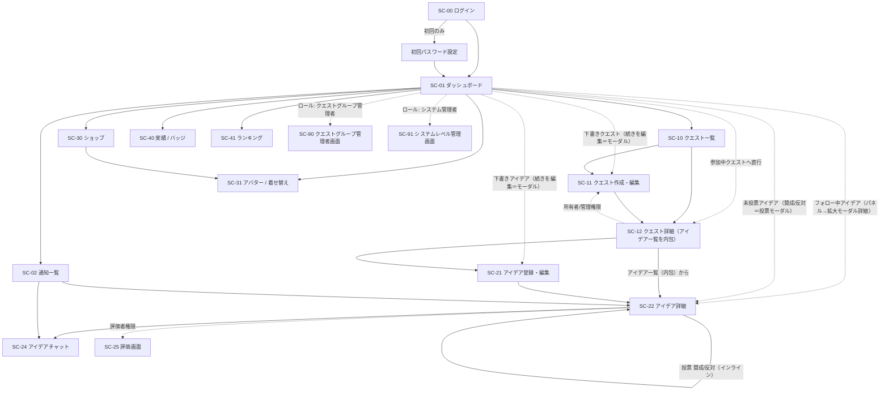

# 画面遷移図（ドラフト）

> ideaquest の画面の全体像と遷移フローを確認するための図。
> **まず本図で流れを合意 → 各画面のワイヤーフレーム → 画面モック → 画面設計（機能詳細）** の順で詰めていく。
> 詳細な要件は `doc/要件定義/README.md` を参照。

- 最終更新: 2026-07-13
- ステータス: ドラフト（流れ確認用のたたき台）

## 1. 画面一覧（暫定・ID 付与）

| 画面ID | 画面名 | 概要 | アクセス条件 |
| --- | --- | --- | --- |
| SC-00 | ログイン | 独自アカウントでログイン。**アカウントは管理者発行のみ**（自己新規登録なし）。初回ログイン時はパスワード設定を行う | 全員（未認証） |
| SC-01 | ダッシュボード | レベル/XP・コイン残高・アバター・**下書き中のクエスト/アイデア**・**未投票アイデア（投票ショートカット）**・参加中クエスト・**フォロー中アイデア**・週間ランキング・通知への導線（ホーム） | 認証済み |
| SC-02 | 通知一覧 | メンション・自アイデアへのコメント等のアプリ内通知 | 認証済み |
| SC-10 | クエスト一覧 | 「所属グループ内で作られ、かつ自分がパーティー参加中」のクエストを表示 | 認証済み |
| SC-11 | クエスト作成・編集（**モーダル**） | カテゴリー・テーマ・期限・クエストグループ・パーティーを設定。**独立画面でなくモーダルダイアログ**（Parallel/Intercept Routes） | 作成は認証済み／編集は所有者・管理権限 |
| SC-12 | クエスト詳細 | クエスト情報・**クエスト内週間ランキング**・**アイデア一覧（内包セクション/タブ）**・**全文検索タブ**・パーティー/権限管理への導線 | 当該クエストのパーティー |
| SC-21 | アイデア登録・編集（**モーダル**） | 件名・本文・価値（必須）ほか、添付。**独立画面でなくモーダルダイアログ**（Parallel/Intercept Routes） | アイデア作成権限 |
| SC-22 | アイデア詳細 | 本文・投票（賛成/反対）・評価結果・添付・チャット導線 | 当該クエストのパーティー |
| SC-24 | アイデアチャット | アイデア単位のチャット（添付・メンション） | コメント作成権限 |
| SC-25 | 評価画面 | 5観点採点＋観点別コメント | 評価者権限 |
| SC-30 | ショップ | コインで装備を購入（5スロット・レアリティ） | 認証済み |
| SC-31 | アバター / 着せ替え | 3Dアバター表示・購入済み装備の着せ替え | 認証済み |
| SC-40 | 実績 / バッジ | 達成した実績・バッジの一覧表示（初期スコープに含む） | 認証済み |
| SC-41 | ランキング | 社内での XP／レベル等のランキング表示（初期スコープに含む） | 認証済み |
| SC-90 | クエストグループ管理者画面 | 自グループ内アカウントの登録・編集・論理削除 | クエストグループ管理者 |
| SC-91 | システムレベル管理画面 | 会社作成・管理（投票匿名化設定含む）・DBプロビジョニング・全アカウント/所属操作 | システム管理者 |

> ※ **アイデア一覧は SC-12 クエスト詳細内のセクション/タブに内包**（独立画面にしない）。旧 SC-20 は廃止し SC-12 に統合。
> ※ 投票（賛成/反対）は独立画面ではなく **SC-22 アイデア詳細内のアクション**（インライン/モーダル）として扱う。
> ※ **UI標準: 登録・編集はモーダルダイアログ**（SC-11・SC-21）。個別画面にせず **Next.js Parallel Routes ＋ Intercept Routes** で差し込む。一覧/ダッシュボードから開く**詳細（SC-22）も Intercept でモーダル表示**（URL直/リロードはフルページ）。ダッシュボードのフォローパネル→SC-22 は**パネルが拡大してモーダル化**（framer-motion `layoutId`）。

## 2. 画面遷移図（全体）

> 図の「戻る」導線（各画面 → 親画面 / ダッシュボード）は自明のため省略。点線は**ロール/権限による条件付き遷移**（「参加中クエストへ直行」はダッシュボードのショートカット）。

## 3. ロール別アクセス（サマリ）

- **一般（パーティーメンバー）**: SC-00〜SC-41（管理画面を除く）。個別操作は権限（投票/アイデア作成/コメント/評価）に従う。
- **クエストグループ管理者**: 上記＋ SC-90。
- **システム管理者（運営）**: SC-91（会社/DB/全アカウント）。※運用画面中心。

## 4. 補足・確認したい点

- **アカウント発行（決定）**: アカウントは**管理者発行のみ**（システム管理者／クエストグループ管理者が発行）。自己新規登録画面は作らない。一般ユーザーは**初回ログイン時にパスワード設定**を行う。
- **アイデア一覧（決定）**: 独立画面にせず **SC-12 クエスト詳細内のセクション/タブに内包**（旧 SC-20 は廃止）。
- **ダッシュボードからの直行（決定）**: ダッシュボードに「参加中クエスト」カードを置き、**一覧を経由せずクエスト詳細へ直行**するショートカットを用意。
- **実績・ランキング（決定）**: **両方とも初期スコープに含める**（SC-40 実績/バッジ・SC-41 ランキング）。
- **登録・編集のモーダル化（決定）**: SC-11・SC-21 は**独立画面ではなくモーダルダイアログ**。**Next.js Parallel Routes ＋ Intercept Routes** で実装し、URLを持つモーダル（共有・戻る/進む・リロードでフルページ）を標準とする。一覧/ダッシュボードから開く**詳細（SC-22）も同方式でモーダル差し込み**。
- **アイデアフォロー（決定）**: 参加中クエストのアイデアを**フォロー＝ウォッチ**。**ダッシュボードにフォローパネル**を置き、パネルクリックで**拡大アニメーション（framer-motion `layoutId`）→ SC-22 をモーダル表示**。
- **下書き（決定）**: クエスト・アイデアは**下書き保存**可（作成者本人のみ表示・公開/投稿までパーティー非公開・XP/コインは公開/投稿時に付与）。**ダッシュボードの最上段（参加中クエストの上）に下書きパネル**を置き、クリックで**作成/編集モーダル（SC-11/SC-21）**を開いて続きを編集。
- **未投票アイデアの投票ショートカット（決定）**: 参加クエストで**自分がまだ投票していないアイデア**をダッシュボード（下書きの下）にパネル表示。**カード内の賛成/反対でクイック投票**、パネルクリックで**拡大→投票モーダル**（アイデア要約＋賛成/反対）。投票=SC-22内のアクションと同一（1人1票・締切まで変更可・XP付与）。
- 残りの確認したい点（TBD）:
  - （現時点で遷移レベルの未決なし。以降は各画面のレイアウト・機能詳細で詰める）

## 5. 次の進め方（提案）

1. **本遷移図で全体フローを合意**（画面の粒度・遷移・TBD の解消）。
2. 画面ごとに **ワイヤーフレーム（レイアウト）** を 1 枚ずつ作成し確認。
3. レイアウト確定後に **画面モック（HTML/CSS・決定）** を作成。ブラウザで見た目を確認でき、Next.js 実装への流用も可能。
4. 画面ごとの **画面設計（機能詳細: 表示項目・アクション・権限・入出力・API）** を詰める。

> - 画面設計（機能詳細）は画面単位で `doc/画面設計/screens/SC-xx_<名前>.md` に分割。
> - HTML/CSS モックは `doc/画面設計/mocks/SC-xx_<名前>.html` に配置（静的ファイル。ブラウザで直接開いて確認）。
> - モックは確認用の静的プロトタイプであり、実装（Next.js）とは別管理。共通の見た目は簡易な共有 CSS を用意して各モックから参照する想定。
