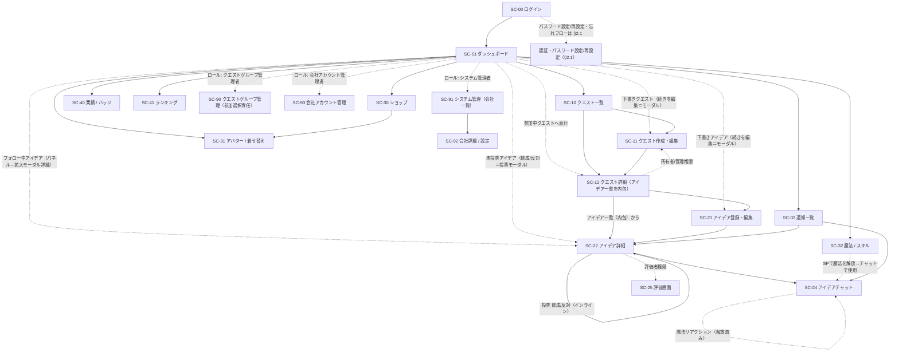
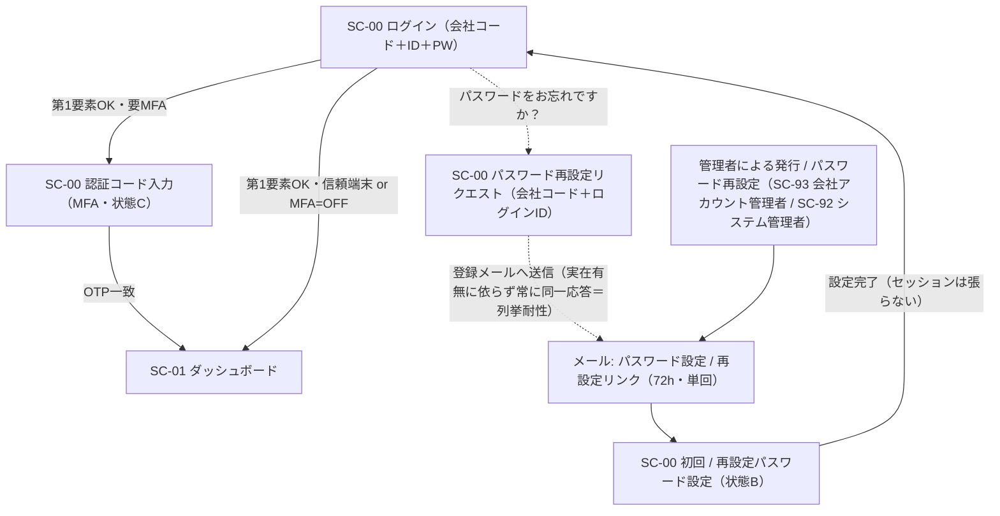

# 画面遷移図（ドラフト）

> ideaquest の画面の全体像と遷移フローを確認するための図。
> **まず本図で流れを合意 → 各画面のワイヤーフレーム → 画面モック → 画面設計（機能詳細）** の順で詰めていく。
> 詳細な要件は `doc/要件定義/README.md` を参照。

- 最終更新: 2026-07-29
- ステータス: ドラフト（流れ確認用のたたき台）

## 1. 画面一覧（暫定・ID 付与）

| 画面ID | 画面名 | 概要 | アクセス条件 |
| --- | --- | --- | --- |
| SC-00 | ログイン | 独自アカウントでログイン。**アカウントは管理者発行のみ**（自己新規登録なし）。**初回パスワード・再設定はいずれもメールの設定リンク（72h・単回）から**（仮パスワードは使わない）。パスワード忘れの自己サービス導線あり（§2.1） | 全員（未認証） |
| SC-01 | ダッシュボード | レベル/XP・コイン残高・アバター・**下書き中のクエスト/アイデア**・**未投票アイデア（投票ショートカット）**・参加中クエスト・**フォロー中アイデア**・週間ランキング・通知への導線（ホーム） | 認証済み |
| SC-02 | 通知一覧 | メンション・自アイデアへのコメント等のアプリ内通知 | 認証済み |
| SC-10 | クエスト一覧 | 「所属グループ内で作られ、かつ自分がパーティー参加中」のクエストを表示 | 認証済み |
| SC-11 | クエスト作成・編集（**モーダル**） | カテゴリー・テーマ・期限・クエストグループ・パーティーを設定。**独立画面でなくモーダルダイアログ**（Parallel/Intercept Routes） | 作成は認証済み／編集は所有者・管理権限 |
| SC-12 | クエスト詳細 | クエスト情報・**クエスト内週間ランキング**・**アイデア一覧（内包セクション/タブ）**・**全文検索タブ**・パーティー/権限管理への導線 | 当該クエストのパーティー |
| SC-21 | アイデア登録・編集（**モーダル**） | 件名・本文・価値（必須）ほか、添付。**独立画面でなくモーダルダイアログ**（Parallel/Intercept Routes） | アイデア作成権限 |
| SC-22 | アイデア詳細 | 本文・投票（賛成/反対）・評価結果・添付・チャット導線 | 当該クエストのパーティー |
| SC-24 | アイデアチャット | アイデア単位のチャット（添付・メンション） | コメント作成権限 |
| SC-25 | 評価画面 | 5観点採点＋観点別コメント | 評価者権限 |
| SC-30 | ショップ | コインで装備を購入（5スロット・レアリティ） | 認証済み |
| SC-31 | アバター / 着せ替え | 3Dアバター表示・購入済み装備の着せ替え | 認証済み |
| SC-32 | 魔法 / スキル | **スキルポイント（SP）で魔法を解放**（スキルツリー/一覧）。解放した魔法は**チャットの魔法リアクション**として使用（SC-24） | 認証済み |
| SC-40 | 実績 / バッジ | 達成した実績・バッジの一覧表示（初期スコープに含む） | 認証済み |
| SC-41 | ランキング | 社内での XP／レベル等のランキング表示（初期スコープに含む） | 認証済み |
| SC-90 | クエストグループ管理者画面 | **参加選択専任**（SoD §8-⑯）＝自社ディレクトリから既存アカウントを選び、自分が admin のグループへ参加追加/除外 | クエストグループ管理者 |
| SC-91 | システム管理（会社一覧） | 会社（テナント）の一覧・作成。各会社の管理は SC-92 へ | システム管理者 |
| SC-92 | 会社詳細 / 設定 | SC-91 で選んだ 1 社の設定（投票匿名化/管理者開示/MFA）・DB識別子・全アカウント/所属のフル操作＋システムロール(3値)/admin 付与。上部に「メンテ中の会社」文脈バナー | システム管理者 |
| SC-93 | 会社アカウント管理 | **自社の全アカウント**のライフサイクル（発行/編集/無効化⇄再有効化/PW再設定）＋**QG管理者（per-group admin）任命**。会社固定・会社設定/システムロール付与は持たない（SoD §8-⑯・2026-08-02改定） | 会社アカウント管理者 |

> ※ **アイデア一覧は SC-12 クエスト詳細内のセクション/タブに内包**（独立画面にしない）。旧 SC-20 は廃止し SC-12 に統合。
> ※ 投票（賛成/反対）は独立画面ではなく **SC-22 アイデア詳細内のアクション**（インライン/モーダル）として扱う。
> ※ **UI標準: 登録・編集はモーダルダイアログ**（SC-11・SC-21）。個別画面にせず **Next.js Parallel Routes ＋ Intercept Routes** で差し込む。一覧/ダッシュボードから開く**詳細（SC-22）も Intercept でモーダル表示**（URL直/リロードはフルページ）。ダッシュボードのフォローパネル→SC-22 は**パネルが拡大してモーダル化**（framer-motion `layoutId`）。

## 2. 画面遷移図（全体）

```mermaid
flowchart TD
    LOGIN["SC-00 ログイン"] --> DASH["SC-01 ダッシュボード"]
    LOGIN -. "パスワード設定/再設定・忘れフローは §2.1" .-> AUTH["認証・パスワード設定/再設定（§2.1）"]

    DASH --> QLIST["SC-10 クエスト一覧"]
    DASH -. "参加中クエストへ直行" .-> QDETAIL["SC-12 クエスト詳細（アイデア一覧を内包）"]
    DASH -. "フォロー中アイデア（パネル→拡大モーダル詳細）" .-> IDETAIL["SC-22 アイデア詳細"]
    DASH -. "下書きクエスト（続きを編集＝モーダル）" .-> QNEW
    DASH -. "下書きアイデア（続きを編集＝モーダル）" .-> INEW
    DASH -. "未投票アイデア（賛成/反対＝投票モーダル）" .-> IDETAIL
    DASH --> SHOP["SC-30 ショップ"]
    DASH --> AVATAR["SC-31 アバター / 着せ替え"]
    DASH --> SPELL["SC-32 魔法 / スキル"]
    DASH --> NOTIF["SC-02 通知一覧"]
    DASH --> ACHIEVE["SC-40 実績 / バッジ"]
    DASH --> RANK["SC-41 ランキング"]
    DASH -. "ロール: クエストグループ管理者" .-> QGADMIN["SC-90 クエストグループ管理（参加選択専任）"]
    DASH -. "ロール: 会社アカウント管理者" .-> ACCADMIN["SC-93 会社アカウント管理"]
    DASH -. "ロール: システム管理者" .-> SYSADMIN["SC-91 システム管理（会社一覧）"]
    SYSADMIN --> COMPANY["SC-92 会社詳細 / 設定"]

    QLIST --> QNEW["SC-11 クエスト作成・編集"]
    QLIST --> QDETAIL
    QNEW --> QDETAIL

    QDETAIL -->|"アイデア一覧（内包）から"| IDETAIL["SC-22 アイデア詳細"]
    QDETAIL --> INEW["SC-21 アイデア登録・編集"]
    QDETAIL -. "所有者/管理権限" .-> QNEW
    INEW --> IDETAIL

    IDETAIL -->|"投票 賛成/反対（インライン）"| IDETAIL
    IDETAIL --> CHAT["SC-24 アイデアチャット"]
    IDETAIL -. "評価者権限" .-> EVAL["SC-25 評価画面"]

    CHAT -. "魔法リアクション（解放済み）" .-> CHAT
    SPELL -. "SPで魔法を解放→チャットで使用" .-> CHAT

    SHOP --> AVATAR

    NOTIF --> IDETAIL
    NOTIF --> CHAT
```

> 図の「戻る」導線（各画面 → 親画面 / ダッシュボード）は自明のため省略。点線は**ロール/権限による条件付き遷移**（「参加中クエストへ直行」はダッシュボードのショートカット）。

### 2.1 認証・パスワード設定 / 再設定フロー（詳細）

> ログインは会社コード＋ログインID＋パスワード（要MFA時はメールOTP）。**初回パスワードも再設定も、メールで届く設定リンク（`otp_challenges` purpose=`password_setup`・72h・単回）から行う**（仮パスワードは使わない）。API の正＝`doc/API設計/A_認証・セッション.md`（§A.1 ログイン/MFA・§A.7 パスワード設定/再設定＝自己サービス要求 `request`・トークン確認 `verify`・設定 `complete`）。

```mermaid
flowchart TD
    LOGIN["SC-00 ログイン（会社コード＋ID＋PW）"]
    OTP["SC-00 認証コード入力（MFA・状態C）"]
    DASH["SC-01 ダッシュボード"]
    PWREQ["SC-00 パスワード再設定リクエスト（会社コード＋ログインID）"]
    ADMIN["管理者による発行 / パスワード再設定（SC-93 会社アカウント管理者 / SC-92 システム管理者）"]
    MAIL["メール: パスワード設定 / 再設定リンク（72h・単回）"]
    PWSET["SC-00 初回 / 再設定パスワード設定（状態B）"]

    LOGIN -->|"第1要素OK・要MFA"| OTP
    OTP -->|"OTP一致"| DASH
    LOGIN -->|"第1要素OK・信頼端末 or MFA=OFF"| DASH
    LOGIN -. "パスワードをお忘れですか？" .-> PWREQ
    PWREQ -. "登録メールへ送信（実在有無に依らず常に同一応答＝列挙耐性）" .-> MAIL
    ADMIN --> MAIL
    MAIL --> PWSET
    PWSET -->|"設定完了（セッションは張らない）"| LOGIN
```

> - **初回パスワード未設定のアカウントで login しても状態B へは遷移しない**（他の失敗と区別せず一律 `401`＝列挙耐性・ドメインA F3）。初回設定リンクは**管理者のアカウント発行時**に送信される。
> - **自己サービスのパスワード再設定リクエスト**は、会社コード＋ログインID を受け、該当があれば登録メールへ再設定リンクを送るが、**応答は常に同一**（アカウントの有無・PW未設定状態を漏らさない）＋レート制限。バックエンドは `POST /api/v1/auth/password-setup/request`（`A_認証・セッション.md` §A.7）。
> - パスワード設定 / 再設定の完了で**当該アカウントの全セッション破棄＋信頼端末失効**（`A_認証・セッション.md` §A.9-③）。完了後はログイン画面（SC-00）から通常ログイン。

## 3. ロール別アクセス（サマリ）

- **一般（パーティーメンバー）**: SC-00〜SC-41（管理画面を除く）。個別操作は権限（投票/アイデア作成/コメント/評価）に従う。
- **クエストグループ管理者**（＝`quest_group_members.role=admin` の有効所属を 1 つ以上持つ・per-group）: 上記＋ SC-90（**参加選択専任**＝自グループへの参加追加/除外のみ）。
- **会社アカウント管理者**（`system_role=company_account_admin`）: 上記＋ SC-93（自社アカウントの発行/編集/無効化/PW再設定＋QG管理者〔per-group admin〕の任命）。※職務分離（SoD §8-⑯）でアカウントのライフサイクル＋グループ管理者の任命を担う（system_role 付与は system_admin のみ）。
- **システム管理者（運営）**（`system_role=system_admin`）: SC-91（会社一覧）＋ SC-92（会社詳細/設定・全アカウント/所属・システムロール(3値)/admin 付与）。SC-90/SC-93 の全操作を全会社範囲で上位互換。※運用画面中心。

## 4. 補足・確認したい点

- **アカウント発行（決定）**: アカウントは**管理者発行のみ**（**会社アカウント管理者〔SC-93〕／システム管理者〔SC-92〕が発行**。QG管理者は職務分離で発行不可＝参加追加のみ SC-90）。自己新規登録画面は作らない。一般ユーザーは**管理者発行時にメールで届く設定リンク（72h・単回）から初回パスワードを設定**する（仮パスワードは使わない）。
- **パスワード再設定（決定・2026-07-29）**: **自己サービス**とする。SC-00 に「パスワードをお忘れですか？」導線を置き、会社コード＋ログインID から**登録メールへ再設定リンク**を送る（**列挙耐性で常に同一応答**＋レート制限）。管理者からの再設定（SC-93 会社アカウント管理者／SC-92 システム管理者）も同じメールリンク基盤を使う。フロー詳細＝§2.1、API＝`POST /api/v1/auth/password-setup/request`（`A_認証・セッション.md` §A.7）。
- **アイデア一覧（決定）**: 独立画面にせず **SC-12 クエスト詳細内のセクション/タブに内包**（旧 SC-20 は廃止）。
- **ダッシュボードからの直行（決定）**: ダッシュボードに「参加中クエスト」カードを置き、**一覧を経由せずクエスト詳細へ直行**するショートカットを用意。
- **実績・ランキング（決定）**: **両方とも初期スコープに含める**（SC-40 実績/バッジ・SC-41 ランキング）。
- **登録・編集のモーダル化（決定）**: SC-11・SC-21 は**独立画面ではなくモーダルダイアログ**。**Next.js Parallel Routes ＋ Intercept Routes** で実装し、URLを持つモーダル（共有・戻る/進む・リロードでフルページ）を標準とする。一覧/ダッシュボードから開く**詳細（SC-22）も同方式でモーダル差し込み**。
- **アイデアフォロー（決定）**: 参加中クエストのアイデアを**フォロー＝ウォッチ**。**ダッシュボードにフォローパネル**を置き、パネルクリックで**拡大アニメーション（framer-motion `layoutId`）→ SC-22 をモーダル表示**。
- **下書き（決定）**: クエスト・アイデアは**下書き保存**可（作成者本人のみ表示・公開/投稿までパーティー非公開・XP/コインは公開/投稿時に付与）。**ダッシュボードの最上段（参加中クエストの上）に下書きパネル**を置き、クリックで**作成/編集モーダル（SC-11/SC-21）**を開いて続きを編集。
- **未投票アイデアの投票ショートカット（決定）**: 参加クエストで**自分がまだ投票していないアイデア**をダッシュボード（下書きの下）にパネル表示。**カード内の賛成/反対でクイック投票**、パネルクリックで**拡大→投票モーダル**（アイデア要約＋賛成/反対）。投票=SC-22内のアクションと同一（1人1票・締切まで変更可・XP付与）。
- **チャットリアクション & 魔法（決定）**: チャット（SC-24）に**2層リアクション**（通常＝絵文字/無料・魔法＝SP解放/エフェクト/クールダウン）。**レベルアップで SP を獲得**し、**新画面 SC-32「魔法/スキル」で SP を消費して魔法を解放**。解放した魔法は SC-24 の**魔法リアクション**として発動し、対象メッセージに**永続エフェクト**（例: 炎＝枠が燃える）を残す。装飾/社交演出のみ（XP/評価に非影響）。
- 残りの確認したい点（TBD）:
  - （現時点で遷移レベルの未決なし。以降は各画面のレイアウト・機能詳細で詰める）

## 5. 次の進め方（提案）

1. **本遷移図で全体フローを合意**（画面の粒度・遷移・TBD の解消）。
2. 画面ごとに **ワイヤーフレーム（レイアウト）** を 1 枚ずつ作成し確認。
3. レイアウト確定後に **画面モック（HTML/CSS・決定）** を作成。ブラウザで見た目を確認でき、Next.js 実装への流用も可能。
4. 画面ごとの **画面設計（機能詳細: 表示項目・アクション・権限・入出力・API）** を詰める。

> - 画面設計（機能詳細）は画面単位で `doc/画面設計/screens/SC-xx_<名前>.md` に分割。
> - HTML/CSS モックは `doc/画面設計/mocks/SC-xx_<名前>.html` に配置（静的ファイル。ブラウザで直接開いて確認）。
> - モックは確認用の静的プロトタイプであり、実装（Next.js）とは別管理。共通の見た目は簡易な共有 CSS を用意して各モックから参照する想定。
