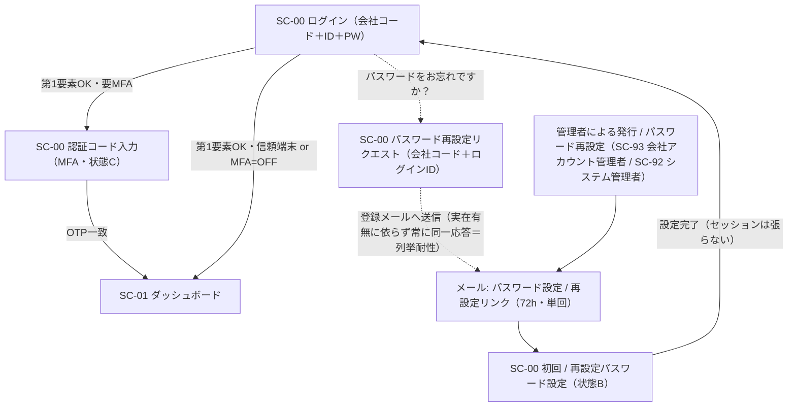

# 画面遷移図（ドラフト）

> ideaquest の画面の全体像と遷移フローを確認するための図。
> **まず本図で流れを合意 → 各画面のワイヤーフレーム → 画面モック → 画面設計（機能詳細）** の順で詰めていく。
> 詳細な要件は `doc/要件定義/README.md` を参照。

- 最終更新: 2026-08-18
- ステータス: ドラフト（流れ確認用のたたき台）

## 1. 画面一覧（暫定・ID 付与）

| 画面ID | 画面名 | 概要 | アクセス条件 |
| --- | --- | --- | --- |
| SC-00 | ログイン | 独自アカウントでログイン。**アカウントは管理者発行のみ**（自己新規登録なし）。**初回パスワード・再設定はいずれもメールの設定リンク（72h・単回）から**（仮パスワードは使わない）。パスワード忘れの自己サービス導線あり（§2.1） | 全員（未認証） |
| SC-01 | ダッシュボード | レベル/XP・コイン残高・アバター・**下書き中のクエスト/アイデア**・**未投票アイデア（投票ショートカット）**・参加中クエスト・**フォロー中アイデア**・週間ランキング・通知への導線（ホーム） | 認証済み |
| SC-02 | 通知一覧 | メンション・自アイデアへのコメント等のアプリ内通知 | 認証済み |
| SC-03 | プロフィール | 本人の自己プロフィール（表示名・言語・プロフィール画像）＋残高表示（レベル/XP/コイン/SP・読取）＋セキュリティ（パスワード/メール変更）。**3D アバターの着せ替えは SC-31**、**背景画像はヘッダーのユーザーメニュー**（本画面外）。導線＝ヘッダーのユーザーメニュー | 認証済み（本人・`/me`） |
| SC-04 | AI処理状況 | 自分の **AIジョブ**（LLM 要約/生成等）の待ち/実行中/完了・失敗を1画面で把握（共有DataTable・サーバー委譲）＋進捗バー＋行キャンセル＋完了選択で対象画面へ。ライブ＝WS `ai_jobs:{user_id}`（[SC-04](screens/SC-04_AI処理状況.md)・FR-45・[API S](../API設計/S_AIジョブ・LLM連携.md) S.1/S.4） | 認証済み（自分のジョブのみ） |
| SC-05 | アカウント作成（セルフサインアップ） | ①作成リクエスト（会社コード/ログインID/メール/パスワード）②認証コード入力（**SC-00 状態C=メール認証/MFA画面を流用**）。`public` デプロイは会社コード欄なし（env `IQ_DEFAULT_COMPANY_CODE`・自動セット）。`self_signup_enabled=true` の会社のみ到達可（FR-48・[API A §A.11](../API設計/A_認証・セッション.md)） | 全員（未認証・opt-in 会社のみ） |
| SC-10 | クエスト一覧 | 「所属グループ内で作られ、かつ自分がパーティー参加中」のクエストを表示 | 認証済み |
| SC-11 | クエスト作成・編集（**モーダル**） | カテゴリー・テーマ・期限・クエストグループ・パーティーを設定。**独立画面でなくモーダルダイアログ**（Parallel/Intercept Routes） | 作成は認証済み／編集は所有者・管理権限 |
| SC-12 | クエスト詳細 | クエスト情報・**クエスト内週間ランキング**・**アイデア一覧（内包セクション/タブ）**・**全文検索タブ**・パーティー/権限管理への導線（**参加リクエストの承諾/却下もパーティータブ**・FR-40） | 当該クエストのパーティー |
| SC-13 | 発見カタログ（クエスト掲示板） | 参加していないクエストを**発見**（メタのみ）・**★フォロー**・**参加をリクエスト**（FR-40）。可視＝`can_discover_quest`（discoverable ∧ 部署交差） | 認証済み（発見門番） |
| SC-21 | アイデア登録・編集（**モーダル**） | 件名・本文・価値（必須）ほか、添付。**独立画面でなくモーダルダイアログ**（Parallel/Intercept Routes） | アイデア作成権限 |
| SC-22 | アイデア詳細 | 本文・投票（賛成/反対）・評価結果・添付・チャット導線 | 当該クエストのパーティー |
| SC-24 | アイデアチャット | アイデア単位のチャット（添付・メンション） | コメント作成権限 |
| SC-25 | 評価画面 | 5観点採点＋観点別コメント | 評価者権限 |
| SC-30 | ショップ | コインで装備を購入（5スロット・レアリティ） | 認証済み |
| SC-31 | アバター / 着せ替え | 3Dアバター表示・購入済み装備の着せ替え | 認証済み |
| SC-32 | 魔法 / スキル | **スキルポイント（SP）で魔法を解放**（スキルツリー/一覧）。解放した魔法は**チャットの魔法リアクション**として使用（SC-24） | 認証済み |
| SC-40 | 実績 / バッジ | 達成した実績・バッジの一覧表示（初期スコープに含む） | 認証済み |
| SC-41 | ランキング | 社内での XP／レベル等のランキング表示（初期スコープに含む） | 認証済み |
| SC-50 | 情報インプット（一覧） | 外部WEB情報を**手動貼付**で登録する会社横断の知識レイヤ。一覧（DataTableサーバー委譲）＋ワードクラウド。登録=全員／属性付与・判定・アーカイブ=`info_curator`（[SC-50](screens/SC-50_情報インプット.md)・[API N](../API設計/N_情報インプット.md)） | 認証済み（会社内） |
| SC-51 | 情報インプット 登録・編集（**モーダル**） | 低摩擦登録（タイトル/本文/出典URL＝全員）＋属性付与（`info_curator`）。URL付きモーダル | 認証済み／属性は `info_curator` |
| SC-52 | 情報インプット 詳細（**モーダル**） | 全属性＋ミニ・ワードクラウド＋**関連リンク**（関連/裏付け/反証・種別変更/手動追加/棄却）。反証で「揺さぶり」通知 | 認証済み（会社内） |
| SC-53 | アイデアコンテスト一覧 | 開催中/予定/終了をタブ・検索（**SC-10 クエスト一覧を流用**）。`contest_create` 保持者は作成ボタン（FR-46・[API T](../API設計/T_アイデアコンテスト.md) T.1）。`public` 会社はここに着地（SC-01 非表示・決定P） | 会社内（`public` は参加者含む） |
| SC-54 | アイデアコンテスト詳細 | ヘッダー（会期/テーマ/賞）＋**アイデア一覧タブ**（応募中/入賞/殿堂入り/お蔵入り）＋ランキング/表彰台（**SC-12 クエスト詳細を流用**）。アイデア詳細=SC-22／チャット=SC-24／評価=SC-25 を流用（ゲートは Tier1/Tier2/審査員）。Tier1 参加/承認・Tier2 参加リクエスト導線（FR-46・T.1/T.2） | 会社内（コンテスト配下は会社全体可視） |
| SC-60 | コンセプト登録・編集（**モーダル**） | 由来アイデア選択＋成果物スキーマ入力（課題/価値/差別化/解の形態/viability=jsonb）。冒頭＋難解ラベル横にガイダンス ⓘ（[SC-60](screens/SC-60_コンセプト登録編集.md)・FR-42・[API P](../API設計/P_コンセプト.md) P.2） | 当該クエストのパーティー |
| SC-61 | コンセプト詳細（**フルページ**） | スキーマ＋前提と検証（核心）＋投票/評価/総合判定＋議論ルーム。関連情報パネル・ガイダンス ⓘ（[SC-61](screens/SC-61_コンセプト詳細.md)・FR-42・P.1） | 当該クエストのパーティー（自分の draft は本人） |
| SC-62 | コンセプト評価（**モーダル**） | 中核5＋補助3観点＋総評＋Go/Pivot/Kill 推奨。観点に ⓘ ガイダンス（[SC-62](screens/SC-62_コンセプト評価.md)・FR-42・P.5） | 評価者権限 |
| SC-70 | プロジェクト一覧（**グローバル領域**） | go コンセプト由来のソリューション開発プロジェクト一覧（共有DataTable・サーバー委譲）。作成は SC-61「開発を始める」から（[SC-70](screens/SC-70_プロジェクト一覧.md)・FR-43・[API Q](../API設計/Q_ソリューション開発.md) Q.1） | 由来クエストのパーティー OR 開発メンバー |
| SC-71 | プロジェクト詳細（**フルページ**） | WBS ツリー（要件→タスク・担当/状態/進捗）＋開発メンバー一覧（SC-12 party 踏襲）＋導入・価値実現メタ＋タスクチャット（SC-24 踏襲・両担当同席）。二層メンバーシップ（[SC-71](screens/SC-71_プロジェクト詳細.md)・FR-43・Q.1/Q.2/Q.4） | 由来クエストのパーティー OR 開発メンバー |
| SC-72 | タスク登録・編集（**モーダル**） | タイトル/粒度(kind)/親/担当(開発メンバー)/状態/期日。§4.7 検証。done で完了報酬（[SC-72](screens/SC-72_タスク登録編集.md)・FR-43・Q.2） | project owner/開発lead/owner |
| SC-90 | クエストグループ管理者画面 | **参加選択専任**（SoD §8-⑯）＝自社ディレクトリから既存アカウントを選び、自分が admin のグループへ参加追加/除外 | クエストグループ管理者 |
| SC-91 | システム管理（会社一覧） | 会社（テナント）の一覧・作成。各会社の管理は SC-92 へ | システム管理者 |
| SC-92 | 会社詳細 / 設定 | SC-91 で選んだ 1 社の設定（投票匿名化/管理者開示/MFA）・DB識別子・全アカウント/所属のフル操作＋システムロール(3値)/admin 付与。上部に「メンテ中の会社」文脈バナー | システム管理者 |
| SC-93 | 会社アカウント管理 | **自社の全アカウント**のライフサイクル（発行/編集/無効化⇄再有効化/PW再設定）＋**QG管理者（per-group admin）任命**。会社固定・会社設定/システムロール付与は持たない（SoD §8-⑯・2026-08-02改定） | 会社アカウント管理者 |
| SC-94 | 会社のLLM設定 | 自社で使う **LLM モデルの ON/OFF・月次予算・利用量/コスト可視化**（会社の課金判断＝会社アカウント管理者の領分／運営フラグの SC-92 とは別カテゴリ）。`paid` ON＝課金合意＋外部送信解禁（確認モーダル）（[SC-94](screens/SC-94_会社のLLM設定.md)・FR-45・[API S](../API設計/S_AIジョブ・LLM連携.md) S.5） | 会社アカウント管理者 |

> ※ **アイデア一覧は SC-12 クエスト詳細内のセクション/タブに内包**（独立画面にしない）。旧 SC-20 は廃止し SC-12 に統合。
> ※ 投票（賛成/反対）は独立画面ではなく **SC-22 アイデア詳細内のアクション**（インライン/モーダル）として扱う。
> ※ **UI標準: 登録・編集はモーダルダイアログ**（SC-11・SC-21）。個別画面にせず **Next.js Parallel Routes ＋ Intercept Routes** で差し込む。一覧/ダッシュボードから開く**詳細（SC-22）も Intercept でモーダル表示**（URL直/リロードはフルページ）。ダッシュボードのフォローパネル→SC-22 は**パネルが拡大してモーダル化**（framer-motion `layoutId`）。

## 2. 画面遷移図（全体）

```mermaid
flowchart TD
    LOGIN["SC-00 ログイン"] --> DASH["SC-01 ダッシュボード"]
    LOGIN -. "パスワード設定/再設定・忘れフローは §2.1" .-> AUTH["認証・パスワード設定/再設定（§2.1）"]

    DASH --> QLIST["SC-10 クエスト一覧"]
    DASH --> QCATALOG["SC-13 発見カタログ（掲示板）"]
    QCATALOG -. "参加をリクエスト（掲示板ダイアログ）／★フォロー" .-> DASH
    QCATALOG -. "承認されると参加中→" .-> QDETAIL
    DASH -. "参加中クエストへ直行" .-> QDETAIL["SC-12 クエスト詳細（アイデア一覧を内包）"]
    DASH -. "フォロー中アイデア（パネル→拡大モーダル詳細）" .-> IDETAIL["SC-22 アイデア詳細"]
    DASH -. "下書きクエスト（続きを編集＝モーダル）" .-> QNEW
    DASH -. "下書きアイデア（続きを編集＝モーダル）" .-> INEW
    DASH -. "未投票アイデア（賛成/反対＝投票モーダル）" .-> IDETAIL
    DASH --> SHOP["SC-30 ショップ"]
    DASH --> AVATAR["SC-31 アバター / 着せ替え"]
    DASH --> SPELL["SC-32 魔法 / スキル"]
    DASH --> NOTIF["SC-02 通知一覧"]
    DASH -. "ヘッダーのベル近傍バッジ（実行中/待ち件数）" .-> AISTATUS["SC-04 AI処理状況"]
    NOTIF -. "ai_task_done / ai_task_failed 通知から" .-> AISTATUS
    AISTATUS -. "完了選択→対象へ（ref_*）" .-> IDETAIL
    DASH --> ACHIEVE["SC-40 実績 / バッジ"]
    DASH --> RANK["SC-41 ランキング"]
    DASH -. "ヘッダーのユーザーメニュー" .-> PROFILE["SC-03 プロフィール"]
    PROFILE -. "きせかえ（装備＝G）" .-> AVATAR
    PROFILE -. "ショップ" .-> SHOP
    DASH -. "ロール: クエストグループ管理者" .-> QGADMIN["SC-90 クエストグループ管理（参加選択専任）"]
    DASH -. "ロール: 会社アカウント管理者" .-> ACCADMIN["SC-93 会社アカウント管理"]
    ACCADMIN -. "AI・LLM設定（会社の課金判断）" .-> LLMSET["SC-94 会社のLLM設定"]
    DASH -. "ロール: システム管理者" .-> SYSADMIN["SC-91 システム管理（会社一覧）"]
    SYSADMIN --> COMPANY["SC-92 会社詳細 / 設定"]

    QLIST --> QNEW["SC-11 クエスト作成・編集"]
    QLIST --> QDETAIL
    QNEW --> QDETAIL

    QDETAIL -->|"アイデア一覧（内包）から"| IDETAIL["SC-22 アイデア詳細"]
    QDETAIL --> INEW["SC-21 アイデア登録・編集"]
    QDETAIL -. "所有者/管理権限" .-> QNEW
    INEW --> IDETAIL

    IDETAIL -->|"投票 賛成/反対（インライン）"| IDETAIL
    IDETAIL --> CHAT["SC-24 アイデアチャット"]
    IDETAIL -. "評価者権限" .-> EVAL["SC-25 評価画面"]

    %% コンセプト段（ISO ②③・FR-42）＝SC-12「🧩 コンセプト」タブ → 詳細/作成/評価
    QDETAIL -->|"🧩 コンセプトタブ（一覧＋検証プール）"| CDETAIL["SC-61 コンセプト詳細（フルページ）"]
    QDETAIL --> CNEW["SC-60 コンセプト登録・編集（モーダル）"]
    CNEW --> CDETAIL
    CDETAIL -->|"投票 賛成/反対（インライン）"| CDETAIL
    CDETAIL --> CCHAT["コンセプト議論ルーム（総合/グループ/前提スレッド・E再利用）"]
    CDETAIL -. "評価者権限" .-> CEVAL["SC-62 コンセプト評価（モーダル）"]
    CDETAIL -. "関連情報パネル" .-> INFODETAIL

    %% ソリューション開発段（ISO ④⑤・FR-43）＝go コンセプト → プロジェクト/タスク（クエスト外・グローバル領域）
    CDETAIL -->|"decision=go『開発を始める』（プロジェクト起票）"| PDETAIL["SC-71 プロジェクト詳細（フルページ・WBSツリー）"]
    PLIST["SC-70 プロジェクト一覧（グローバル領域）"] --> PDETAIL
    PDETAIL --> PTASK["SC-72 タスク登録・編集（モーダル）"]
    PTASK --> PDETAIL
    PDETAIL --> PCHAT["タスクチャット（SC-24 IdeaChatView 踏襲・chat_thread owner_type=task）"]
    PDETAIL -. "開発メンバー管理（SC-12 パーティー編集 踏襲）" .-> PDETAIL
    PDETAIL -. "由来コンセプトへ" .-> CDETAIL

    CHAT -. "魔法リアクション（解放済み）" .-> CHAT
    SPELL -. "SPで魔法を解放→チャットで使用" .-> CHAT

    %% ゲーム層3画面（ショップ/きせかえ/魔法）は各画面の見出し直下の共通ナビ（gamenav）で相互に行き来できる（決定 2026-08-18）
    SHOP <--> AVATAR
    AVATAR <--> SPELL
    SHOP <--> SPELL
    %% ヘッダーの通貨アイコンが「それを使う画面」への入口（全画面共通）: コイン◆→ショップ / SP✦→魔法
    DASH -. "ヘッダー ◆コイン残高" .-> SHOP
    DASH -. "ヘッダー ✦SP" .-> SPELL

    NOTIF --> IDETAIL
    NOTIF --> CHAT

    %% 情報インプット（知識レイヤ・FR-41）＝グローバルナビから一覧、行→詳細モーダル、成果物の「関連情報」パネル→詳細
    DASH -. "グローバルナビ" .-> INFO["SC-50 情報インプット（一覧）"]
    INFO --> INFODETAIL["SC-52 情報インプット詳細（モーダル）"]
    INFO --> INFONEW["SC-51 情報インプット登録・編集（モーダル）"]
    IDETAIL -. "関連情報パネル" .-> INFODETAIL
    QDETAIL -. "関連情報パネル" .-> INFODETAIL
    INFODETAIL -. "反証→要再評価（通知）" .-> IDETAIL
```

> 図の「戻る」導線（各画面 → 親画面 / ダッシュボード）は自明のため省略。点線は**ロール/権限による条件付き遷移**（「参加中クエストへ直行」はダッシュボードのショートカット）。

### 2.1 認証・パスワード設定 / 再設定フロー（詳細）

> ログインは会社コード＋ログインID＋パスワード（要MFA時はメールOTP）。**初回パスワードも再設定も、メールで届く設定リンク（`otp_challenges` purpose=`password_setup`・72h・単回）から行う**（仮パスワードは使わない）。API の正＝`doc/API設計/A_認証・セッション.md`（§A.1 ログイン/MFA・§A.7 パスワード設定/再設定＝自己サービス要求 `request`・トークン確認 `verify`・設定 `complete`）。

```mermaid
flowchart TD
    LOGIN["SC-00 ログイン（会社コード＋ID＋PW）"]
    OTP["SC-00 認証コード入力（MFA・状態C）"]
    DASH["SC-01 ダッシュボード"]
    PWREQ["SC-00 パスワード再設定リクエスト（会社コード＋ログインID）"]
    ADMIN["管理者による発行 / パスワード再設定（SC-93 会社アカウント管理者 / SC-92 システム管理者）"]
    MAIL["メール: パスワード設定 / 再設定リンク（72h・単回）"]
    PWSET["SC-00 初回 / 再設定パスワード設定（状態B）"]

    LOGIN -->|"第1要素OK・要MFA"| OTP
    OTP -->|"OTP一致"| DASH
    LOGIN -->|"第1要素OK・信頼端末 or MFA=OFF"| DASH
    LOGIN -. "パスワードをお忘れですか？" .-> PWREQ
    PWREQ -. "登録メールへ送信（実在有無に依らず常に同一応答＝列挙耐性）" .-> MAIL
    ADMIN --> MAIL
    MAIL --> PWSET
    PWSET -->|"設定完了（セッションは張らない）"| LOGIN
```

> - **初回パスワード未設定のアカウントで login しても状態B へは遷移しない**（他の失敗と区別せず一律 `401`＝列挙耐性・ドメインA F3）。初回設定リンクは**管理者のアカウント発行時**に送信される。
> - **自己サービスのパスワード再設定リクエスト**は、会社コード＋ログインID を受け、該当があれば登録メールへ再設定リンクを送るが、**応答は常に同一**（アカウントの有無・PW未設定状態を漏らさない）＋レート制限。バックエンドは `POST /api/v1/auth/password-setup/request`（`A_認証・セッション.md` §A.7）。
> - パスワード設定 / 再設定の完了で**当該アカウントの全セッション破棄＋信頼端末失効**（`A_認証・セッション.md` §A.9-③）。完了後はログイン画面（SC-00）から通常ログイン。

## 3. ロール別アクセス（サマリ）

- **一般（パーティーメンバー）**: SC-00〜SC-41（管理画面を除く）＋ **SC-04（AI処理状況・自分のジョブのみ）**。個別操作は権限（投票/アイデア作成/コメント/評価）に従う。**プロフィール（SC-03）はヘッダーのユーザーメニューから全ロール共通で開ける**（本人のみ・`/me`）。
- **クエストグループ管理者**（＝`quest_group_members.role=admin` の有効所属を 1 つ以上持つ・per-group）: 上記＋ SC-90（**参加選択専任**＝自グループへの参加追加/除外のみ）。
- **会社アカウント管理者**（`system_role=company_account_admin`）: 上記＋ SC-93（自社アカウントの発行/編集/無効化/PW再設定＋QG管理者〔per-group admin〕の任命）＋ **SC-94（会社のLLM設定＝モデル ON/OFF・予算・利用量／会社の課金判断＝運営フラグ SC-92 とは別カテゴリ）**。※職務分離（SoD §8-⑯）でアカウントのライフサイクル＋グループ管理者の任命を担う（system_role 付与は system_admin のみ）。
- **システム管理者（運営）**（`system_role=system_admin`）: SC-91（会社一覧）＋ SC-92（会社詳細/設定・全アカウント/所属・システムロール(3値)/admin 付与）。SC-90/SC-93 の全操作を全会社範囲で上位互換。※運用画面中心。

## 4. 補足・確認したい点

- **アカウント発行（決定）**: アカウントは**管理者発行のみ**（**会社アカウント管理者〔SC-93〕／システム管理者〔SC-92〕が発行**。QG管理者は職務分離で発行不可＝参加追加のみ SC-90）。自己新規登録画面は作らない。一般ユーザーは**管理者発行時にメールで届く設定リンク（72h・単回）から初回パスワードを設定**する（仮パスワードは使わない）。
- **パスワード再設定（決定・2026-07-29）**: **自己サービス**とする。SC-00 に「パスワードをお忘れですか？」導線を置き、会社コード＋ログインID から**登録メールへ再設定リンク**を送る（**列挙耐性で常に同一応答**＋レート制限）。管理者からの再設定（SC-93 会社アカウント管理者／SC-92 システム管理者）も同じメールリンク基盤を使う。フロー詳細＝§2.1、API＝`POST /api/v1/auth/password-setup/request`（`A_認証・セッション.md` §A.7）。
- **アイデア一覧（決定）**: 独立画面にせず **SC-12 クエスト詳細内のセクション/タブに内包**（旧 SC-20 は廃止）。
- **ダッシュボードからの直行（決定）**: ダッシュボードに「参加中クエスト」カードを置き、**一覧を経由せずクエスト詳細へ直行**するショートカットを用意。
- **実績・ランキング（決定）**: **両方とも初期スコープに含める**（SC-40 実績/バッジ・SC-41 ランキング）。
- **登録・編集のモーダル化（決定）**: SC-11・SC-21 は**独立画面ではなくモーダルダイアログ**。**Next.js Parallel Routes ＋ Intercept Routes** で実装し、URLを持つモーダル（共有・戻る/進む・リロードでフルページ）を標準とする。一覧/ダッシュボードから開く**詳細（SC-22）も同方式でモーダル差し込み**。
- **アイデアフォロー（決定）**: 参加中クエストのアイデアを**フォロー＝ウォッチ**。**ダッシュボードにフォローパネル**を置き、パネルクリックで**拡大アニメーション（framer-motion `layoutId`）→ SC-22 をモーダル表示**。
- **下書き（決定）**: クエスト・アイデアは**下書き保存**可（作成者本人のみ表示・公開/投稿までパーティー非公開・XP/コインは公開/投稿時に付与）。**ダッシュボードの最上段（参加中クエストの上）に下書きパネル**を置き、クリックで**作成/編集モーダル（SC-11/SC-21）**を開いて続きを編集。
- **未投票アイデアの投票ショートカット（決定）**: 参加クエストで**自分がまだ投票していないアイデア**をダッシュボード（下書きの下）にパネル表示。**カード内の賛成/反対でクイック投票**、パネルクリックで**拡大→投票モーダル**（アイデア要約＋賛成/反対）。投票=SC-22内のアクションと同一（1人1票・締切まで変更可・XP付与）。
- **ゲーム層3画面の導線統一（決定・2026-08-18 → 2026-09-10 にグローバルナビへ集約）**: **ショップ(SC-30)／きせかえ(SC-31)／魔法・スキル(SC-32)** は入口・相互リンクを統一する。①**ヘッダーの通貨アイコン＝それを使う画面の入口**（`◆ コイン`→ショップ・`✦ SP`→魔法。全画面共通）②**ダッシュボードのタイル**に3画面すべてを並べる（魔法/スキルも追加）③**3画面の見出し直下に共通ナビ `gamenav`**（🛒ショップ/🧍きせかえ/✦魔法・スキル・現在地は非リンク）を置き相互に往来可能にする。**なぜ**＝従来は「ショップへの導線はあるが魔法へは無い」「SC-32 はヘッダーの SP リンクだけ」等、入口がバラバラだったため。実体＝`shared.css .gamenav`／impl `components/ui/GameNav`＋ヘッダー（`AppHeader`）。**※ 2026-09-10 更新＝下記「グローバルナビへの集約」により ②タイル・③`gamenav` は撤去し、ゲーム3画面を含む行き先はグローバルナビ（ドロワー）に集約する（①通貨アイコンの入口は据え置き）。**
- **グローバルナビへの集約（決定・2026-09-10・社内レビュー#1）**: 行き先導線を**ヘッダー左の `☰` → 左ドロワー（📌ピン留めで常設サイドバー化）`.appnav`** に一本化する（デザイン標準 §4.1「グローバルナビ」）。これに伴い **①ダッシュボードのタイル（TILES）と ②ゲーム層の共通ナビ `gamenav`（上記 2026-08-18）は撤去**し、ドロワーの**業務群（🏠ホーム/📜クエスト/🔔通知）＋ゲーム群（🛒ショップ/🧍きせかえ/✦魔法・スキル/🏅実績/🏆ランキング）**へ置き換える。**ゲーム群はゲームモード（レビュー#2）ON 時のみ表示**。**ヘッダー右の通貨アイコン（◆→ショップ／✦→魔法）・通知ベル・アバターメニュー `.usermenu`（アカウント/設定/管理/ログアウト）は据え置き**（ステータス/アカウントであり行き先ナビの分散ではない）。ピン状態は端末に記憶（localStorage）・ピン可は広い画面のみ（狭幅はオーバーレイ）。**なぜ**＝入口が「タイル／`gamenav`／通貨アイコン」に分散し発見性・一貫性が低かったため、単一のグローバルナビへ集約する。実体＝`design-system.css .appnav*`／impl `components/layout/AppNav`＋`(app)` レイアウト。
- **チャットリアクション & 魔法（決定）**: チャット（SC-24）に**2層リアクション**（通常＝絵文字/無料・魔法＝SP解放/エフェクト/クールダウン）。**レベルアップで SP を獲得**し、**新画面 SC-32「魔法/スキル」で SP を消費して魔法を解放**。解放した魔法は SC-24 の**魔法リアクション**として発動し、対象メッセージに**永続エフェクト**（例: 炎＝枠が燃える）を残す。装飾/社交演出のみ（XP/評価に非影響）。
- **プロフィール画面（決定・2026-08-18）**: 本人の自己プロフィールを **SC-03** として採番（旧 `K_プロフィール`）。導線＝**ヘッダーのユーザーメニュー・全ロール共通・本人のみ（`/me`）**。表示名/言語/プロフィール画像の編集＋残高表示（読取）＋セキュリティ（PW/メール変更）。**3D アバターの着せ替えは SC-31（ドメイン G）**、**プロフィール画像（アイコン・K.4）は 3D アバターとは別物**、**背景画像はユーザーメニュー（FR-30）**＝いずれも本画面外へ導線。詳細＝`doc/画面設計/screens/SC-03_プロフィール.md`・API＝`doc/API設計/K_プロフィール・背景画像.md`。
- 残りの確認したい点（TBD）:
  - （現時点で遷移レベルの未決なし。以降は各画面のレイアウト・機能詳細で詰める）

## 5. 次の進め方（提案）

1. **本遷移図で全体フローを合意**（画面の粒度・遷移・TBD の解消）。
2. 画面ごとに **ワイヤーフレーム（レイアウト）** を 1 枚ずつ作成し確認。
3. レイアウト確定後に **画面モック（HTML/CSS・決定）** を作成。ブラウザで見た目を確認でき、Next.js 実装への流用も可能。
4. 画面ごとの **画面設計（機能詳細: 表示項目・アクション・権限・入出力・API）** を詰める。

> - 画面設計（機能詳細）は画面単位で `doc/画面設計/screens/SC-xx_<名前>.md` に分割。
> - HTML/CSS モックは `doc/画面設計/mocks/SC-xx_<名前>.html` に配置（静的ファイル。ブラウザで直接開いて確認）。
> - モックは確認用の静的プロトタイプであり、実装（Next.js）とは別管理。共通の見た目は簡易な共有 CSS を用意して各モックから参照する想定。
